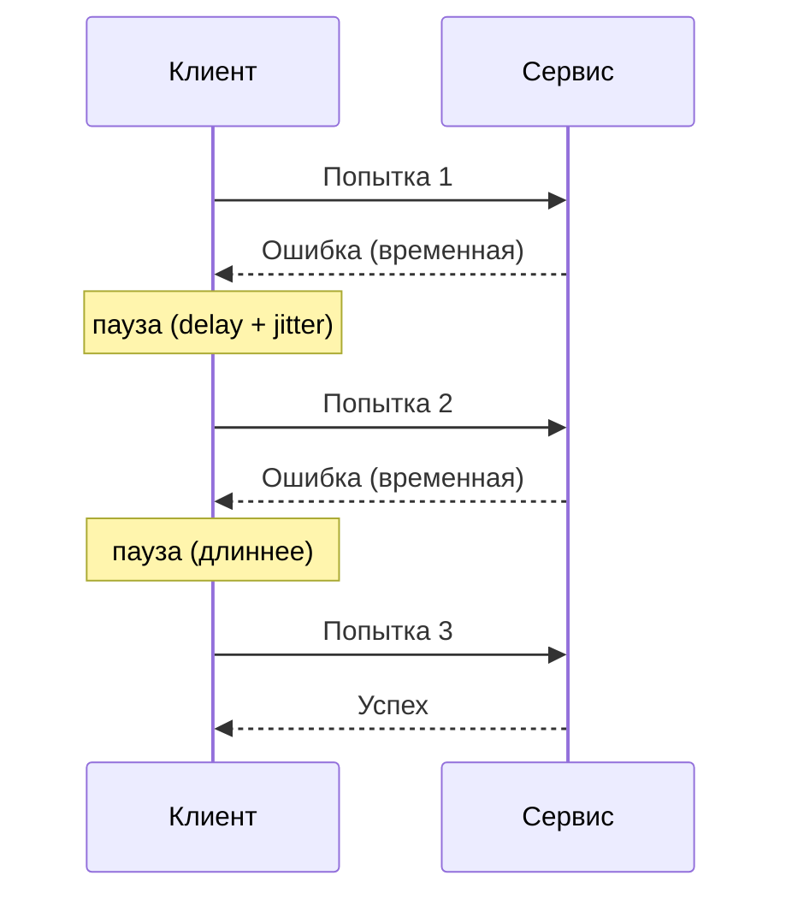
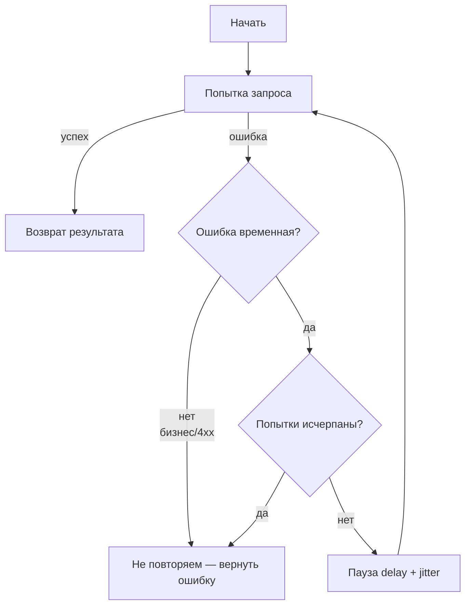

# Retries (Повторные запросы)

## Определение

**Retry (Повторный запрос)** — автоматическое выполнение операции заново, если первая попытка завершилась ошибкой, которую можно считать **временной (transient fault)**: сбой сети, рестарт реплики, превышенный таймаут, кратковременная недоступность. Идея в том, что большинство таких сбоев «самолечатся», и повтор почти наверняка пройдёт.

## Зачем нужно

- **Прятать временные сбои от пользователя** — сеть моргнула, реплика перезапустилась, балансировщик переключил: без retries клиент получит ошибку там, где фактически «почти вышло».
- **Повышать доступность и надёжность** — цепочка «повтор после короткой паузы» позволяет пережить локальные вспышки сбоев, не меняя логику.
- **Дополнять таймауты и breaker'ы** — таймаут ограничивает ожидание, breaker останавливает поток, retry — это механизм «попробовать ещё раз».



## Как работает

Базовый цикл: **попытка → временная ошибка → пауза → следующая попытка**, пока не кончится лимит попыток.



Ключевые понятия:

- **Max attempts (макс. попыток)** — конечное число, обычно 2–5. Нет «бесконечных» retries в синхронном запросе.
- **Delay (пауза)** — время между попытками. Фиксированная или растущая (см. Exponential Backoff).
- **Jitter (разброс)** — случайное смещение паузы, чтобы клиенты не повторяли запросы **синхронно** (иначе — «бьющее стадо», thundering herd).
- **Should retry (что повторять)** — только временные ошибки: сетевые, таймауты, 5xx/429 (с учётом Retry-After). **4xx не повторяем** — это ошибка запроса, повтор не поможет.
- **Retry budget (бюджет повторов)** — ограничение на долю трафика, идущего на повторы (напр., 10%), чтобы surge повторов не уронил систему.

> Полностью про то, **как** расти паузе между попытками — см. тему Exponential Backoff.

## Примеры кода

> Утилита `withRetry`: повторяет `fn`, если ошибка подходит под `shouldRetry`, конечное число раз, с паузой и небольшим jitter. Полноценный растущий backoff вынесен в тему Exponential Backoff.

### TypeScript

```typescript
const sleep = (ms: number) => new Promise<void>((r) => setTimeout(r, ms))

export interface RetryOptions {
  maxAttempts?: number
  delayMs?: number
  shouldRetry?: (error: unknown) => boolean
}

export async function withRetry<T>(
  fn: () => Promise<T>,
  { maxAttempts = 3, delayMs = 200, shouldRetry }: RetryOptions = {},
): Promise<T> {
  let lastError: unknown
  for (let attempt = 0; attempt < maxAttempts; attempt++) {
    try {
      return await fn()
    } catch (e) {
      lastError = e
      if (shouldRetry && !shouldRetry(e)) throw e
      if (attempt >= maxAttempts - 1) break
      const jitter = Math.floor(Math.random() * (delayMs / 2))
      await sleep(delayMs + jitter) // против «бьющего стада»
    }
  }
  throw lastError
}
```

### Go

```go
type RetryOptions struct {
	MaxAttempts int
	Delay       time.Duration
	ShouldRetry func(error) bool
}

func withRetry[T any](fn func() (T, error), opts RetryOptions) (T, error) {
	var zero T
	var lastErr error

	for attempt := 0; attempt < opts.MaxAttempts; attempt++ {
		value, err := fn()
		if err == nil {
			return value, nil
		}
		lastErr = err
		if opts.ShouldRetry != nil && !opts.ShouldRetry(err) {
			return zero, err // не временная — сразу наружу
		}
		if attempt >= opts.MaxAttempts-1 {
			break
		}
		// jitter: прячем поздние «синхронные повторы» всех клиентов
		jitter := time.Duration(rand.Int63n(int64(opts.Delay / 2)))
		time.Sleep(opts.Delay + jitter)
	}
	return zero, lastErr
}
```

### Java

```java
public final class Retries {

    @FunctionalInterface
    public interface Predicate {
        boolean test(Throwable error);
    }

    public static <T> T withRetry(
            java.util.function.Supplier<T> fn,
            int maxAttempts,
            long delayMs,
            Predicate shouldRetry
    ) {
        Throwable last = null;
        for (int attempt = 0; attempt < maxAttempts; attempt++) {
            try {
                return fn.get();
            } catch (RuntimeException e) {
                last = e;
                if (shouldRetry != null && !shouldRetry.test(e)) throw e;
                if (attempt >= maxAttempts - 1) break;
                long jitter = ThreadLocalRandom.current().nextLong(delayMs / 2 + 1);
                try {
                    Thread.sleep(delayMs + jitter);
                } catch (InterruptedException ie) {
                    Thread.currentThread().interrupt();
                    throw e;
                }
            }
        }
        throw new RuntimeException(last);
    }
}
```

## Пример использования: интеграция

> Retry — это обёртка вокруг вызова зависимости. Главное — повторять только временные ошибки и **не повторять неидемпотентные операции без ключа идемпотентности** (см. Idempotency).

### Express + fetch (TypeScript)

```typescript
import express from 'express'
import { withRetry } from './retry' // утилита из «Примеров кода»

const app = express()

app.get('/api/orders', async (req, res) => {
  try {
    const orders = await withRetry(
      () =>
        fetch('http://orders/api/orders').then((r) => {
          if (!r.ok) throw Object.assign(new Error(`upstream ${r.status}`), { status: r.status })
          return r.json()
        }),
      {
        maxAttempts: 3,
        delayMs: 150,
        // повторяем только временные сбои: сеть (TypeError) и 5xx/429
        shouldRetry: (e: any) => e?.status === 429 || e?.status >= 500 || e instanceof TypeError,
      },
    )
    res.json(orders)
  } catch {
    res.status(502).json({ error: 'upstream failed' })
  }
})
```

### net/http (Go)

```go
// getWithRetry делает несколько попыток GET и возвращает успешный ответ.
func getWithRetry(client *http.Client, url string, attempts int) (*http.Response, error) {
	for i := 0; i < attempts; i++ {
		resp, err := client.Get(url)
		if err == nil {
			if resp.StatusCode < 500 {
				return resp, nil // временная «неудача» только 5xx
			}
			resp.Body.Close()
		}
		if i < attempts-1 {
			// маленький роющий jitter; полный backoff — в теме Exponential Backoff
			jitter := time.Duration(rand.Int63n(100)) * time.Millisecond
			time.Sleep(150*time.Millisecond + jitter)
		}
	}
	return nil, fmt.Errorf("all %d attempts failed", attempts)
}
```

### Spring WebFlux + spring-retry (Java)

Полноценный retry в проде удобнее оставить библиотекам: в Spring это аннотация `@Retryable` (spring-retry / resilience4j-spring-boot3).

```java
import org.springframework.retry.annotation.Backoff;
import org.springframework.retry.annotation.Retryable;
import org.springframework.stereotype.Service;
import org.springframework.web.client.HttpServerErrorException;
import org.springframework.web.client.ResourceAccessException;
import org.springframework.web.client.RestTemplate;

@Service
public class OrdersClient {

    private final RestTemplate restTemplate = new RestTemplate();

    // повторяем только инфраструктурные ошибки: 5xx и недоступность сети
    @Retryable(
        retryFor = { HttpServerErrorException.class, ResourceAccessException.class },
        maxAttempts = 3,
        backoff = @Backoff(delay = 200, multiplier = 1.5, maxDelay = 2000)
    )
    public Order[] getOrders() {
        return restTemplate.getForObject("http://orders/api/orders", Order[].class);
    }
}
```

## Паттерны использования

- **Повторять только временные ошибки** — сеть, таймауты, 5xx, 429 (с уважением к `Retry-After`). 4xx не повторяем.
- **Конечное число попыток** — 2–5, никогда «пока не получится» в синхронном запросе.
- **Укладываться в общий дедлайн запроса** — сумма «таймаут + retry-паузы» не должна превышать бюджет (см. Timeouts).
- **Добавлять jitter** — без него все клиенты повторяют одновременно и создают «бьющее стадо» (thundering herd).
- **Сочетать с breaker'ом** — не ретраить, когда цепь Open: breaker и так вернёт ошибку мгновенно, retry только раздует поток.
- **Для модифицирующих запросов** — только с **идемпотентным ключом** (POST/PUT создание) либо повторять только GET/PUT-idempotent.
- **Считать повторы в метриках** — доля трафика из-за retries должна быть видна (см. Observability).

## Антипаттерны и ловушки

- **Повторять всё подряд** — включая 4xx: ошибки валидации, 401/403. Повтор не исправит запрос, а нагрузку добавит.
- **Бесконечные / огромные retries** — удерживают поток, кладут сервис под «стадом» повторов.
- **Синхронные retries без jitter** — эффект «бьющего стада»: все клиенты повторили в одно время, сервер получил лавину.
- **Retry поверх Open breaker'а** — breaker перестал пускать поток, а retry продолжает долбить впустую.
- **Повтор неидемпотентных запросов без ключа** — двойное списание, дубли ордеров (см. Idempotency).
- **Не учитывать дедлайн** — сумма retry-попыток выходит за бюджет запроса, пользователь ждёт дольше обещанного.
- **Retry внутри retry внутри retry** — вложенные бесконечные повторы на разных уровнях кратно повышают нагрузку.

## Когда использовать / когда НЕ использовать

**Использовать:**
- Сетевые вызовы и вызовы к сервисам с временными сбоями (рестарты, сеть, балансировка).
- Идемпотентные операции: `GET`, `DELETE`, `PUT`-по-id, POST с ключом идемпотентности.
- Работу с очередями/брокерами, где сообщение можно безопасно взять повторно.

**НЕ использовать:**
- Ошибки, которые повтор не исправит: **4xx** (валидация, авторизация), постоянные 5xx из-за бага.
- Неидемпотентные модификации без идемпотентного ключа (повторное списание платежа!).
- Когда ценность результата меньше стоимости повтора (тяжелая генерация отчётов, сквозная обработка).
- Когда уже есть retry на более высоком уровне (месседж-брокер, gateway) — избегаем кратности.

## Связанные темы

- **Exponential Backoff** — правильная формула роста паузы между попытками: `delay * 2^attempt` + jitter, ограничение `maxDelay`.
- **Timeouts** — что считать «ошибкой для повтора»: таймаут — временный сбой, повторить допустимо (учитывая бюджет).
- **Circuit Breakers** — когда повторять бессмысленно: Open → не ретраить, ждать восстановления.
- **Rate Limiting** — 429 требует уважать `Retry-After`, а не долбить; лимитирование и повторы нужно согласовывать.
- **Idempotency** — обязательная база для безопасных повторов модифицирующих запросов.
- **Backpressure** — если система не справляется, повторы усугубляют; правильнее вернуть «позже» и передать давление назад.

## Вопросы

### Q1
**Какие ошибки разумно повторять (retry)?**
- [x] Сетевые сбои, таймауты, 5xx, 429 с Retry-After
- [ ] Любые 4xx (валидация, 401)
- [ ] Любые 500, включая постоянные из-за бага
- [ ] Только 200 с пустым телом

Пояснение: повтор имеет смысл только для временных (transient) сбоев; 4xx — ошибка запроса, повтор не поможет.

### Q2
**Что происходит, если все клиенты повторяют запросы одновременно (без jitter)?**
- [ ] Ничего особенного
- [x] «Бьющее стадо» (thundering herd) — лавина повторов в один момент
- [ ] Повторы замедляют только одного клиента
- [ ] Сервер автоматически увеличит лимиты

Пояснение: синхронные повторы накладываются и ударяют по серверу «в один момент»; случайный jitter раскидывает их во времени.

### Q3
**Почему нельзя ретраить, когда circuit breaker в состоянии Open?**
- [ ] Breaker сам повторяет запросы
- [x] Breaker уже мгновенно отклоняет запросы; retry только раздувает трафик впустую
- [ ] Open отключает retry внутри себя
- [ ] Retry быстрее breaker'а

Пояснение: в Open запросы до зависимости не доходят — повторы не исправят ситуацию, а только создадут лишнюю нагрузку на сам клиент.

### Q4
**Что должно быть выполнено, чтобы безопасно повторять модифицирующий POST?**
- [ ] Метод всегда безопасен
- [x] Запрос идемпотентен (есть ключ идемпотентности) или повторение не создаёт побочный эффект
- [ ] Посторонний ключ для всех операций не нужен
- [ ] Достаточно ждать 10 секунд между попытками

Пояснение: повтор неидемпотентного POST может создать дубль (двойное списание, два ордера). Наличие идемпотентного ключа позволяет серверу безопасно выполнить повтор.

### Q5
**Какой «бюджет» важен при ретраях в синхронном запросе?**
- [ ] Только число попыток
- [x] Сумма «попытки + паузы» должна укладываться в общий дедлайн запроса пользователя
- [ ] Всегда можно ждать сколько угодно
- [ ] Бюджет равен одному таймауту

Пояснение: повторные попытки увеличивают общее время; если они выходят за deadline, пользователь ждёт дольше обещанного — целесообразнее отдать ошибку раньше.

## Источники

- AWS SDK — Retry behavior: https://docs.aws.amazon.com/sdkref/latest/guide/feature-retry-behavior.html
- AWS Architecture Blog — Exponential Backoff And Jitter: https://aws.amazon.com/blogs/architecture/exponential-backoff-and-jitter/
- Google Cloud Storage — Retry strategy: https://cloud.google.com/storage/docs/retry-strategy
- Google SRE Book — Retry budget / cascading failures: https://sre.google/sre-book/addressing-cascading-failures/
- Resilience4j — Retry module: https://resilience4j.readme.io/docs/retry
- Spring Retry (Java): https://docs.spring.io/spring-retry/reference/