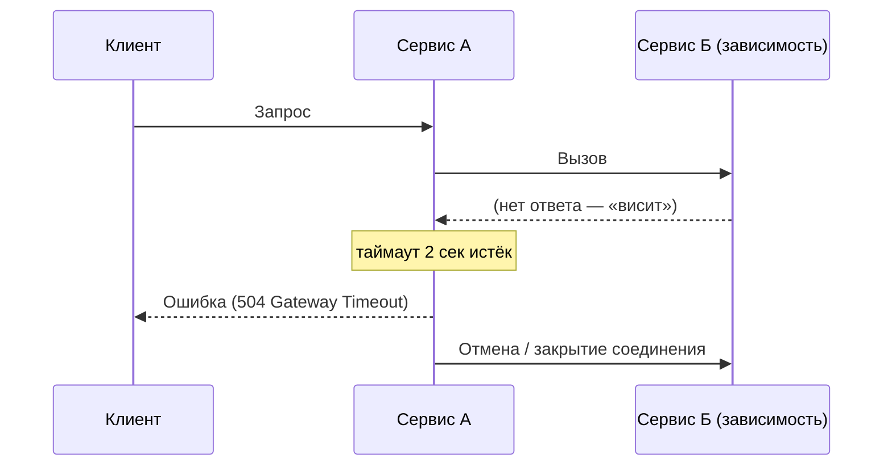
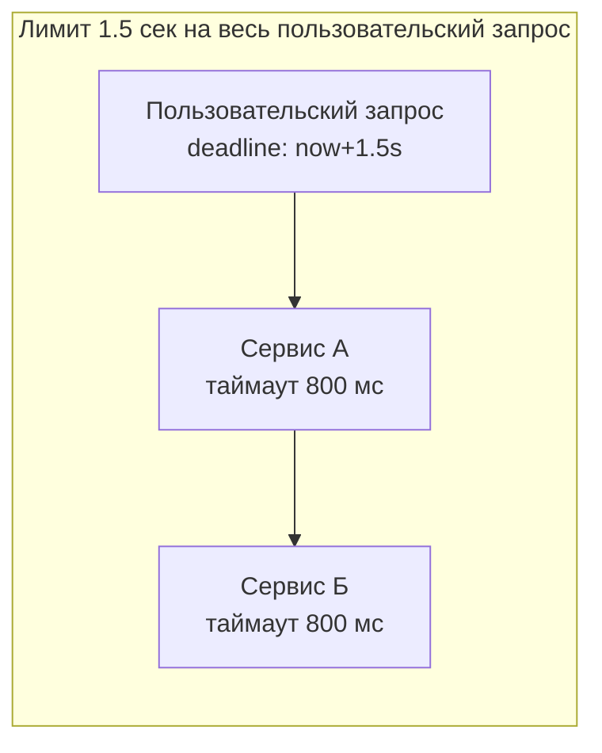

# Timeouts (Таймауты)

## Определение

**Timeout (Таймаут)** — максимальное время, которое система готова ждать ответ от вызова (сетевого запроса, базы данных, другого сервиса). Если за это время ответа нет, вызов **прерывается с ошибкой** (например, 504 Gateway Timeout), а занимаемые им ресурсы освобождаются. Близкое понятие — **deadline (крайний срок)**: абсолютная точка времени, к которой вся цепочка операций должна завершиться.

## Зачем нужно

- **Не держать потоки и соединения вечно** — зависший вызов «съедает» поток пула, TCP-соединение, сокет. Битых потоков много → пул исчерпан → сервис не принимает ни новые запросы, ни здоровые.
- **Не дать зависнуть запросу пользователя** — без таймаута клиент видит бесконечное ожидание, уходит, а ресурсы продолжают тратиться.
- **Предотвратить каскад** — если каждый узел ждёт ответа вечно, цепочка из N сервисов может «повиснуть» целиком.
- **Ограничить время восстановления** — пауза для манипуляций «перестало отвечать → пробуем снова» управляется таймаутами и retries.

## Как работает

Один таймаут похож на будильник: попросили — завели таймер — дождались ответа либо **отмены/ошибки**.



Ключевые понятия:

- **Connection timeout (таймаут соединения)** — сколько ждать установления TCP-соединения.
- **Read / response timeout (таймаут ответа)** — сколько ждать данные после того, как соединение установлено.
- **Request timeout (общий)** — суммарное время на весь запрос (часто включает connect + read + обработку).
- **Deadline (крайний срок)** — абсолютное время `now + лимит`, пробрасывается через всю цепочку вызовов (см. диаграмму ниже).
- **Budget (бюджет времени)** — сколько времени разрешено потратить на все вызовы внутри запроса.



Правило: **сумма таймаутов вложенных вызовов не должна превышать бюджет запроса**. Каждое звено должно иметь запас на вызов «в свою сторону» и на передачу ошибки обратно.

## Примеры кода

> Как задать таймаут исходящего вызова в трёх языках. Во всех случаях переданный дедлайн распространяется на сетевой вызов и отменяет его по истечении.

### TypeScript

```typescript
// Универсальный helper: выполняет fn, но прерывает её через timeoutMs.
export function withTimeout<T>(
  fn: (signal: AbortSignal) => Promise<T>,
  timeoutMs: number,
): Promise<T> {
  const controller = new AbortController()
  const timer = setTimeout(() => controller.abort(), timeoutMs)
  return fn(controller.signal).finally(() => clearTimeout(timer))
}

// Пример: запрос к downstream с таймаутом 3 секунды
const res = await withTimeout(
  (signal) => fetch('https://payments/api/charge', { signal }),
  3000,
)

// Node 17.3+ / современные браузеры: встроенный таймаут в fetch
const res2 = await fetch('https://orders/api/orders', {
  signal: AbortSignal.timeout(3000),
})
// при превышении abort() бросает AbortError/TimeoutError
```

### Go

```go
// context.WithTimeout создаёт дедлайн и пробрасывается в HTTP-вызов.
ctx, cancel := context.WithTimeout(r.Context(), 3*time.Second)
defer cancel()

req, err := http.NewRequestWithContext(ctx, "GET", "https://orders/api/orders", nil)
if err != nil {
	panic(err) // создание запроса не сетевой вызов
}

resp, err := http.DefaultClient.Do(req)
if err != nil {
	if errors.Is(err, context.DeadlineExceeded) {
		// истёк дедлайн — отвечаем 504
		fmt.Println("timeout")
	} else {
		// прочие сетевые ошибки
		fmt.Println("network error")
	}
}
```

### Java

```java
// Вариант 1: блокирующий get() со временем ожидания
CompletableFuture<String> future = asyncCall();
try {
    String result = future.get(3, TimeUnit.SECONDS);
    System.out.println(result);
} catch (TimeoutException e) {
    System.out.println("timeout"); // будущий результат больше не нужен
}

// Вариант 2: неблокирующий orTimeout (Java 9+)
future
    .orTimeout(3, TimeUnit.SECONDS)
    .exceptionally(ex -> "fallback");
```

## Пример использования: интеграция

> Запрос пользователя должен иметь **общий бюджет времени** (deadline), а каждый исходящий вызов — свой таймаут, меньший бюджета. Так мы успеваем ответить пользователю ошибкой, а не «повиснуть» на цепочке зависимостей.

### Express (TypeScript)

```typescript
import express from 'express'
import { withTimeout } from './timeout' // helper из «Примеров кода»

const app = express()
const TOTAL_BUDGET_MS = 1_500 // на весь запрос пользователя
const DOWNSTREAM_TIMEOUT_MS = 800 // на одно звено

// middleware: общий дедлайн на входящий запрос
app.use((req, res, next) => {
  const timer = setTimeout(() => {
    res.status(504).json({ error: 'gateway timeout' })
  }, TOTAL_BUDGET_MS)
  res.on('finish', () => clearTimeout(timer))
  next()
})

app.get('/api/orders', async (req, res) => {
  try {
    const r = await withTimeout(
      (signal) => fetch('http://orders/api/orders', { signal }),
      DOWNSTREAM_TIMEOUT_MS,
    )
    res.json(await r.json())
  } catch {
    // таймаут звена или сеть — быстрый 504, а не долгий «висяк»
    res.status(504).json({ error: 'timed out' })
  }
})
```

### net/http (Go)

```go
// context.WithTimeout делает общий дедлайн видимым для всех вложенных вызовов,
// которые принимают context.Context — он отменится автоматически.
ctx, cancel := context.WithTimeout(r.Context(), 1_500*time.Millisecond)
defer cancel()

// http.Client со своим таймаутом на весь HTTP-обмен (как резервная граница)
client := &http.Client{Timeout: 800 * time.Millisecond}

req, err := http.NewRequestWithContext(ctx, "GET", "http://orders/api/orders", nil)
if err != nil {
	http.Error(w, "bad request", http.StatusBadRequest)
	return
}

resp, err := client.Do(req)
if err != nil {
	if errors.Is(err, context.DeadlineExceeded) {
		http.Error(w, "gateway timeout", http.StatusGatewayTimeout)
		return
	}
	http.Error(w, "bad gateway", http.StatusBadGateway)
	return
}
defer resp.Body.Close()
```

### Spring WebFlux (Java)

```java
import java.time.Duration;
import reactor.core.publisher.Mono;
import io.netty.channel.ChannelOption;
import org.springframework.http.client.reactive.ReactorClientHttpConnector;
import org.springframework.web.reactive.function.client.WebClient;
import reactor.netty.http.client.HttpClient;

// Таймауты лучше выносить в конфигурацию клиента:
public static WebClient ordersClient() {
    HttpClient reactor = HttpClient.create()
        .option(ChannelOption.CONNECT_TIMEOUT_MILLIS, 500)           // соединение
        .responseTimeout(Duration.ofMillis(800));                    // ответ
    return WebClient.builder()
        .baseUrl("http://orders")
        .clientConnector(new ReactorClientHttpConnector(reactor))
        .build();
}

// В сервисе: общий бюджет запроса ограничиваем оператором timeout()
Mono<Order> fetchOrder(String id) {
    return ordersClient().get().uri("/orders/{id}", id)
        .retrieve().bodyToMono(Order.class)
        .timeout(Duration.ofMillis(1500))                            // бюджет
        .onErrorResume(TimeoutException.class, e -> Mono.error(
            new GatewayTimeoutException()));
}
```

## Паттерны использования

- **Давать таймауты всем вызовам I/O** — сеть, БД, HTTP, файловые операции. «Бесконечное ожидание» — почти всегда баг.
- **Hierarchy of deadlines** — общий бюджет на запрос + меньшие таймауты на звенья. Сумма звеньев < бюджета.
- **Пробрасывать deadline (deadline propagation)** — передавать контекст/deadline через цепочку (context в Go, сигнал в node-fetch/AbortController, WebClient timeout).
- **Таймаут на запрос должен быть больше, чем обычно быстрый ответ** — ориентироваться на p99 задержки зависимости + запас; слишком агрессивный таймаут режет здоровые медленные запросы (см. p99 / tail latency).
- **Отменять работу по истечении** — после таймаута надо реально прерывать вызов (abort/close), а не просто вернуть ошибку, иначе потоки занимаются впустую.
- **Логировать и мониторить таймауты** — отдельно от других ошибок, чтобы видеть деградацию зависимостей (см. Observability).

## Антипаттерны и ловушки

- **Вообще не ставить таймауты** — «если сервис не отвечает, пусть висит» — главный источник каскадных сбоев.
- **Ставить только connect timeout** — соединение установилось, а чтение ответа может висеть бесконечно.
- **Бюджет больше суммы звеньев** — время «само в себя»: каждое звено ждёт по максимуму, в итоге ответ пользователю приходит за сумму таймаутов, а не за бюджет.
- **Не пробрасывать deadline** — каждый уровень «переустанавливает» свой таймаут заново вместо использования общего — суммарное ожидание не контролируется.
- **Compensating retries без учёта бюджета** — retries, которые в сумме превышают общий дедлайн запроса (см. Retries, Exponential Backoff).
- **Ожидание сброса таймаута после каждого чанка** — read timeout, перезапускаемый на каждый байт, превращается в бесконечный (мы не детализируем здесь, но это классическая ловушка socket-level).
- **Слишком маленький таймаут** — здоровые запросы, которые просто медленнее, начинают падать (ложные срабатывания).

## Когда использовать / когда НЕ использовать

**Использовать:**
- Все сетевые вызовы: HTTP/RPC, БД, внешние API.
- Цепочки вызовов, где важен общий бюджет ответа пользователю.
- Операции, которые могут «висеть» из-за зависания зависимости (сеть, диск, сложные запросы).

**НЕ использовать (в классическом виде):**
- **Long polling**-подходы и **WebSocket/SSE** — там подключение держат открытым умышленно долго; вместо жёсткого таймаута используют heartbeat/ping и собственную логику «тишины» (см. WebSockets, Long Polling, SSE).
- **Фоновые очереди задач** — если задача может быть очень долгой по своей природе, таймаут на «выполнилось ли всё» не применяют; ограничивают только отдельные шаги.
- Вместо таймаута на каждый запрос в асинхронных брокерах корректнее использовать **retry/backpressure** (см. связанные темы).

## Связанные темы

- **Circuit Breakers** — логичное продолжение: когда таймауты срабатывают слишком часто, breaker размыкает цепь и перестаёт ходить в упавшую зависимость.
- **Retries** — повторные попытки после таймаута; важно укладываться в общий бюджет запроса.
- **Exponential Backoff** — увеличивающиеся паузы между retries дают упавшей зависимости время на восстановление (и укладывают retries в дедлайн).
- **Rate Limiting** — ограничивает частоту запросов; таймаут ограничивает длительность одного.
- **Backpressure** — если ответов больше, чем обработчики успевают, таймаут «на всё» не поможет; нужна передача давления назад в очередь/поток.
- **WebSockets / Long Polling / SSE** — сценарии, где долгая «тишина» ожидаема и таймаутом не лечится.

## Вопросы

### Q1
**Что происходит с занимаемыми ресурсами, когда наступил таймаут вызова?**
- [ ] Поток продолжает ждать, соединение виснет
- [x] Вызов отменяется (abort/close), поток и соединение освобождаются
- [ ] Запрос ставится в очередь для повтора
- [ ] Ресурсы блокируются навсегда

Пояснение: смысл таймаута — именно освободить поток/соединение; без реальной отмены (abort/close) таймаут не освободит ресурсы.

### Q2
**В чём разница между timeout и deadline в цепочке вызовов?**
- [ ] Никакой разницы, это синонимы
- [x] Timeout — свой лимит на одно звено; deadline — общая абсолютная граница (now + лимит), пробрасываемая по цепочке
- [ ] Deadline ставится только на БД
- [ ] Timeout длиннее deadline по определению

Пояснение: deadline задаёт крайний срок всего запроса и переносится во вложенные вызовы; таймауты отдельных звеньев должны укладываться в этот бюджет.

### Q3
**Какое правило для бюджетов звеньев относительно общего бюджета запроса?**
- [ ] Сумма может быть любой, главное — таймауты вообще есть
- [x] Сумма таймаутов вложенных вызовов не должна превышать бюджет запроса
- [ ] Бюджет запроса должен быть меньше любого звена
- [ ] Каждое звено получает весь бюджет целиком

Пояснение: иначе цепочка из N звеньев ждёт по очереди по максимуму, и запрос пользователя «висит» сумму таймаутов — каскад не остановится вовремя.

### Q4
**Почему таймаут только на установку соединения — это часто ловушка?**
- [ ] Соединение устанавливается мгновенно бесплатно
- [x] Соединение может установиться, а данные из ответа висеть бесконечно — нужен и read/response timeout
- [ ] Таймаут соединения всегда больше read
- [ ] Соединение нельзя отменить

Пояснение: connect timeout защищает только фазу установления TCP; после него ответ может ждать неограниченно. Нужны отдельные таймауты на чтение/ответ.

### Q5
**Где классический таймаут «на всё» скорее мешает?**
- [ ] Внешние HTTP API
- [x] WebSocket / SSE / Long Polling и долгие фоновые задачи
- [ ] Запросы к БД
- [ ] RPC-вызовы между сервисами

Пояснение: в долгоживущих подключениях «тишина» — норма, там используют heartbeat/ping; в очереди задач ограничивают отдельные шаги, а не всё выполнение.

## Источники

- Google SRE Book — «Managing Timeouts and Retries»: https://sre.google/sre-book/addressing-cascading-failures/
- Сайт о cascading failures (Timeouts and deadlines): https://bennet.org/cascading-failures/
- MDN AbortSignal.timeout (TypeScript/Node): https://developer.mozilla.org/en-US/docs/Web/API/AbortSignal/timeout
- Go context package (context.WithTimeout): https://pkg.go.dev/context
- Java CompletableFuture.orTimeout / Future.get: https://docs.oracle.com/en/java/javase/17/docs/api/java.base/java/util/concurrent/CompletableFuture.html
- Reactor — timeout operator (Spring WebFlux): https://projectreactor.io/docs/core/release/api/reactor/core/publisher/Mono.html