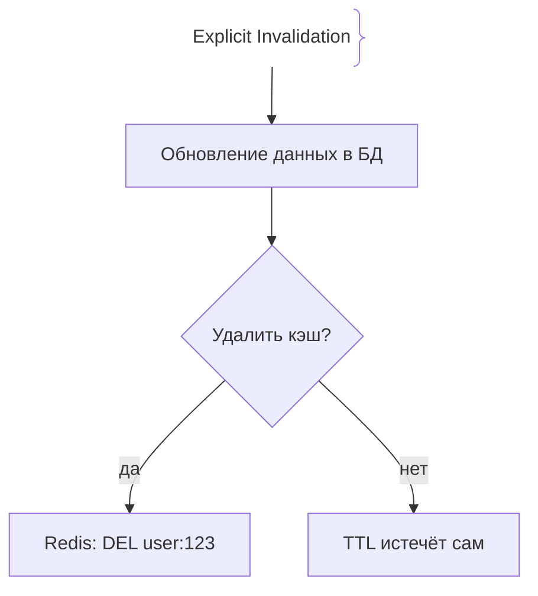
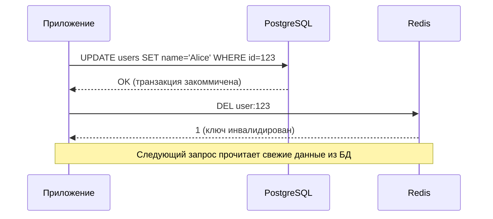

# Инвалидация кэша (Cache Invalidation)

Инвалидация кэша (Cache Invalidation) — это процесс удаления или обновления устаревших данных в кэше после того, как исходные данные в персистентной базе данных были изменены. В компьютерных науках существует знаменитая цитата: *«There are only two hard things in Computer Science: cache invalidation and naming things»*.

## Зачем нужна инвалидация кэша

Если данные в базе данных изменились (например, пользователь обновил профиль или сменилась цена товара), а в кэше осталась старая версия, возникает проблема несогласованности данных (Stale Data). Пользователи будут видеть устаревшую информацию, что критично для финансовых и транзакционных систем.

## Основные стратегии инвалидации

1. **TTL (Time-To-Live):** Автоматическое истечение срока жизни ключа. Просто в реализации, но допускает окно несогласованности до истечения TTL.
2. **Explicit Invalidation (Явное удаление):** При изменении данных в БД приложение явно вызывает команду удаления/обновления ключа в кэше (например, `DEL user:123`).
3. **Write-Through / Write-Back:** Обновление кэша одновременно с записью в БД.
4. **Cache Tagging / Versioning:** Добавление версии или тегов к ключам кэша (например, `users:v2:123`), позволяя сбрасывать целые группы ключей одной операцией.

## Как работает инвалидация





## Примеры кода

> Ключевые сценарии: явное удаление ключа кэша после апдейта в БД на TypeScript, Go и Java.

### TypeScript (Node.js с ioredis)

```typescript
import Redis from 'ioredis';

const redis = new Redis();

interface UserUpdateInput {
  name: string;
}

async function updateUser(userId: string, input: UserUpdateInput): Promise<void> {
  // 1. Обновляем данные в БД (эмуляция)
  await dbUpdateUser(userId, input);

  // 2. Инвалидируем кэш явно (удаляем ключ)
  const cacheKey = `user:${userId}`;
  await redis.del(cacheKey);
}

async function dbUpdateUser(id: string, input: UserUpdateInput): Promise<void> {
  // Эмуляция SQL UPDATE
  console.log(`Updated user ${id} in DB to ${input.name}`);
}
```

### Go (go-redis)

```go
package main

import (
	"context"
	"fmt"

	"github.com/redis/go-redis/v9"
)

var ctx = context.Background()

func UpdateUser(rdb *redis.Client, userID string, newName string) error {
	// 1. Обновление в БД
	err := dbUpdateUser(userID, newName)
	if err != nil {
		return err
	}

	// 2. Явная инвалидация кэша
	cacheKey := fmt.Sprintf("user:%s", userID)
	return rdb.Del(ctx, cacheKey).Err()
}

func dbUpdateUser(id, name string) error {
	return nil
}
```

### Java (Spring Data Redis)

```java
import org.springframework.data.redis.core.StringRedisTemplate;
import org.springframework.stereotype.Service;
import org.springframework.transaction.annotation.Transactional;

@Service
public class UserUpdateService {

    private final StringRedisTemplate redisTemplate;

    public UserUpdateService(StringRedisTemplate redisTemplate) {
        this.redisTemplate = redisTemplate;
    }

    @Transactional
    public void updateUser(String userId, String newName) {
        // 1. Обновление в базе данных
        dbUpdateUser(userId, newName);

        // 2. Инвалидация кэша
        String cacheKey = "user:" + userId;
        redisTemplate.delete(cacheKey);
    }

    private void dbUpdateUser(String id, String name) {
        // Эмуляция сохранения в БД
    }
}
```

## Вопросы

### Q1
**Почему инвалидация кэша считается одной из самых сложных задач в разработке?**
- [ ] Кэш занимает слишком много места на диске
- [x] Из-за распределённой природы систем трудно обеспечить атомарность и согласованность между изменением в БД и очисткой кэша по сети
- [ ] Redis написан на языке C
- [ ] Кэш нельзя удалить вручную

Пояснение: Если между обновлением БД и удалением кэша произойдет сбой сети или сервера, система останется в состоянии несогласованности данных.

### Q2
**Что такое паттерн Cache Tagging (тегирование кэша)?**
- [ ] Добавление стикеров на монитор
- [x] Связывание нескольких ключей кэша с общим тегом, что позволяет сбрасывать целую группу ключей одной операцией инвалидации
- [ ] Шифрование кэша по тегам безопасности
- [ ] Обязательное логирование HTTP-заголовков

Пояснение: Тегирование позволяет одной командой инвалидировать множество связанных ключей (например, все кэши товаров определенной категории).

### Q3
**Какой главный недостаток использования только TTL (без явной инвалидации)?**
- [ ] TTL невозможно настроить в Redis
- [x] Окно устаревания данных (Stale Data Window): пользователи видят старые данные до тех пор, пока TTL не истечет
- [ ] TTL приводит к падению базы данных
- [ ] Кэш удаляется мгновенно при каждом запросе

Пояснение: TTL полагается на время, а не на события изменения данных, что гарантирует несогласованность данных в течение времени жизни TTL.

### Q4
**Что лучше делать первым при изменении данных: обновлять БД или удалять кэш (в стратегии Cache-Aside)?**
- [ ] Сначала удалить кэш, потом обновить БД
- [x] Сначала обновить БД (закоммитить транзакцию), а затем удалить кэш
- [ ] Порядок не имеет никакого значения
- [ ] Обновлять только кэш, игнорируя БД

Пояснение: Обновление БД должно завершиться успешно (commit), прежде чем мы инвалидируем кэш, иначе можно закешировать грязные данные из незакоммиченной транзакции.

### Q5
**Что такое гонка данных (Race Condition) при инвалидации кэша?**
- [ ] Соревнование между серверами по скорости пинга
- [x] Ситуация, когда параллельный поток успевает записать старые данные из БД в кэш *после* того, как другой поток выполнил инвалидацию
- [ ] Удаление ключа по таймеру
- [ ] Ошибка компиляции кода на Go

Пояснение: Если между операцией удаления кэша и чтением из БД втиснется другой поток, он может прочитать старые данные из незавершенной транзакции и снова записать их в кэш.

## Источники

- Martin Kleppmann — Designing Data-Intensive Applications (Caching chapters)
- AWS Caching Strategies: https://aws.amazon.com/caching/
- Redis Best Practices for Invalidation: https://redis.io/docs/manual/patterns/
