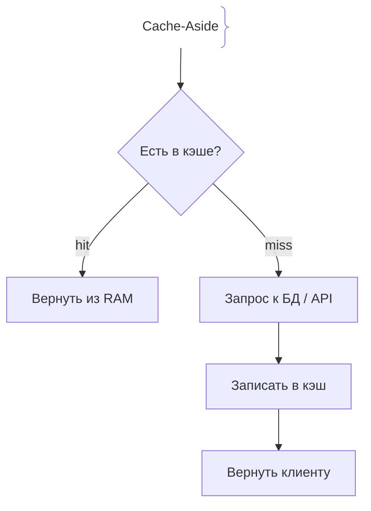
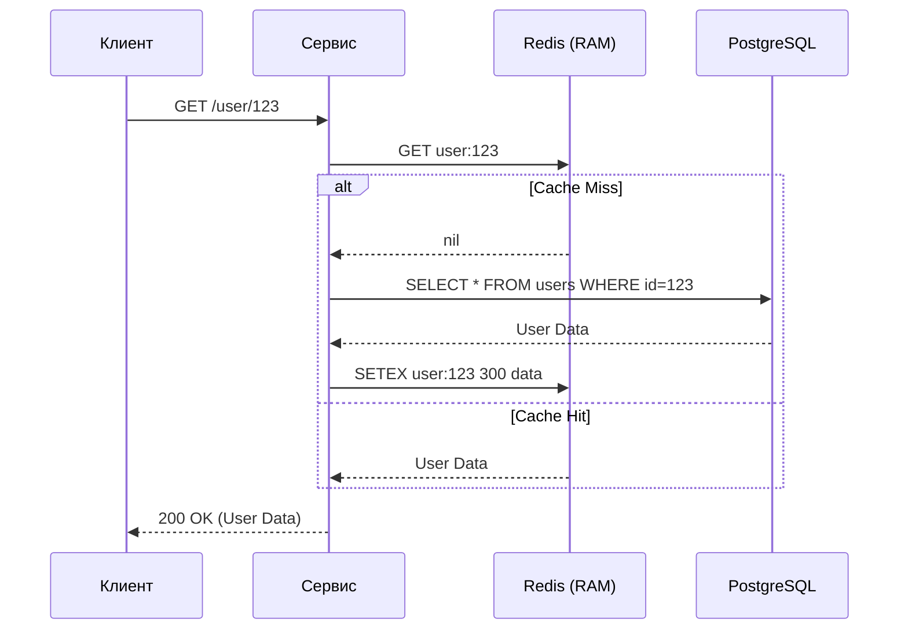

# Основы кэширования (Caching Basics)

## Определение

Кэширование (Caching) — это процесс сохранения копии часто запрашиваемых или ресурсоёмких данных в быстром хранилище (обычно в оперативной памяти) для уменьшения времени ответа системы и снижения нагрузки на персистентные базы данных или внешние API.

## Зачем нужно кэширование

В современных распределённых системах персистентные базы данных (PostgreSQL, MySQL) и сетевые вызовы являются главным узким горлышком (bottleneck) по производительности и масштабируемости. 
- Обращение к диску (SSD/HDD) занимает миллисекунды, тогда как чтение из оперативной памяти (RAM) — наносекунды.
- Сетевые вызовы между микросервисами добавляют сетевой latency (RTT).
- Кэш позволяет обслуживать тысячи RPS (requests per second) с минимальными задержками.

## Как работает кэширование

### Основные стратегии

1. **Cache-Aside (Lazy Loading):** Приложение сначала проверяет кэш. Если данных нет (Cache Miss), оно читает из БД, записывает результат в кэш и возвращает клиенту.
2. **Write-Through:** При записи данные обновляются и в кэше, и в БД синхронно.
3. **Write-Back (Write-Behind):** Данные пишутся в кэш, а в БД сбрасываются асинхронно пачками.





## Примеры кода

> Ключевые сценарии: реализация паттерна **Cache-Aside** на TypeScript, Go и Java с использованием Redis.

### TypeScript (Node.js с ioredis)

```typescript
import Redis from 'ioredis';

const redis = new Redis();

interface User {
  id: string;
  name: string;
}

async function getUser(userId: string): Promise<User | null> {
  const cacheKey = `user:${userId}`;
  
  // 1. Проверяем кэш
  const cached = await redis.get(cacheKey);
  if (cached) {
    return JSON.parse(cached) as User;
  }

  // 2. Cache Miss: идём в БД (эмуляция)
  const user = await fetchUserFromDB(userId);
  if (!user) return null;

  // 3. Сохраняем в кэш с TTL 5 минут (300 секунд)
  await redis.setex(cacheKey, 300, JSON.stringify(user));

  return user;
}

async function fetchUserFromDB(id: string): Promise<User | null> {
  // Эмуляция SQL запроса
  return { id, name: 'Alice' };
}
```

### Go (go-redis)

```go
package main

import (
	"context"
	"encoding/json"
	"fmt"
	"time"

	"github.com/redis/go-redis/v9"
)

type User struct {
	ID   string `json:"id"`
	Name string `json:"name"`
}

var ctx = context.Background()

func GetUser(rdb *redis.Client, userID string) (*User, error) {
	cacheKey := fmt.Sprintf("user:%s", userID)

	// 1. Чтение из Redis
	val, err := rdb.Get(ctx, cacheKey).Result()
	if err == nil {
		var user User
		if json.Unmarshal([]byte(val), &user) == nil {
			return &user, nil
		}
	}

	// 2. Cache Miss: запрос в БД
	user, err := fetchUserFromDB(userID)
	if err != nil {
		return nil, err
	}

	// 3. Запись в кэш с TTL
	data, _ := json.Marshal(user)
	rdb.Set(ctx, cacheKey, data, 5*time.Minute)

	return user, nil
}

func fetchUserFromDB(id string) (*User, error) {
	return &User{ID: id, Name: "Bob"}, nil
}
```

### Java (Spring Data Redis)

```java
import org.springframework.data.redis.core.StringRedisTemplate;
import org.springframework.stereotype.Service;
import com.fasterxml.jackson.databind.ObjectMapper;
import java.time.Duration;

@Service
public class UserService {

    private final StringRedisTemplate redisTemplate;
    private final ObjectMapper objectMapper;

    public UserService(StringRedisTemplate redisTemplate, ObjectMapper objectMapper) {
        this.redisTemplate = redisTemplate;
        this.objectMapper = objectMapper;
    }

    public User getUser(String userId) {
        String cacheKey = "user:" + userId;
        
        try {
            // 1. Проверка кэша
            String cached = redisTemplate.opsForValue().get(cacheKey);
            if (cached != null) {
                return objectMapper.readValue(cached, User.class);
            }

            // 2. Cache Miss: запрос в БД
            User user = fetchUserFromDB(userId);
            if (user == null) return null;

            // 3. Сохранение в кэш (TTL 5 минут)
            String json = objectMapper.writeValueAsString(user);
            redisTemplate.opsForValue().set(cacheKey, json, Duration.ofMinutes(5));

            return user;
        } catch (Exception e) {
            // Fallback: при сбое кэша идём в БД напрямую
            return fetchUserFromDB(userId);
        }
    }

    private User fetchUserFromDB(String id) {
        return new User(id, "Charlie");
    }
}

class User {
    public String id;
    public String name;
    public User() {}
    public User(String id, String name) {
        this.id = id;
        this.name = name;
    }
}
```

## Пример использования: интеграция

Встроим Cache-Aside в сервисный слой: сначала Redis, при промахе — БД и заполнение кэша с TTL.

```ts
import Redis from 'ioredis'
const redis = new Redis(process.env.REDIS_URL)

export async function cached(id: string, load: () => Promise<User>) {
  const key = `user:${id}`
  const hit = await redis.get(key)
  if (hit) return JSON.parse(hit) as User
  const fresh = await load()
  await redis.set(key, JSON.stringify(fresh), 'EX', 300)
  return fresh
}
```

Ключ создаётся с префиксом сущности (`user:<id>`), TTL выставляется сразу при записи — это снимает риск «вечного» устаревшего значения.

## Паттерны использования

- **Cache-Aside как базовый паттерн** — подходит для read-heavy нагрузок; промах перекрывает сам себя, кладя результат обратно.
- **TTL с небольшим jitter по умолчанию** — даже «постоянным» данным дают часы жизни, чтобы устаревание наступало, а не зависело от ручной чистки.
- **Версия в ключе** (`users:v2:<id>`) — сброс целой группы ключей одним изменением префикса.
- **Деградация в фоне** — при недоступности Redis сервис продолжает читать из БД: кэш всегда оптимизация, а не источник истины.

## Антипаттерны и ловушки

- **Cache stampede (thundering herd)** — при массовом истечении TTL все потоки идут в БД одновременно; лечится jitter TTL, singleflight-блокировкой, stale-while-revalidate.
- **Бесконечный TTL** — данные живут навсегда, пока кто-то вручную не удалит ключ.
- **Кэширование уникальных данных** — ключ читается один раз, RAM расходуется впустую.
- **Гигантские значения на ключ** — несколько МБ замедляют сетевой обмен и вытесняют другие записи.

## Когда использовать / когда НЕ использовать

- **Использовать:** часто читаемые и редко меняющиеся данные (каталоги, настройки, сессии), тяжёлые запросы к БД, результаты, идентичные для многих пользователей.
- **НЕ использовать:** write-heavy таблицы, где запись чаще чтения; данные с жёсткими требованиями к актуальности (балансы, остатки); когда издержки инвалидации выше выигрыша от чтения.

## Связанные темы

- **cache-invalidation** — как и когда удалять устаревшие ключи после апдейтов в БД.
- **edge-caching** — вынос кэша ближе к пользователю через CDN.

## Вопросы

### Q1
**В чём главное отличие Cache-Aside (Lazy Loading) от Write-Through?**
- [ ] Cache-Aside работает только с диском
- [x] При Cache-Aside приложение само управляет загрузкой в кэш при промахе, а при Write-Through данные пишутся в кэш и БД синхронно
- [ ] Write-Through не использует память
- [ ] Между ними нет разницы

Пояснение: Cache-Aside загружает данные «по требованию» при промахе кэша, тогда как Write-Through обновляет кэш при каждой записи в систему.

### Q2
**Что происходит при Cache Miss в паттерне Cache-Aside?**
- [ ] Приложение возвращает ошибку 500
- [x] Приложение читает данные из персистентной БД, сохраняет их в кэш и возвращает клиенту
- [ ] Кэш автоматически запрашивает данные у клиента
- [ ] Данные удаляются из базы данных

Пояснение: Cache Miss означает отсутствие ключа в кэше, поэтому требуется fallback-чтение из источника (БД) с последующим прогревом кэша.

### Q3
**Какой тип хранилища чаще всего используется для распределённого кэша?**
- [ ] HDD диски с файловой системой
- [x] In-memory базы данных, такие как Redis или Memcached
- [ ] Реляционные БД с репликацией
- [ ] Объектные хранилища S3

Пояснение: In-memory хранилища обеспечивают микросекундный доступ к данным, что критично для производительности кэша.

### Q4
**Зачем задавать TTL (Time-To-Live) для записей в кэше?**
- [ ] Чтобы забить оперативную память мусором
- [x] Для автоматического устаревания старых данных и предотвращения постоянного хранения неактуальной информации
- [ ] Для ускорения записи в жесткий диск
- [ ] TTL нужен только для безопасности TLS

Пояснение: TTL ограничивает время жизни ключа в кэше, помогая бороться со stale data (устаревшими данными).

### Q5
**Что такое Cache Stampede (Thundering Herd)?**
- [ ] Обычное чтение из кэша
- [x] Ситуация, когда при истечении TTL популярного ключа тысячи одновременных запросов идут в БД одновременно, перегружая её
- [ ] Полное отключение питания сервера
- [ ] Синхронизация реплик в PostgreSQL

Пояснение: Cache Stampede возникает, когда популярный ключ инвалидируется, и лавина одновременных запросов пробивает кэш в базу данных.

## Источники

- Redis Documentation: https://redis.io/docs/
- AWS Architecture Center - Caching Best Practices: https://aws.amazon.com/caching/
- Martin Kleppmann — Designing Data-Intensive Applications
