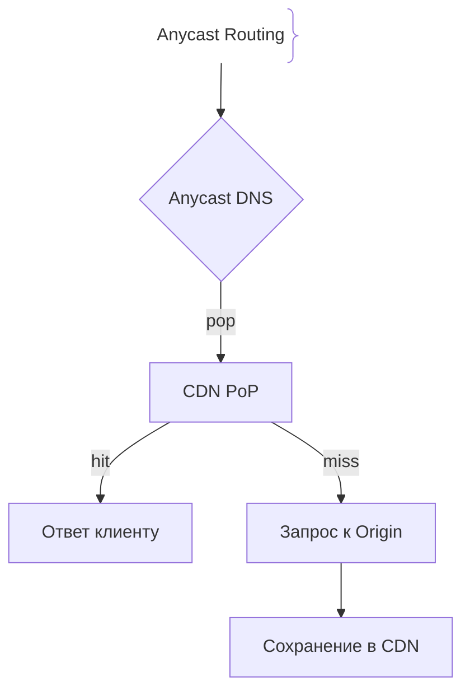
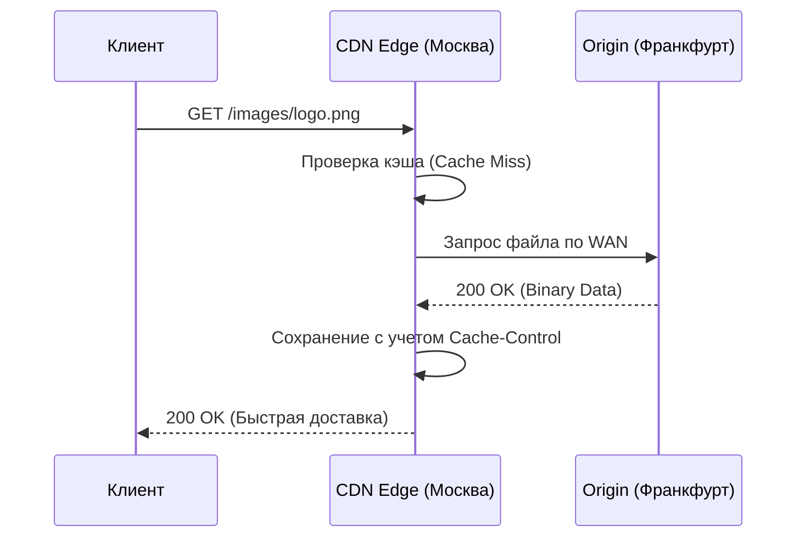

# CDN (Сеть доставки контента)

## Определение

CDN (Content Delivery Network) — это географически распределенная сеть прокси-серверов, которая кэширует и доставляет статический (и частично динамический) контент пользователям с минимальной сетевой задержкой, опираясь на их физическое местоположение (Anycast DNS и точки присутствия — PoP).

## Зачем нужен CDN

Главные проблемы прямого обращения к центральному серверу (Origin) — высокая сетевая задержка (RTT) при удалении клиента, перегрузка входящего интернет-канала и уязвимость перед DDoS-атаками.
- **Минимизация RTT:** Контент раздается с ближайшей PoP-ноды CDN.
- **Разгрузка Origin:** Потоки статики (картинки, JS, CSS, видео) полностью обслуживаются сетью CDN, снижая нагрузку на бэкенд на 80-90%.
- **Масштабируемость и DDoS-защита:** CDN поглощает гигантские объемы трафика за счет распределенной инфраструктуры.

## Как работает CDN





## Примеры кода

> Ключевые сценарии: генерация URL для CDN с версионированием статики в TypeScript, Go и Java.

### TypeScript (Helpers для статики)

```typescript
const CDN_HOST = 'https://cdn.example.com';

function getCdnUrl(assetPath: string, version: string): string {
  // Добавление версии или хеша файла гарантирует инвалидацию при деплое
  return `${CDN_HOST}/${version}${assetPath}`;
}

// Использование
const logoUrl = getCdnUrl('/images/logo.png', 'v1.0.4');
console.log(logoUrl); // https://cdn.example.com/v1.0.4/images/logo.png
```

### Go (URL Builder)

```go
package main

import (
	"fmt"
)

const cdnHost = "https://cdn.example.com"

func BuildCdnURL(path string, version string) string {
	return fmt.Sprintf("%s/%s%s", cdnHost, version, path)
}

func main() {
	url := BuildCdnURL("/assets/app.js", "v2.1.0")
	fmt.Println(url) // https://cdn.example.com/v2.1.0/assets/app.js
}
```

### Java (Spring Static Resource Url Resolver)

```java
import org.springframework.stereotype.Component;

@Component
public class CdnHelper {

    private static final String CDN_DOMAIN = "https://cdn.example.com";

    public String resolveCdnUrl(String relativePath, String version) {
        if (!relativePath.startsWith("/")) {
            relativePath = "/" + relativePath;
        }
        return CDN_DOMAIN + "/" + version + relativePath;
    }
}
```

## Пример использования: интеграция

Задаём заголовки, которые уважает любой CDN (Cloudflare, Fastly, CloudFront): версионированная статика получает долгий `immutable`-TTL, динамика — короткий.

```ts
import express from 'express'
const app = express()

// Файлы отдаются как app.a1b2c3.js — версия меняется вместе с именем
app.use('/static', express.static('public', {
  maxAge: '1y',
  immutable: true,
  etag: true,
}))
```

Origin остаётся единственным местом, где задаются `Cache-Control` и `ETag`; CDN просто тиражирует эти правила на все PoP-ноды.

## Паттерны использования

- **Версионирование через имя файла** (`app.<hash>.js`) — позволяет выставлять `immutable` и годовой TTL без риска отдать старый бандл.
- **Разделение статики и динамики** — CDN обслуживает GET-статику, API уходит в Origin.
- **Заголовки только на Origin** — правила кэширования живут в одном месте, а не размазаны по настройкам CDN.
- **On-demand Purge как часть релизного процесса** — после критического фикса сбрасывается конкретный путь, а не весь кэш.

## Антипаттерны и ловушки

- **Вечный TTL без хеша в имени** — деплой отдаёт пользователям старые JS/CSS.
- **Персонализированный контент через CDN** — разные пользователи получают ответы друг друга.
- **Игнорирование `Vary`** — мобильная и десктопная версия берутся из одного ключа кэша.
- **Отсутствие процедуры сброса** — после инцидента некого пути, который можно очистить за секунды.

## Когда использовать / когда НЕ использовать

- **Использовать:** статические ассеты, публичные каталоги и картинки, разгрузка Origin от повторяющихся GET, защита от DDoS всплесками.
- **НЕ использовать:** персональные страницы и API с частыми POST/PUT, данные с обязательной мгновенной актуальностью, контент, который нельзя версионировать или сбрасывать.

## Связанные темы

- **edge-caching** — как устроено кэширование ближе к пользователю на уровне PoP.
- **caching-basics** — базовые стратегии кэширования, применённые к сетевой доставке.
- **cache-invalidation** — как сбрасывать устаревший контент на узлах CDN.

## Вопросы

### Q1
**Что такое Anycast в контексте работы CDN?**
- [ ] Случайная рассылка спама
- [x] Технология маршрутизации, при которой один IP-адрес анонсируется из множества точек мира, и роутеры направляют клиента к ближайшей ноде
- [ ] Протокол шифрования трафика
- [ ] Способ сжатия картинок

Пояснение: Anycast позволяет пользователям из разных континентов отправлять запросы на один и тот же IP, попадая на ближайший физический сервер CDN.

### Q2
**Почему при обновлении статики на CDN рекомендуется использовать хэш в имени файла (например, `app.a1b2c3.js`)?**
- [ ] Чтобы файлы занимали меньше места
- [x] Чтобы обойти проблему кэширования в CDN и браузерах, гарантируя мгновенную доставку новой версии без ручной инвалидации
- [ ] Это требование спецификации HTTP/3
- [ ] Для шифрования исходного кода

Пояснение: Изменение содержимого файла меняет его хэш в имени, что делает старый URL недействительным и заставляет CDN забрать свежую версию с Origin.

### Q3
**Какой тип контента эффективнее всего кэшировать на CDN?**
- [ ] Персональные банковские выписки пользователей в реальном времени
- [x] Статические файлы (изображения, шрифты, JS/CSS бандлы, видео)
- [ ] Транзакционные SQL-запросы на запись
- [ ] Сессионные токены авторизации

Пояснение: Статический контент не меняется в зависимости от пользователя, идеально подмходя для глобального кэширования на CDN.

### Q4
**Что такое Origin Shield в архитектуре CDN?**
- [ ] Бронежилет для серверов
- [x] Промежуточный кэширующий слой CDN между локальными Edge-нодами и главным сервером (Origin), защищающий бэкенд от лавины промахов
- [ ] Межсетевой экран для блокировки ботов
- [ ] Протокол аутентификации

Пояснение: Origin Shield аккумулирует запросы от сотен Edge-нод со всего мира, предотвращая дублирование запросов к Origin при глобальном Cache Miss.

### Q5
**Как CDN определяет, что контент на Origin устарел и его нужно обновить?**
- [ ] По числу кликов на сайте
- [x] На основе HTTP заголовков кэширования (`Cache-Control: max-age`, `Expires`) или по явному запросу purge/invalidate API
- [ ] CDN угадывает это по времени суток
- [ ] Только путем полного удаления зоны

Пояснение: Стандарты HTTP (`Cache-Control`, `ETag`, `Last-Modified`) руководят жизненным циклом кэша на CDN-нодах.

## Источники

- Cloudflare Learning Center: What is a CDN?: https://www.cloudflare.com/learning/cdn/what-is-a-cdn/
- AWS CloudFront Documentation: https://docs.aws.amazon.com/cloudfront/
- MDN Web Docs - HTTP Caching: https://developer.mozilla.org/en-US/docs/Web/HTTP/Caching
