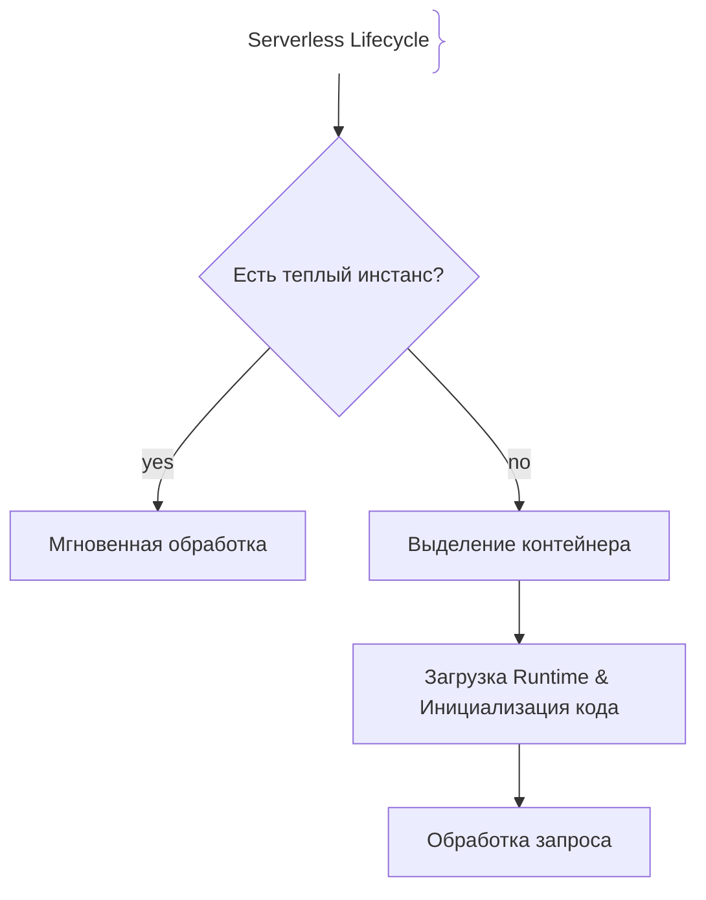
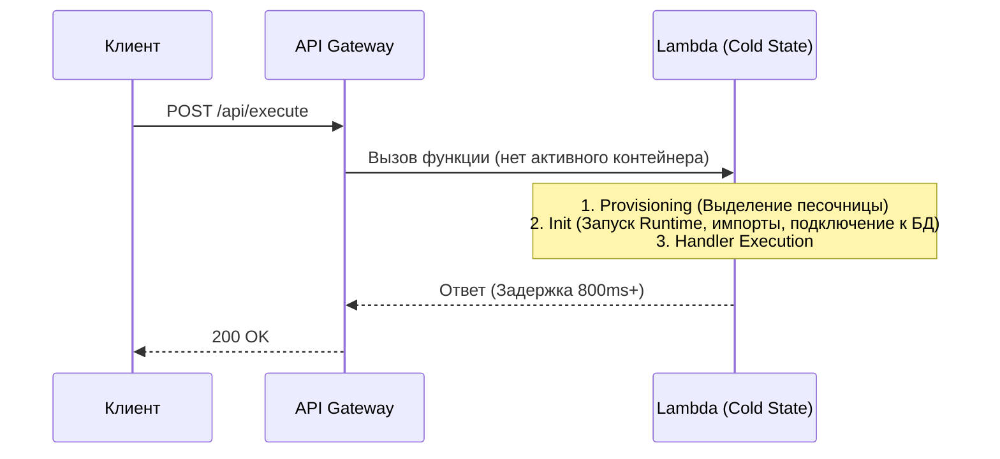

# Холодный старт (Cold Starts)

Холодный старт (Cold Start) — это задержка (latency spike), возникающая в бессерверных (Serverless / FaaS) архитектурах, когда облачная платформа вынуждена с нуля выделить контейнер/микровиртуальную машину, загрузить среду выполнения (runtime) и инициализировать код приложения для обработки первого входящего запроса.

## Зачем знать о холодных стартах

В serverless-моделях (AWS Lambda, Google Cloud Functions, Azure Functions) масштабирование происходит автоматически от нуля. Когда запросов нет, инстансы контейнеров уничтожаются (scale to zero). При поступлении нового запроса в момент отсутствия активных инстансов происходит холодный старт.
- **Влияние на P99 Latency:** Холодный старт может добавить от сотен миллисекунд до нескольких секунд к времени ответа, что критично для пользовательского опыта.
- **Разница между рантаймами:** JVM (Java) и .NET обычно имеют более долгий холодный старт по сравнению с Go, Node.js (TypeScript) или Python из-за тяжелой инициализации среды выполнения.

## Как работает холодный старт





## Примеры кода

> Ключевые сценарии: оптимизация инициализации (вынос подключений за пределы Handler) в TypeScript, Go и Java.

### TypeScript (AWS Lambda / Clean Handler)

```typescript
import { APIGatewayProxyEvent, APIGatewayProxyResult } from 'aws-lambda';
import { Pool } from 'pg';

// Инициализация вне хендлера переиспользуется при Warm Starts
const dbPool = new Pool({
  connectionString: process.env.DATABASE_URL,
});

export async function handler(event: APIGatewayProxyEvent): Promise<APIGatewayProxyResult> {
  // Этот код выполняется при холодном старте один раз, при теплых — пропускается
  const client = await dbPool.connect();
  try {
    const result = await client.query('SELECT NOW()');
    return {
      statusCode: 200,
      body: JSON.stringify({ time: result.rows[0] }),
    };
  } finally {
    client.release();
  }
}
```

### Go (Golang AWS Lambda Handler)

```go
package main

import (
	"context"
	"database/sql"
	"os"

	"github.com/aws/aws-lambda-go/lambda"
	_ "github.com/lib/pq"
)

var db *sql.DB

// init() выполняется при холодном старте (Cold Start)
func init() {
	var err error
	db, err = sql.Open("postgres", os.Getenv("DATABASE_URL"))
	if err != nil {
		panic(err)
	}
	// Настройка пула соединений
	db.SetMaxOpenConns(5)
}

func HandleRequest(ctx context.Context) (string, error) {
	// При теплых вызовах подключение к БД уже готово в глобальной переменной db
	var now string
	err := db.QueryRowContext(ctx, "SELECT NOW()").Scan(&now)
	if err != nil {
		return "", err
	}
	return "Current time: " + now, nil
}

func main() {
	lambda.Start(HandleRequest)
}
```

### Java (AWS Lambda StreamHandler & Singleton Client)

```java
package com.example;

import com.amazonaws.services.lambda.runtime.Context;
import com.amazonaws.services.lambda.runtime.RequestHandler;
import software.amazon.awssdk.regions.Region;
import software.amazon.awssdk.services.s3.S3Client;

public class LambdaHandler implements RequestHandler<Object, String> {

    // Инициализация AWS SDK клиента вне метода handleRequest (сохраняется на Warm starts)
    private static final S3Client s3Client = S3Client.builder()
            .region(Region.US_EAST_1)
            .build();

    @Override
    public String handleRequest(Object input, Context context) {
        // Логика обработки запроса
        long remainingTime = context.getRemainingTimeInMillis();
        return "Processed successfully. Remaining time: " + remainingTime;
    }
}
```

## Вопросы

### Q1
**Что является главной причиной задержки при холодном старте функции?**
- [ ] Медленный интернет на клиенте
- [x] Необходимость выделения инфраструктуры, запуска среды выполнения (runtime) и выполнения глобального кода инициализации
- [ ] Ошибки в синтаксисе SQL
- [ ] Использование протокола HTTP/1.1

Пояснение: Холодный старт нагружен инфраструктурными задачами: аллокация песочницы, поднятие рантайма и старт приложения.

### Q2
**Где правильно инициализировать тяжелые подключения (к БД, клиенты AWS SDK), чтобы минимизировать задержки при последующих теплых вызовах?**
- [ ] Внутри самого обработчика (handler-функции) при каждом запросе
- [x] В глобальной области видимости / методе инициализации (вне хендлера), чтобы переиспользовать соединение на Warm Starts
- [ ] В браузере пользователя
- [ ] Нигде, соединения должны открываться и закрываться ежесекундно

Пояснение: Вынос инициализации за пределы хендлера позволяет сохранить подключение активным в течение всего жизненного цикла теплого контейнера.

### Q3
**Какой стек технологий обычно демонстрирует наименьшее время холодного старта?**
- [ ] Java (Spring Boot с тяжелым classpath)
- [x] Go или Rust (скомпилированные в нативный бинарник без тяжелой виртуальной машины)
- [ ] .NET Framework
- [ ] Python с большим числом тяжелых бинарных библиотек

Пояснение: Скомпилированные языки с минимальным временем инициализации рантайма (Go, Rust) стартуют значительно быстрее JVM или .NET.

### Q4
**Что такое Provisioned Concurrency в AWS Lambda?**
- [ ] Полное отключение функции
- [x] Функция предварительного прогрева определенного числа инстансов, удерживающих их в «теплом» состоянии для исключения холодных стартов
- [ ] Лимит на количество одновременных пользователей
- [ ] Протокол кеширования на CDN

Пояснение: Provisioned Concurrency держит инстансы готовыми к работе заранее, устраняя холодные старты ценой дополнительных финансовых затрат.

### Q5
**Как холодный старт влияет на метрики производительности системы?**
- [ ] Улучшает общую пропускную способность
- [x] Создает пиковые скачки в хвостовой задержке (Tail Latency, метрики P99), портя пользовательский опыт редких запросов
- [ ] Никак не влияет
- [ ] Ускоряет работу базы данных

Пояснение: Холодные старты проявляются как редкие, но сильные задержки (outliers), которые сильно ухудшают метрики P99/P99.9.

## Источники

- AWS Lambda Cold Starts Documentation: https://docs.aws.amazon.com/lambda/latest/dg/welcome.html
- Serverless Architectures Best Practices: https://www.serverless.com/
- Google Cloud Functions Execution Environment: https://cloud.google.com/functions/docs/concepts/execution-env
