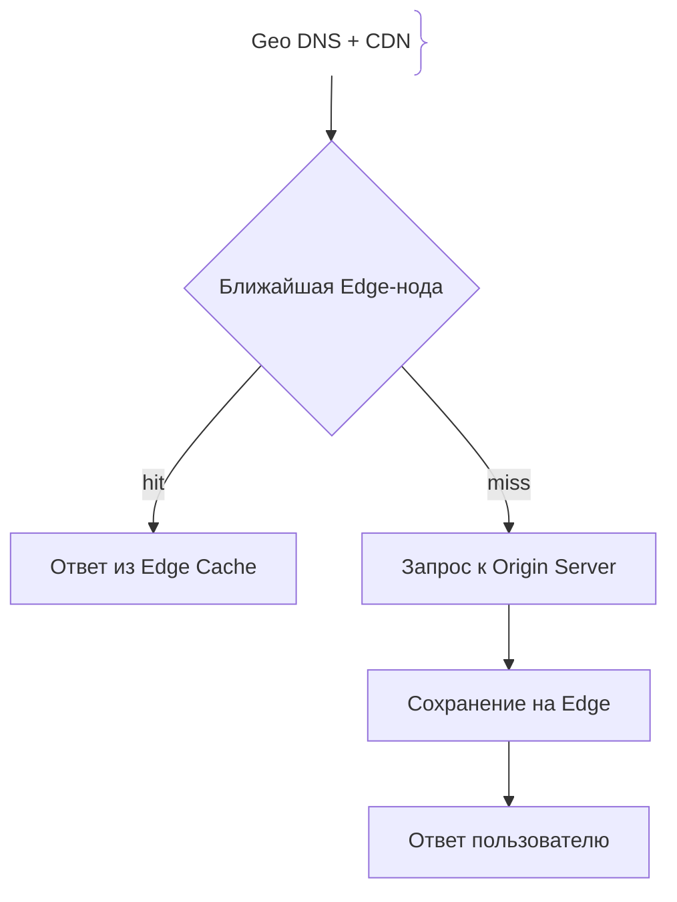
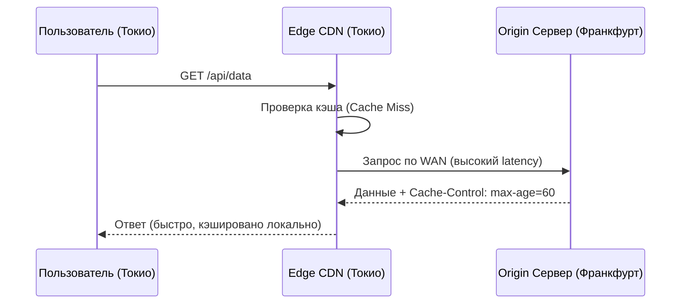

# Кэширование на edge-серверах (Edge Caching)

## Определение

Edge Caching (кэширование на «краю» сети) — это архитектурный подход, при котором статический и динамический контент кэшируется на распределенных по всему миру CDN-нодах (Edge-серверах), находящихся максимально близко к физическому пользователю.

## Зачем нужен Edge Caching

Традиционная модель с одним центральным дата-центром (Origin) страдает от сетевой задержки (latency), вызванной законами физики (скорость света в оптоволокне). 
- **Приближение к пользователю:** Вместо того чтобы забирать контент из Франкфурта или Токио, клиент получает его с ближайшей edge-ноды (например, в своем городе).
- **Разгрузка Origin:** Основной бэкенд освобождается от обработки миллионов повторяющихся GET-запросов.
- **Устойчивость (Resilience):** Если Origin временно недоступен или испытывает перегрузку, edge-серверы могут отдавать stale (устаревший, но валидный) контент из кэша.

## Как работает Edge Caching





## Примеры кода

> Ключевые сценарии: управление заголовками кэширования для Edge в TypeScript (Next.js), Go (Fiber/Gin) и Java (Spring Boot).

### TypeScript (Next.js / Response Headers)

```typescript
import { NextResponse } from 'next/server';
import type { NextRequest } from 'next/server';

export function GET(request: NextRequest) {
  // Данные меняются редко, кэшируем на Edge на 1 час, stale-while-revalidate на 24 часа
  return NextResponse.json(
    { message: 'Hello from Edge API', timestamp: Date.now() },
    {
      status: 200,
      headers: {
        'Cache-Control': 'public, s-maxage=3600, stale-while-revalidate=86400',
        'CDN-Cache-Control': 'max-age=3600',
      },
    }
  );
}
```

### Go (Fiber Framework)

```go
package main

import (
	"time"

	"github.com/gofiber/fiber/v2"
)

func main() {
	app := fiber.New()

	app.Get("/api/products", func(c *fiber.Ctx) error {
		// Устанавливаем заголовки для CDN / Edge
		c.Set("Cache-Control", "public, max-age=600, s-maxage=3600")
		c.Set("Vary", "Accept-Encoding")

		return c.JSON(fiber.Map{
			"status":   "success",
			"products": []string{"Item 1", "Item 2"},
		})
	})

	app.Listen(":8080")
}
```

### Java (Spring Boot Cache-Control)

```java
import org.springframework.http.CacheControl;
import org.springframework.http.ResponseEntity;
import org.springframework.web.bind.annotation.GetMapping;
import org.springframework.web.bind.annotation.RequestMapping;
import org.springframework.web.bind.annotation.RestController;
import java.util.concurrent.TimeUnit;

@RestController
@RequestMapping("/api")
public class EdgeController {

    @GetMapping("/config")
    public ResponseEntity<AppConfig> getConfig() {
        AppConfig config = new AppConfig("v1.2", true);

        // Кэширование на CDN/Edge в течение 2 часов
        CacheControl cacheControl = CacheControl.maxAge(2, TimeUnit.HOURS)
                .cachePublic()
                .proxyRevalidate();

        return ResponseEntity.ok()
                .cacheControl(cacheControl)
                .body(config);
    }
}

class AppConfig {
    public String version;
    public boolean maintenance;

    public AppConfig(String version, boolean maintenance) {
        this.version = version;
        this.maintenance = maintenance;
    }
}
```

## Пример использования: интеграция

Edge-нода кэширует по заголовкам, которые задаёт origin; на примере Express для статики и публичных ответов:

```ts
app.use(express.static('public', {
  maxAge: '1h',
  setHeaders: (res) => {
    res.setHeader('Cache-Control', 'public, max-age=3600, stale-while-revalidate=86400')
    res.setHeader('Vary', 'Accept-Encoding')
  },
}))
```

`stale-while-revalidate` разрешает edge отдать прошлую копию и обновить её в фоне: пользователь не ждёт, а Origin получает существенно меньше запросов.

## Паттерны использования

- **Stale-while-revalidate на edge** — ответ сразу из кэша, пересчёт в фоне.
- **Разделение статики и динамики** — edge обслуживает GET-статику, API уходит в Origin.
- **Короткий TTL плюс background revalidation** вместо длинного TTL для контента, который меняется.
- **Единые `Cache-Control` на Origin** — одно место задания правил для всех PoP-нод.

## Антипаттерны и ловушки

- **Кэширование персонализированного контента** — пользователи получают ответы друг друга.
- **Вечный TTL без версии в URL** — после деплоя раздаётся старый бандл.
- **Игнорирование `Vary`** — мобильная и десктопная версия берутся из одного ключа.
- **Отсутствие purge-процедуры** — после критического фикса кэш невозможно сбросить за секунды.

## Когда использовать / когда НЕ использовать

- **Использовать:** статика, публичные каталоги, HTML с допустимой задержкой обновления, разгрузка Origin от повторяющихся GET.
- **НЕ использовать:** данные, чувствительные к мгновенной актуальности; персональные страницы без строгой настройки; API с частыми POST/PUT.

## Связанные темы

- **caching-basics** — базовые принципы кэширования, применённые к периферийным узлам.
- **cache-invalidation** — как сбрасывать устаревшее содержимое edge-кэша.
- **cdn** — географическая сеть PoP-нод, на которых работает edge-кэш.

## Вопросы

### Q1
**Что делает заголовок `s-maxage` в сравнении с `max-age`?**
- [ ] Ничем не отличается
- [x] `s-maxage` предназначен специально для прокси-серверов и CDN (Edge), переопределяя `max-age` для них
- [ ] `s-maxage` запрещает кэширование на клиенте
- [ ] `s-maxage` работает только в браузерах

Пояснение: `max-age` контролирует браузерный кэш, а `s-maxage` — кэширование на промежуточных shared-серверах и CDN-нодах.

### Q2
**Что означает стратегия `stale-while-revalidate`?**
- [ ] Удаление кэша при первом запросе
- [x] CDN немедленно отдаёт устаревшую версию из кэша, а в фоне делает запрос к Origin для обновления кэша
- [ ] Полный запрет сетевых запросов
- [ ] Ошибка 504 при промахе

Пояснение: `stale-while-revalidate` обеспечивает мгновенный ответ пользователю (даже устаревшими данными), обновляя кэш асинхронно.

### Q3
**В чём главное отличие Edge Caching от обычного кэширования в Redis на бэкенде?**
- [ ] Edge Caching работает внутри базы данных
- [x] Edge-ноды распределены географически близко к пользователям по всему миру, снижая сетевой RTT
- [ ] Redis работает быстрее света
- [ ] Edge Caching не умеет хранить JSON

Пояснение: Близость к клиенту (снижение физического расстояния передачи пакетов) — ключевое преимущество Edge-архитектуры.

### Q4
**Какую роль играет заголовок `Vary` при Edge-кэшировании?**
- [ ] Увеличивает размер кэша в 10 раз
- [x] Указывает CDN, какие заголовки запроса (например, `Accept-Encoding`, `Authorization`) учитываться при построении ключа кэша
- [ ] Отключает кэширование для всех пользователей
- [ ] Управляет тайм-аутами соединения

Пояснение: `Vary` гарантирует, что CDN не отдаст gzip-сжатую версию клиенту, который поддерживает только Brotli, или приватные данные другому пользователю.

### Q5
**Что произойдет, если Origin-сервер упадет, а у CDN настроен Edge Caching?**
- [ ] CDN сразу вернет ошибку 503 всем пользователям
- [x] CDN сможет отдавать актуальный кэшированный контент (или stale-версию), защищая пользователей от простоя
- [ ] CDN сотрет весь кэш в памяти
- [ ] Произойдет канонизация домена

Пояснение: Наличие актуальных копий на Edge-нодах повышает отказоустойчивость всей системы при авариях бэкенда.

## Источники

- Cloudflare Edge Caching Documentation: https://developers.cloudflare.com/cache/
- MDN Web Docs - Cache-Control: https://developer.mozilla.org/en-US/docs/Web/HTTP/Headers/Cache-Control
- AWS CloudFront Caching Strategies: https://docs.aws.amazon.com/AmazonCloudFront/latest/DeveloperGuide/Expiration.html
