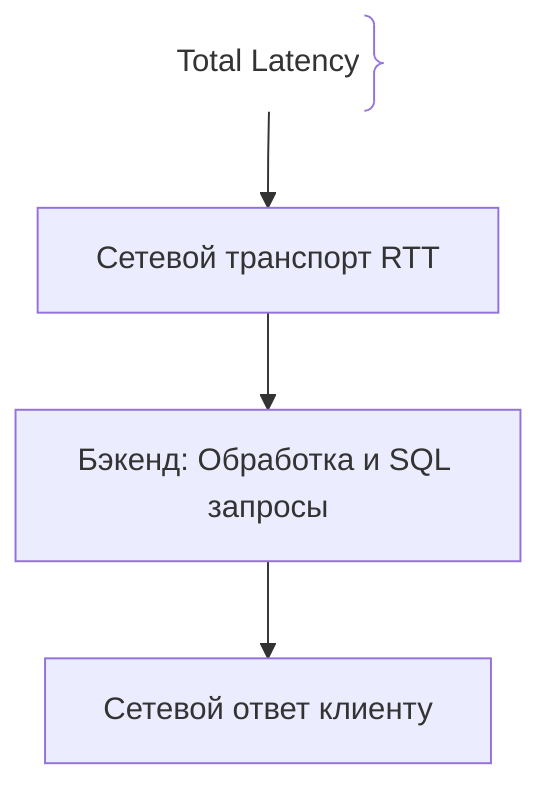
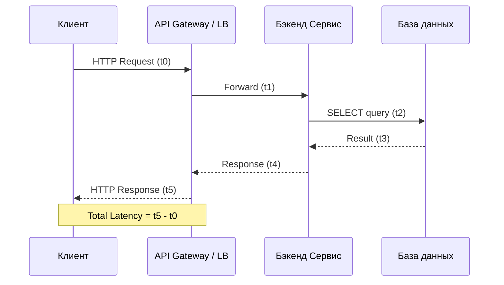

# Задержка (Latency)

Задержка (Latency) — это временной интервал между отправкой запроса клиентом и получением ответа от системы. В контексте веб-приложений и бэкенда latency измеряется в миллисекундах (ms) и является ключевым фактором пользовательского опыта (UX).

## Зачем измерять и контролировать Latency

Высокая задержка приводит к ощущению «торможения» интерфейса, снижает конверсию в интернет-магазинах и ухудшает позиции сайтов в поисковых системах.
- **Сетевая составляющая (RTT):** Время прохождения пакетов туда и обратно по оптоволокну.
- **Серверная составляющая:** Время обработки запроса CPU, обращения к базе данных, кэшу и внешним API.
- **Queueing Delay:** Время ожидания в очереди потоков или пула соединений при высокой нагрузке.

## Как работает измерение задержки





## Примеры кода

> Ключевые сценарии: измерение времени выполнения запроса (latency) с помощью middleware в TypeScript, Go и Java.

### TypeScript (Express Middleware)

```typescript
import express, { Request, Response, NextFunction } from 'express';

const app = express();

app.use((req: Request, res: Response, next: NextFunction) => {
  const start = process.hrtime.bigint();

  res.on('finish', () => {
    const end = process.hrtime.bigint();
    const durationMs = Number(end - start) / 1_000_000;
    console.log(`[HTTP] ${req.method} ${req.url} - ${durationMs.toFixed(2)}ms`);
  });

  next();
});

app.get('/api/ping', (req, res) => {
  res.send('pong');
});
```

### Go (Fiber Timing Middleware)

```go
package main

import (
	"log"
	"time"

	"github.com/gofiber/fiber/v2"
)

func main() {
	app := fiber.New()

	app.Use(func(c *fiber.Ctx) error {
		start := time.Now()
		err := c.Next()
		duration := time.Since(start)

		log.Printf("[HTTP] %s %s - %v", c.Method(), c.Path(), duration)
		return err
	})

	app.Get("/api/ping", func(c *fiber.Ctx) error {
		return c.SendString("pong")
	})

	app.Listen(":8080")
}
```

### Java (Spring Boot HandlerInterceptor)

```java
package com.example.demo;

import jakarta.servlet.http.HttpServletRequest;
import jakarta.servlet.http.HttpServletResponse;
import org.springframework.stereotype.Component;
import org.springframework.web.servlet.HandlerInterceptor;

@Component
public class LatencyInterceptor implements HandlerInterceptor {

    private static final String START_TIME_ATTR = "startTime";

    @Override
    public boolean preHandle(HttpServletRequest request, HttpServletResponse response, Object handler) {
        request.setAttribute(START_TIME_ATTR, System.currentTimeMillis());
        return true;
    }

    @Override
    public void afterCompletion(HttpServletRequest request, HttpServletResponse response, Object handler, Exception ex) {
        long startTime = (Long) request.getAttribute(START_TIME_ATTR);
        long duration = System.currentTimeMillis() - startTime;
        System.out.println("[HTTP] " + request.getMethod() + " " + request.getRequestURI() + " - " + duration + "ms");
    }
}
```

## Вопросы

### Q1
**Из чего складывается полная задержка (Total Latency) веб-запроса?**
- [ ] Только из размера базы данных
- [x] Из сетевых задержек (RTT), времени обработки на бэкенде (CPU, БД, кэш) и времени ожидания в очередях
- [ ] Только из скорости процессора клиента
- [ ] Из количества строк в коде

Пояснение: Latency — комплексная метрика, включающая как сетевой путь туда-обратно, так и внутренние задержки сервисов.

### Q2
**Что такое RTT (Round Trip Time)?**
- [ ] Время загрузки операционной системы
- [x] Время, необходимое сетевому пакету для отправки от клиента к серверу и возврата ответа обратно
- [ ] Время компиляции проекта
- [ ] Период обновления кэша

Пояснение: RTT отражает чисто сетевую задержку канала связи между узлами.

### Q3
**Как влияет увеличение нагрузки (Throughput) на Latency в нагруженной системе?**
- [ ] Latency всегда падает до нуля
- [x] При приближении к пределу пропускной способности (Saturation) очередь запросов растет, и Latency резко возрастает
- [ ] Нагрузка никак не связана с задержкой
- [ ] Сервер начинает работать в 10 раз быстрее

Пояснение: Закон Литтла и поведение очередей показывают, что при исчерпании ресурсов системы задержка начинает лавинообразно расти.

### Q4
**Какой инструмент чаще всего используется для точного измерения малых интервалов времени в Node.js без влияния таймеров ОС?**
- [ ] `setTimeout`
- [x] `process.hrtime.bigint()`
- [ ] `Date.now()`
- [ ] `Math.random()`

Пояснение: `process.hrtime.bigint()` предоставляет высокоточное монотонное время в наносекундах, устойчивое к изменениям системных часов.

### Q5
**Что такое Queueing Delay (задержка в очереди)?**
- [ ] Время скачивания файла по торренту
- [x] Время, которое запрос проводит в ожидании свободного потока, воркера или соединения с базой данных
- [ ] Время холодного старта облака
- [ ] Время компиляции Java-классов

Пояснение: При высокой конкурентности запросы встают в очередь, что добавляет Queueing Delay к общему времени ответа.

## Источники

- High Performance Browser Networking by Ilya Grigorik: https://hpbn.co/
- Google SRE Book - Service Level Objectives: https://sre.google/sre-book/service-level-objectives/
