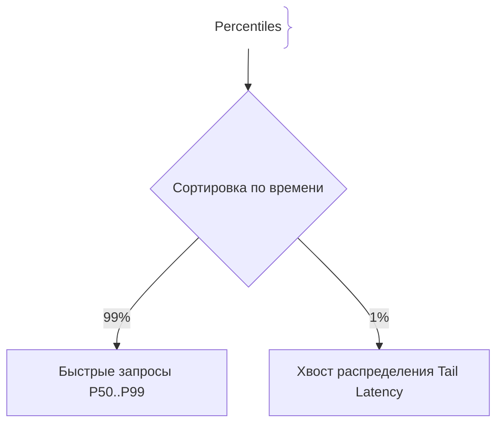
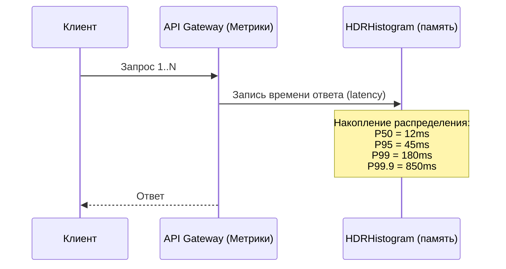

# P99 Latency (Перцентиль 99)

P99 Latency (99-й перцентиль задержки) — это статистический показатель, который показывает, что 99% всех запросов к системе выполняются быстрее или равны указанному времени, и только 1% самых медленных запросов превышают это значение.

## Зачем нужен P99 вместо среднего (Average)

В веб-приложениях и микросервисах среднее арифметическое (Average) времени ответа является крайне обманчивой метрикой.
- **Маскировка проблем:** Если 999 пользователей получили ответ за 10 мс, а 1 пользователь ждал 10 секунд (из-за сборщика мусора, холодного старта или блокировки БД), среднее значение составит около 20 мс — система кажется «быстрой». Однако для того 1% пользователей опыт от использования будет крайне негативным.
- **Хвостовые задержки (Tail Latencies):** В крупномасштабных распределенных системах, где один пользовательский запрос порождает десятки вызовов микросервисов параллельно, даже P99 на уровне каждого сервиса означает, что большинство конечных пользователей столкнутся с задержками.

## Как работает измерение перцентилей





## Примеры кода

> Ключевые сценарии: расчет перцентилей задержки с использованием гистограмм в TypeScript, Go и Java.

### TypeScript (Расчет P99 в памяти)

```typescript
class LatencyTracker {
  private latencies: number[] = [];

  record(latencyMs: number) {
    this.latencies.push(latencyMs);
  }

  getPercentile(p: number): number {
    if (this.latencies.length === 0) return 0;
    
    // Сортируем массив
    const sorted = [...this.latencies].sort((a, b) => a - b);
    const index = Math.ceil((p / 100) * sorted.length) - 1;
    
    return sorted[Math.max(0, index)];
  }
}

// Использование
const tracker = new LatencyTracker();
tracker.record(10);
tracker.record(15);
tracker.record(500); // выброс

console.log(`P99 Latency: ${tracker.getPercentile(99)}ms`);
```

### Go (Использование HDRHistogram)

```go
package main

import (
	"fmt"
	"time"

	"github.com/HdrHistogram/hdrhistogram-go"
)

func main() {
	// Создаем гистограмму для диапазона от 1мс до 10 секунд с точностью в 3 знака
	hist := hdrhistogram.New(1, 10000000, 3)

	// Имитируем запись задержек запросов
	hist.RecordValue(12)  // 12 ms
	hist.RecordValue(45)  // 45 ms
	hist.RecordValue(850) // 850 ms (tail)

	p99 := hist.ValueAtPercentile(99.0)
	fmt.Printf("P99 Latency: %d ms\n", p99)
}
```

### Java (Micrometer Percentile Histogram)

```java
package com.example.demo;

import io.micrometer.core.instrument.Timer;
import io.micrometer.core.instrument.simple.SimpleMeterRegistry;
import org.springframework.stereotype.Component;
import java.time.Duration;

@Component
public class MetricsService {

    private final Timer requestTimer;

    public MetricsService(SimpleMeterRegistry registry) {
        this.requestTimer = Timer.builder("http.server.requests")
                .publishPercentiles(0.5, 0.95, 0.99, 0.999) // P50, P95, P99, P99.9
                .register(registry);
    }

    public void recordRequestDuration(Runnable action) {
        requestTimer.record(action);
    }
}
```

## Вопросы

### Q1
**Почему среднее арифметическое (Average) времени ответа не подходит для оценки производительности веб-сервисов под нагрузкой?**
- [ ] Среднее значение невозможно вычислить
- [x] Среднее полностью скрывает редкие, но экстремально долгие запросы («хвосты»), которые портят опыт реальным пользователям
- [ ] Среднее всегда равно нулю
- [ ] Среднее учитывает только размер базы данных

Пояснение: Выбросы (outliers) растворяются в усреднении, тогда как перцентили (P99, P99.9) явно выносят их на поверхность.

### Q2
**Что означает метрика P99 = 250ms?**
- [ ] Что все запросы выполняются ровно за 250 миллисекунд
- [x] Что 99% всех запросов отрабатывают за 250 мс или быстрее, а 1% самых медленных занимают больше времени
- [ ] Что сервер работает 250 миллисекунд в сутки
- [ ] Что максимальная задержка равна 250 мс

Пояснение: P99 указывает порог, который не превышают 99% лучших по скорости запросов.

### Q3
**Почему в распределенных системах (где запрос проходит через 5 микросервисов) хвостовая задержка (Tail Latency) становится критической проблемой?**
- [ ] Микросервисы работают медленнее монолитов
- [x] Вероятность того, что хотя бы один из 5 независимых вызовов попадет в медленный 1% (P99), суммарно резко возрастает для конечного клиента
- [ ] Сеть начинает передавать пакеты со скоростью звука
- [ ] Происходит автоматическое удаление кэша

Пояснение: Законы вероятности таковы, что при каскаде параллельных или последовательных вызовов шанс поймать P99-задержку на клиенте приближается к 100%.

### Q4
**Какой инструмент структуры данных чаще всего используется в production для эффективного подсчета перцентилей в памяти?**
- [ ] Обычный массив `number[]` без ограничения размера
- [x] Гистограммы (например, HDRHistogram), сжимающие данные с заданной точностью
- [ ] Случайный выбор каждого 10-го запроса
- [ ] Логарифмический блокчейн

Пояснение: Хранение всех сырых таймингов в памяти приводит к утечке памяти; гистограммы позволяют эффективно аппроксимировать перцентили.

### Q5
**Что такое Tail Latency (хвостовая задержка)?**
- [ ] Время ответа самого быстрого запроса
- [x] Задержки на дальних процентилях распределения (P99, P99.9, P99.99), отражающие редкие аномалии работы системы
- [ ] Время закрытия соединения
- [ ] Задержка в хвостовой части кабеля Ethernet

Пояснение: Tail latency описывает «хвост» графика распределения вероятностей — самые медленные запросы системы.

## Источники

- Google SRE Book - Eliminating Tail Latency: https://sre.google/sre-book/handling-overload/
- HDRHistogram GitHub: https://github.com/HdrHistogram/HdrHistogram
- The Tail at Scale (Dean & Barroso, Stanford): https://cacm.acm.org/magazines/2013/2/160173-the-tail-at-scale/fulltext
