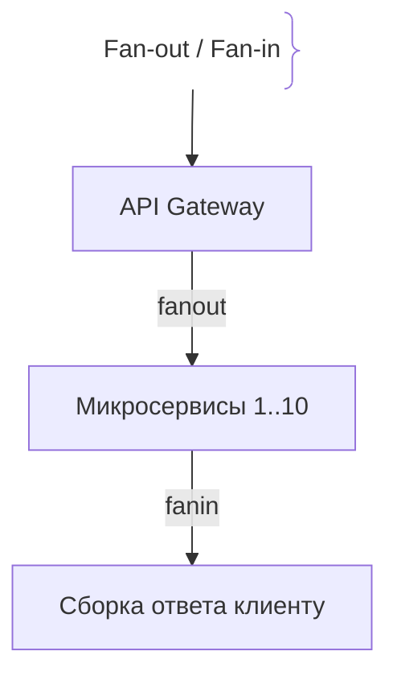
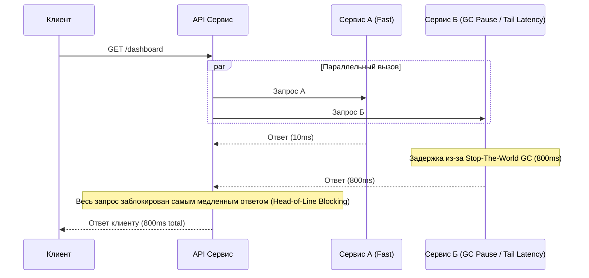

# Хвостовая задержка (Tail Latency)

## Определение

Хвостовая задержка (Tail Latency) — это задержка на дальних процентилях распределения времени ответа системы (P99, P99.9, P99.99), отражающая самые редкие, медленные и непредсказуемые запросы.

## Зачем бороться с Tail Latency

В современных облачных и распределенных архитектурах хвостовая задержка является главным убийцей производительности пользовательского интерфейса.
- **Эффект масштаба:** Если веб-страница делает 50 параллельных запросов к бэкенду, а вероятность задержки >100мс для одного запроса составляет 1% (P99), то шанс того, что *хотя бы один* из 50 запросов будет медленным, равен $1 - (0.99)^{50} \approx 39\%$. Практически каждый третий пользователь столкнётся с задержкой!
- **Источники хвостовых задержек:** Сборка мусора (GC pauses), состязание за блокировки (lock contention), исчерпание пула потоков, переключения контекста (context switching), шумные соседи (noisy neighbors) в виртуализации и сетевые ретрансмиссии (TCP retransmissions).

## Как работает эскалация хвостовой задержки





## Примеры кода

> Ключевые сценарии: реализация паттерна Hedged Requests (повторный отправленный запрос при задержке) для борьбы с Tail Latency в TypeScript, Go и Java.

### TypeScript (Hedged Requests)

```typescript
async function fetchWithHedging<T>(
  primaryFn: () => Promise<T>,
  hedgeFn: () => Promise<T>,
  delayMs: number
): Promise<T> {
  return new Promise((resolve, reject) => {
    let completed = false;

    const execute = async (fn: () => Promise<T>) => {
      try {
        const res = await fn();
        if (!completed) {
          completed = true;
          resolve(res);
        }
      } catch (err) {
        // Игнорируем ошибку первичного, если хэдж еще жив
      }
    };

    execute(primaryFn);

    // Если основной запрос не ответил за delayMs, отправляем дубликат (hedged request)
    const timer = setTimeout(() => {
      if (!completed) {
        execute(hedgeFn);
      }
    }, delayMs);
  });
}
```

### Go (Context with Timeout & Hedged call)

```go
package main

import (
	"context"
	"errors"
	"time"
)

func CallWithHedge(ctx context.Context, primary, backup func(context.Context) (string, error), hedgeDelay time.Duration) (string, error) {
	type result struct {
		val string
		err error
	}

	ch := make(chan result, 2)

	// Запускаем основной запрос
	go func() {
		v, err := primary(ctx)
		ch <- result{val: v, err: err}
	}()

	// Таймер для хэдж-запроса
	timer := time.NewTimer(hedgeDelay)
	defer timer.Stop()

	select {
	case <-timer.C:
		// Основной задержался — запускаем запасной
		go func() {
			v, err := backup(ctx)
			ch <- result{val: v, err: err}
		}()
		// Ждем любой быстрый ответ
		res1 := <-ch
		if res1.err == nil {
			return res1.val, nil
		}
		res2 := <-ch
		return res2.val, res2.err

	case res := <-ch:
		return res.val, res.err
	}
}
```

### Java (CompletableFuture AnyOf / Hedging)

```java
package com.example.demo;

import java.util.concurrent.CompletableFuture;
import java.util.concurrent.TimeUnit;
import java.util.function.Supplier;

public class HedgedRequestDemo {

    public static <T> CompletableFuture<T> hedge(Supplier<T> primary, Supplier<T> backup, long delayMs) {
        CompletableFuture<T> future = CompletableFuture.supplyAsync(primary);
        
        CompletableFuture.delayedExecutor(delayMs, TimeUnit.MILLISECONDS).execute(() -> {
            if (!future.isDone()) {
                future.completeAsync(backup);
            }
        });
        
        return future;
    }
}
```

## Пример использования: интеграция

Ограничиваем вклад хвоста общим дедлайном на fan-out — один медленный вызов не утащивает весь ответ (Go):

```go
ctx, cancel := context.WithTimeout(parent, 150*time.Millisecond)
defer cancel()

g, _ := errgroup.WithContext(ctx)
for _, svc := range []string{"catalog", "cart", "pricing"} {
    g.Go(func() error { return call(ctx, svc) })
}
if err := g.Wait(); err != nil {
    return degrade(ctx) // частичный ответ вместо блокировки на хвосте
}
```

Общий контекст плюс fallback не дают одному медленному сервису утащить ответ в хвост; альтернатива — hedged request: дубликат через короткую задержку, забирается первый ответ.

## Паттерны использования

- **Общий дедлайн на fan-out** — таймауты параллельных вызовов не суммируются.
- **Hedged requests** — повтор через N мс, если первый вызов не ответил.
- **Быстрый fallback вместо ожидания хвоста** — отдать кэш или частичный ответ.
- **Изоляция GC** — короткие паузы вместо Stop-The-World на длинных heap'ах.

## Антипаттерны и ловушки

- **Head-of-line blocking** — один медленный вызов блокирует все параллельные.
- **Последовательные вызовы с общим timeout** — таймауты складываются и съедают бюджет.
- **Отсутствие per-request трассировки** — хвост не виден без логов и trace ID.
- **Среднее по сервису вместо разреза по зависимостям** — хвост обычно растёт из одной конкретной зависимости.

## Когда использовать / когда НЕ использовать

- **Использовать:** агрегационные API, page-рендер, fan-out к нескольким сервисам, где задержка суммируется.
- **НЕ использовать:** в последовательных конвейерах без параллелизма (хвост лечится дедлайном, а не hedging'ом), в задачах без требований ко времени ответа.

## Связанные темы

- **latency** — базовое понятие задержки, частью которого является хвост.
- **p99-latency** — как измерить хвост через перцентили.
- **throughput** — как хвост связан с пропускной способностью под нагрузкой.

## Вопросы

### Q1
**Почему в системах с большим количеством параллельных микросервисных вызовов (Fan-out) хвостовая задержка (Tail Latency) становится критичнее среднего времени ответа?**
- [ ] Серверы начинают греться
- [x] Вероятность того, что хотя бы один из множества параллельных зависимых вызовов попадет в «хвост» (P99), растет по закону вероятности, блокируя весь ответ
- [ ] База данных удаляет индексы
- [ ] Сеть переходит на аналоговый сигнал

Пояснение: Поскольку для формирования ответа клиенту нужно дождаться окончания *всех* параллельных подзапросов, задержка всей операции определяется самым медленным компонентом (Head-of-Line blocking).

### Q2
**Что такое паттерн Hedged Requests (страховочные запросы)?**
- [ ] Покупка страховки на сервер
- [x] Отправка дублирующего запроса на другой инстанс или ноду, если основной запрос не вернулся за заданный интервал времени (например, P95)
- [ ] Запрет любых сетевых запросов
- [ ] Резервное копирование базы данных

Пояснение: Hedged requests позволяют побороть случайные задержки (например, GC паузу на ноде), быстро переключившись на дублирующий запрос.

### Q3
**Какой внутренний фактор рантайма часто вызывает неожиданные всплески хвоста задержки (Tail Latency) в Java (JVM)?**
- [ ] Компиляция в байт-код
- [x] Паузы сборщика мусора (Stop-the-World Garbage Collection), останавливающие выполнение потоков приложения
- [ ] Использование интерфейсов
- [ ] Наличие статических методов

Пояснение: STW-паузы GC временно замораживают весь процесс, что резко увеличивает latency для запросов, попавших в этот момент.

### Q4
**В чем заключается проблема «шумных соседей» (Noisy Neighbors) в облачной инфраструктуре?**
- [ ] Соседи громко слушают музыку в дата-центре
- [x] Один из виртуальных серверов на той же физической машине утилизирует 100% CPU или диска, вызывая задержки (tail latency) у остальных соседей по хосту
- [ ] Сетевой кабель проложен слишком близко к колонкам
- [ ] Ошибки в синтаксисе Dockerfile

Пояснение: В multi-tenant облаках соседи по железу могут конкурировать за ресурсы, вызывая случайные задержки ввода-вывода.

### Q5
**Почему увеличение параллелизма (Fan-out) с 10 до 100 подзапросов драматически ухудшает P99 для клиента?**
- [ ] Клиентский браузер зависает
- [x] Растет статистическая вероятность поймать хотя бы один выброс (outlier) среди 100 независимых распределений задержек
- [ ] Сеть начинает сжимать пакеты
- [ ] Уменьшается пропускная способность

Пояснение: Это чисто математический эффект: чем больше независимых случайных испытаний (запросов) вы делаете, тем выше шанс получить максимальное отклонение (tail).

## Источники

- Google SRE Book - Dealing with outliers: https://sre.google/sre-book/handling-overload/
- The Tail at Scale (Dean & Barroso): https://cacm.acm.org/magazines/2013/2/160173-the-tail-at-scale/fulltext
- AWS Architecture Blog - Mitigating Tail Latency: https://aws.amazon.com/blogs/architecture/
