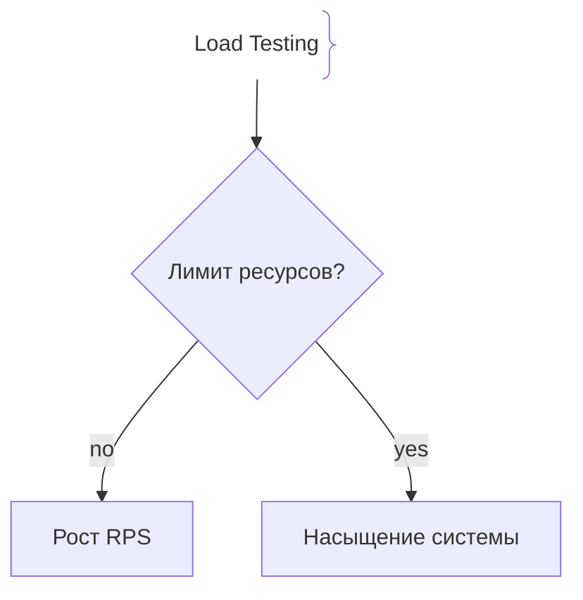
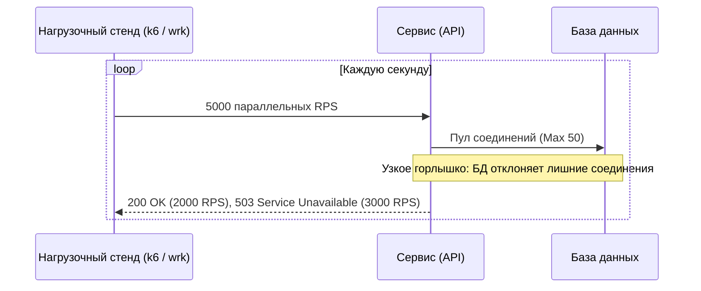

# Пропускная способность (Throughput)

Пропускная способность (Throughput / RPS) — это количество успешных запросов или объем данных, которые система способна обработать за единицу времени (обычно запросов в секунду — Requests Per Second, или мегабит в секунду — Mbps).

## Зачем измерять и масштабировать Throughput

В отличие от Latency, измеряющей скорость одного запроса, Throughput оценивает общую емкость системы под нагрузкой.
- **Планирование мощности (Capacity Planning):** Понимание того, сколько пользователей одновременно может выдержать сервис до деградации.
- **Закон Литтла (Little's Law):** Фундаментальное соотношение в теории массового обслуживания: $L = \lambda \times W$, где $L$ — число запросов в системе, $\lambda$ — Throughput (интенсивность), $W$ — Latency (время ожидания).
- **Предел насыщения (Saturation):** Точка, после которой рост Throughput останавливается, а Latency уходит в бесконечность из-за исчерпания CPU, памяти или пула соединений.

## Как работает измерение Throughput





## Примеры кода

> Ключевые сценарии: простой счётчик RPS и ограничение параллелизма в TypeScript, Go и Java.

### TypeScript (Simple RPS Counter)

```typescript
import express from 'express';

const app = express();
let requestCount = 0;

// Считаем RPS каждую секунду
setInterval(() => {
  console.log(`[Throughput] Current RPS: ${requestCount}`);
  requestCount = 0;
}, 1000);

app.get('/api/data', (req, res) => {
  requestCount++;
  res.json({ status: 'ok' });
});

app.listen(3000);
```

### Go (Concurrency Limiting / Semaphore)

```go
package main

import (
	"net/http"
)

// Ограничение максимального числа одновременных запросов (защита от перегрузки)
var sem = make(chan struct{}, 100) // максимум 100 параллельных воркеров

func handler(w http.ResponseWriter, r *http.Request) {
	select {
	case sem <- struct{}{}: // занимаем слот
		defer func() { <-sem }() // освобождаем по завершении
		w.Write([]byte("Processed"))
	default: // если слот занят — сразу отдаем 503
		http.Error(w, "Too Many Requests", http.StatusServiceUnavailable)
	}
}

func main() {
	http.HandleFunc("/", handler)
	http.ListenAndServe(":8080", nil)
}
```

### Java (AtomicLong RPS tracker)

```java
package com.example.demo;

import org.springframework.web.bind.annotation.GetMapping;
import org.springframework.web.bind.annotation.RestController;
import java.util.concurrent.atomic.AtomicLong;

@RestController
public class ThroughputController {

    private final AtomicLong counter = new AtomicLong(0);

    @GetMapping("/api/work")
    public String doWork() {
        counter.incrementAndGet();
        return "OK";
    }

    // Метод для периодического сброса/логирования RPS
    public long getAndResetRps() {
        return counter.getAndSet(0);
    }
}
```

## Вопросы

### Q1
**В чем главная разница между Latency и Throughput?**
- [ ] Между ними нет разницы, это одно и то же
- [x] Latency измеряет время выполнения одного запроса (мс), а Throughput — количество успешно обработанных запросов в секунду (RPS)
- [ ] Throughput измеряется в секундах, а Latency в байтах
- [ ] Latency важна только для баз данных

Пояснение: Latency — это время отклика, а Throughput — пропускная способность (емкость) системы.

### Q2
**Что утверждает закон Литтла ($L = \lambda \times W$)?**
- [ ] Что скорость света равна пропускной способности сети
- [x] Что среднее число запросов в системе ($L$) равно произведению интенсивности поступления запросов ($\lambda$, Throughput) и среднего времени их обработки ($W$, Latency)
- [ ] Что кэш всегда ускоряет работу в 10 раз
- [ ] Что память сервера бесконечна

Пояснение: Закон Литтла связывает пропускную способность, задержку и количество одновременно обрабатываемых запросов.

### Q3
**Что происходит с Throughput при превышении порога насыщения (Saturation point) сервера?**
- [ ] Он продолжает расти бесконечно линейно
- [x] Он стабилизируется на максимальном значении или падает, так как новые запросы начинают вызывать ошибки и таймауты
- [ ] Он падает ровно до нуля за 1 секунду
- [ ] Сервер переходит в режим энергосбережения

Пояснение: После достижения предела ресурсов система не может обрабатывать больше запросов, и рост RPS останавливается.

### Q4
**Как оптимизация базы данных (например, добавление индекса) влияет одновременно на Latency и Throughput?**
- [ ] Ухудшает обе метрики
- [x] Снижает Latency (запрос выполняется быстрее) и за счет этого увеличивает Throughput (система успевает обслужить больше запросов в секунду)
- [ ] Увеличивает задержку, но снижает пропускную способность
- [ ] Никак не влияет

Пояснение: Ускорение обработки каждого отдельного запроса освобождает ресурсы процессора и пула соединений, позволяя системе пропускать больше RPS.

### Q5
**Что такое скан / тестирование пропускной способности (Load Testing)?**
- [ ] Выключение серверов по пятницам
- [x] Искусственная генерация тысяч RPS с помощью инструментов (k6, wrk, JMeter) для поиска предела возможностей системы
- [ ] Проверка орфографии в README
- [ ] Обновление зависимостей через npm

Пояснение: Нагрузочное тестирование позволяет эмпирически найти максимальный Throughput и точку деградации Latency.

## Источники

- The Art of Capacity Planning by John Allspaw
- Little's Law in Computer Science: https://en.wikipedia.org/wiki/Little%27s_law
- k6 Load Testing Documentation: https://k6.io/docs/
