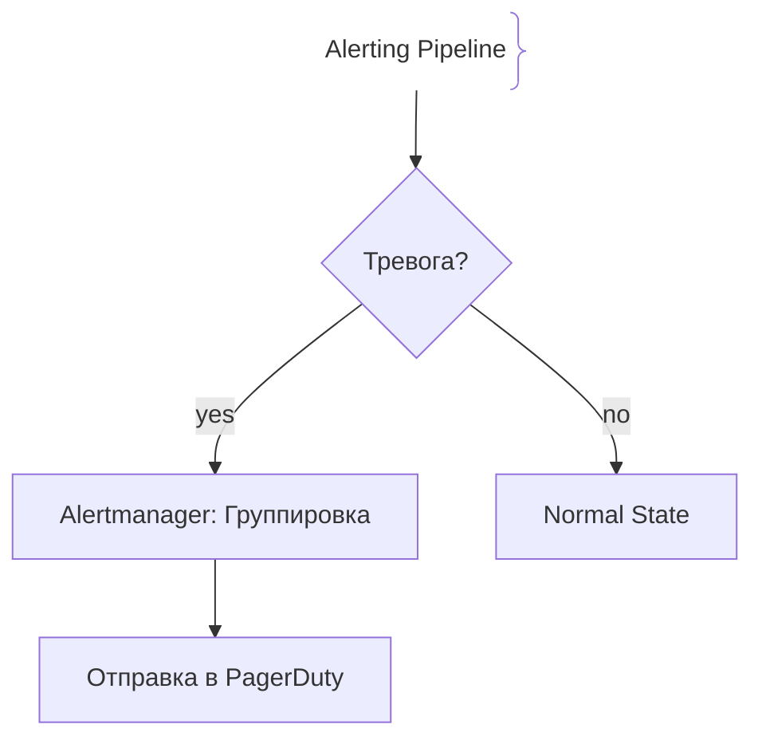
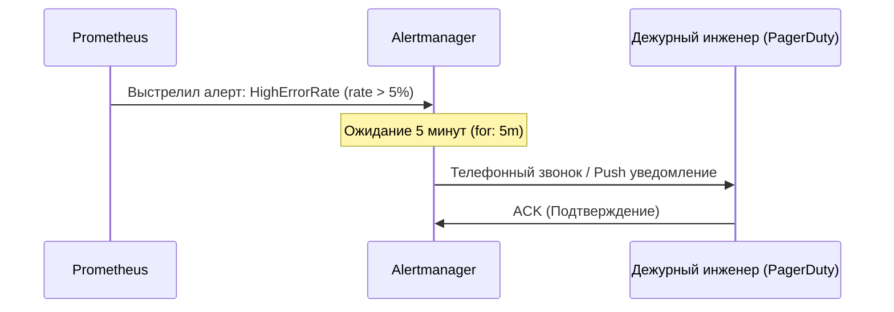

# Алерты и оповещения (Alerts)

## Определение

Алерты (Alerts) — это автоматические уведомления, отправляемые системой мониторинга дежурным инженерам (On-Call) при обнаружении аномалий, деградации сервисов или критических сбоев в работе приложения.

## Зачем нужны эффективные алерты

Правильно настроенные алерты позволяют оперативно реагировать на реальные инциденты, не вызывая у команды «усталости от алертов» (Alert Fatigue) из-за ложных срабатываний.
- **Симптомы вместо причин:** Хороший алерт сообщает о том, что страдает пользователь (например, рост ошибок 5xx), а не о том, что у какого-то сервера подскочил CPU.
- **Маршрутизация:** Критические инциденты уходят в PagerDuty/звонки, а предупреждения (Warnings) — в информационные каналы Slack.
- **Дедупликация:** Группировка одинаковых алертов во время крупной аварии, чтобы не засыпать инженера тысячами одинаковых писем.

## Как работают алерты





## Примеры кода

> Ключевые сценарии: конфигурация алертов в Prometheus Alerting Rules в YAML, Go и Java.

### Prometheus Alert Rule (YAML)

```yaml
groups:
  - name: core-service-alerts
    rules:
      - alert: HighErrorRate
        expr: sum(rate(http_requests_total{status=~"5.."}[5m])) / sum(rate(http_requests_total[5m])) > 0.05
        for: 5m
        labels:
          severity: critical
        annotations:
          summary: "High HTTP error rate detected on {{ $labels.instance }}"
          description: "Error rate is above 5% for the last 5 minutes."
```

### Go (Alert check helper)

```go
package main

import (
	"fmt"
)

func CheckErrorRate(errorsCount, totalRequests int) {
	if totalRequests == 0 {
		return
	}
	errorRate := float64(errorsCount) / float64(totalRequests)
	
	if errorRate > 0.05 {
		TriggerAlert("HighErrorRate", fmt.Sprintf("Error rate is %.2f%%", errorRate*100))
	}
}

func TriggerAlert(alertName, message string) {
	fmt.Printf("[ALERT] CRITICAL - %s: %s\n", alertName, message)
}

func main() {
	CheckErrorRate(60, 1000)
}
```

### Java (Micrometer Alert Evaluator)

```java
package com.example.demo;

import io.micrometer.core.instrument.MeterRegistry;
import org.springframework.scheduling.annotation.Scheduled;
import org.springframework.stereotype.Component;

@Component
public class AlertEvaluator {

    private final MeterRegistry registry;

    public AlertEvaluator(MeterRegistry registry) {
        this.registry = registry;
    }

    @Scheduled(fixedRate = 30000)
    public void evaluateErrors() {
        double errors = registry.counter("http.errors.total").count();
        double total = registry.counter("http.requests.total").count();

        if (total > 100 && (errors / total) > 0.05) {
            triggerPagerDutyAlert("High error rate in Java app: " + (errors / total * 100) + "%");
        }
    }

    private void triggerPagerDutyAlert(String message) {
        System.err.println("[PAGERDUTY ALERT]: " + message);
    }
}
```

## Пример использования: интеграция

Правило алерта пишется на метриках и связано с runbook'ом:

```yaml
groups:
  - name: api
    rules:
      - alert: HighErrorRate
        expr: |
          sum(rate(http_requests_total{status=~"5.."}[5m]))
          / sum(rate(http_requests_total[5m])) > 0.05
        for: 5m
        labels:
          severity: page
        annotations:
          summary: 'Error rate > 5%'
          runbook_url: 'https://wiki/app/runbooks/high-error-rate'
```

Порог выводится из SLO, задержка `for: 5m` отсекает короткие всплески, а runbook_page делает каждый алерт выполняемым.

## Паттерны использования

- **Алерты от SLI/SLO** — порог считается от бюджета, а не «придуман цифрой».
- **`for` на длительность нарушения** — временной фильтр убирает шум коротких выбросов.
- **Классификация severity и эскалация** — pager только для «горит», остальное в чат и на дашборд.
- **Runbook на каждый page** — алерт без инструкции — это стресс, а не инструмент.
- **Periodic: амплитуда между алертами** — дедупликация флагами/ack главнее количества.

## Антипаттерны и ловушки

- **Алерт «на глаз» без SLO** — порог никто не пересматривает, и алерты глохнут.
- **Шум приоритезацией всего** — 200 page-алертов в день читаться не будут.
- **Алерт без action-owner** — все «видят», но никто не отвечает.
- **Игнорирование тихого повышения ошибок** — мониторинг покрывает только редкое «5%», а медленный рост невиден.

## Когда использовать / когда НЕ использовать

- **Использовать:** production-сервисы с метриками и SLO; алерты нужны на каждое критичное поведение.
- **НЕ использовать:** для вещей без потребителя и плана действий; ранняя стадия проекта — обычные дашборды и нотификации в чат.

## Связанные темы

- **monitoring** — основной источник данных для алертов.
- **metrics** — метрики, на которых пишутся правила.
- **slo** — целевые значения, от которых считаются пороги.
- **error-budgets** — бюджет как контекст для приоритета алертов.

## Вопросы

### Q1
**Что такое «усталость от алертов» (Alert Fatigue)?**
- [ ] Физическая усталость серверов под нагрузкой
- [x] Состояние команды, при котором из-за огромного количества ложных или несущественных алертов инженеры начинают их игнорировать, пропуская реальные аварии
- [ ] Медленная работа графиков в Grafana
- [ ] Ошибка в конфигурации Docker

Пояснение: Если алерты звенят по пустякам, инженеры отключают уведомления или перестают на них реагировать, что приводит к катастрофам при реальных сбоях.

### Q2
**Почему в правилах алертинга рекомендуется использовать параметр `for: 5m` (задержка перед отправкой)?**
- [ ] Чтобы сэкономить электричество
- [x] Для фильтрации кратковременных скачков (микросбоев сети, рестартов), чтобы алерт срабатывал только при устойчивой деградации
- [ ] Чтобы база данных успела удалить старые логи
- [ ] Это обязательное требование HTTP/2

Пояснение: Задержка (for) предотвращает ложные срабатывания от секундных сетевых штормов.

### Q3
**На какие алерты в первую очередь должна реагировать команда поддержки (On-Call)?**
- [x] На симптомы, влияющие на пользователей (рост 5xx ошибок, падение RPS, задержки)
- [ ] На то, что у какого-то сервера загрузка CPU подскочила до 80% (при этом пользователи не страдают)
- [ ] На истечение срока действия SSL-сертификата через 2 года
- [ ] На коммиты коллег в репозиторий

Пояснение: Алерты должны быть ориентированы на симптомы пользовательской боли (symptom-based), а не на внутренние ресурсы (resource-based).

### Q4
**Что делает Alertmanager при получении сотен одинаковых алертов от падающего дата-центра?**
- [ ] Удаляет все сервера
- [x] Дедуплицирует, группирует (grouping) и отправляет одно сводное уведомление вместо шторма писем
- [ ] Отключает интернет на роутере
- [ ] Перезагружает Kubernetes кластер

Пояснение: Группировка алертов предотвращает шторм уведомлений (alert storm) во время крупных инцидентов.

### Q5
**Что такое PagerDuty / Opsgenie в стеке мониторинга?**
- [ ] Базы данных для логов
- [x] Системы управления инцидентами и эскалацией, умеющие звонить инженеру ночью на телефон
- [ ] Инструменты для сборки фронтенда
- [ ] Сборщики метрик с диска

Пояснение: Системы управления инцидентами гарантируют, что срочный алерт разбудит дежурного инженера по телефону или SMS.

## Источники

- Prometheus Alerting Documentation: https://prometheus.io/docs/alerting/latest/alertmanager/
- Google SRE Book - Managing Incidents & Alerting: https://sre.google/sre-book/monitoring-distributed-systems/
