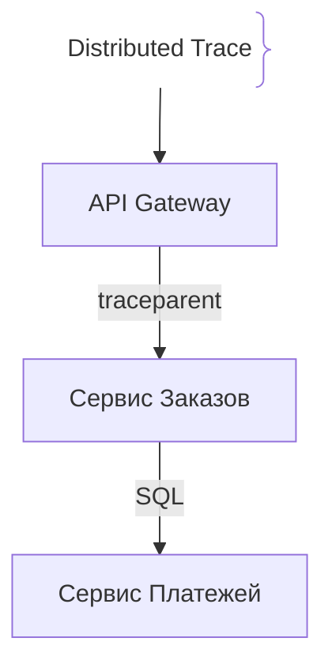
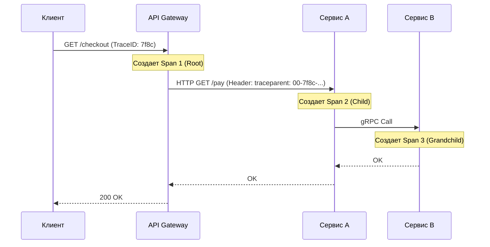

# Распределённая трассировка (Distributed Tracing)

Распределённая трассировка (Distributed Tracing) — это метод отслеживания жизненного цикла одного пользовательского запроса по мере его прохождения через множество распределенных микросервисов, очередей сообщений и баз данных.

## Зачем нужна распределенная трассировка

В микросервисной архитектуре один HTTP-запрос клиента может породить цепочку из 20+ вызовов между различными сервисами.
- **Поиск узких мест (Latency Bottlenecks):** Понимание того, какой именно микросервис или SQL-запрос затормозил всю цепочку.
- **TraceID & SpanContext:** Сквозной идентификатор (`traceId`), который передается в HTTP-заголовках (например, `traceparent`) между всеми сервисами, связывая разрозненные логи в единую карту выполнения.
- **OpenTelemetry (OTel):** Стандарт индустрии для сбора и экспорта трейсов, метрик и логов.

## Как работает трассировка





## Примеры кода

> Ключевые сценарии: инициализация OpenTelemetry трейсера и передача контекста в TypeScript, Go и Java.

### TypeScript (OpenTelemetry SDK)

```typescript
import { NodeSDK } from '@opentelemetry/sdk-node';
import { OTLPTraceExporter } from '@opentelemetry/exporter-trace-otlp-http';
import { trace } from '@opentelemetry/api';

const sdk = new NodeSDK({
  traceExporter: new OTLPTraceExporter({
    url: 'http://localhost:4318/v1/traces',
  }),
  serviceName: 'order-service',
});

sdk.start();

// Создание кастомного спана (Span) в коде
const tracer = trace.getTracer('order-tracer');

async function processCheckout() {
  return tracer.startActiveSpan('processCheckout', async (span) => {
    try {
      // Имитация работы
      await new Promise((r) => setTimeout(r, 50));
      span.setAttribute('order.status', 'success');
    } finally {
      span.end();
    }
  });
}
```

### Go (OpenTelemetry Tracer)

```go
package main

import (
	"context"
	"fmt"
	"time"

	"go.opentelemetry.io/otel"
	"go.opentelemetry.io/otel/trace"
)

func doBusinessLogic(ctx context.Context) error {
	tr := otel.Tracer("payment-service")
	ctx, span := tr.Start(ctx, "ProcessPayment")
	defer span.End()

	// Имитация работы с БД
	time.Sleep(30 * time.Millisecond)
	span.SetAttributes(trace.String("payment.method", "card"))

	return nil
}

func main() {
	ctx := context.Background()
	doBusinessLogic(ctx)
	fmt.Println("Trace executed")
}
```

### Java (OpenTelemetry Manual Span)

```java
package com.example.demo;

import io.opentelemetry.api.GlobalOpenTelemetry;
import io.opentelemetry.api.trace.Span;
import io.opentelemetry.api.trace.Tracer;
import org.springframework.stereotype.Service;

@Service
public class InventoryService {

    private final Tracer tracer = GlobalOpenTelemetry.getTracer("inventory-service");

    public void reserveStock(String itemId) {
        Span span = tracer.spanBuilder("reserveStock").startSpan();
        try (io.opentelemetry.context.Scope scope = span.makeCurrent()) {
            span.setAttribute("item.id", itemId);
            // Бизнес-логика резервирования
        } catch (Throwable t) {
            span.recordException(t);
            throw t;
        } finally {
            span.end();
        }
    }
}
```

## Вопросы

### Q1
**Что такое `TraceID` и `SpanID` в распределенной трассировке?**
- [ ] IP-адреса серверов в облаке
- [x] `TraceID` — сквозной идентификатор всей цепочки запроса через все сервисы, а `SpanID` — уникальный идентификатор конкретной подзадачи (операции) внутри трейса
- [ ] Пароли для доступа к Jaeger UI
- [ ] Идентификаторы контейнеров Docker

Пояснение: TraceID объединяет все операции запроса воедино, а SpanID описывает отдельные отрезки (например, вызов конкретного метода или SQL-запроса).

### Q2
**Что такое стандарт OpenTelemetry (OTel)?**
- [ ] Протокол беспроводной связи для IoT
- [x] Объединенный стандарт индустрии для сбора метрик, логов и трейсов, поддерживаемый Cloud Native Computing Foundation (CNCF)
- [ ] Система контроля версий баз данных
- [ ] Компилятор для языка Go

Пояснение: OpenTelemetry объединил проекты OpenTracing и OpenCensus, став универсальным стандартом наблюдаемости.

### Q3
**Как контекст трассировки (TraceContext) передается между независимыми HTTP-микросервисами?**
- [ ] Через файлы на общем жестком диске
- [x] Через специальные HTTP-заголовки (например, `traceparent`), которые клиент отправляет, а сервер принимает и продолжает
- [ ] С помощью SMS-уведомлений
- [ ] Через DNS-записи

Пояснение: Передача заголовков (propagation) позволяет связанным микросервисам подхватывать существующий TraceID.

### Q4
**Что такое Span в структуре распределенного трейса?**
- [ ] Ошибка компиляции
- [x] Единица работы (unit of work), содержащая имя операции, время начала, окончания, теги и логи
- [ ] Размер оперативной памяти
- [ ] Сетевой интерфейс

Пояснение: Спаны образуют древовидную структуру (дерево вызовов) внутри одного общего трейса.

### Q5
**Почему полная трассировка 100% запросов (100% sampling) в высоконагруженных системах с миллионами RPS встречается редко?**
- [ ] Это запрещено законом
- [x] Это создает колоссальную нагрузку на сеть, процессоры и хранилища данных (требуется огромный объем дискового пространства под трейсы)
- [ ] Трейсы работают только в режиме отладки
- [ ] Браузеры не поддерживают трейсы

Пояснение: Из-за избыточности объема данных при высоком RPS применяют сэмплирование (например, сохраняют только 1% трейсов или 100% трейсов с ошибками).

## Источники

- OpenTelemetry Official Documentation: https://opentelemetry.io/docs/
- Jaeger Tracing: https://www.jaegertracing.io/
- Distributed Tracing in Practice (Austin Clements et al.)
