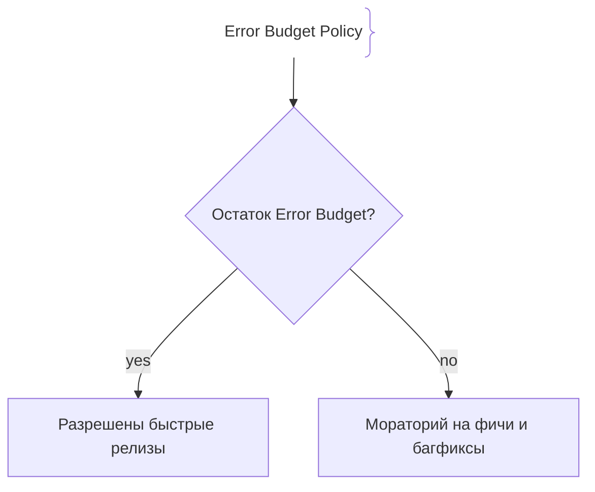
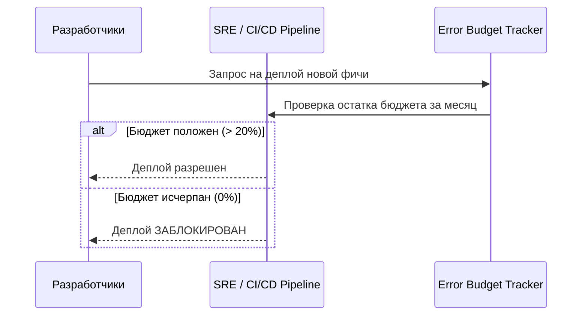

# Бюджеты ошибок (Error Budgets)

Бюджет ошибок (Error Budget) — это допустимый объем «недопустимого» поведения системы (ошибок или простоев) за определенный период времени, вытекающий напрямую из установленного SLO.

## Зачем нужны бюджеты ошибок

Ошибка — неизбежная часть работы любых сложных распределенных систем. Бюджет ошибок превращает ее в инструмент управления рисками.
- **Формула расчета:** Если SLO равен 99.9% доступности за 30 дней, то бюджет ошибок составляет $100\% - 99.9\% = 0.1\%$ от общего числа запросов или времени (около 43 минут простоя в месяц).
- **Баланс скорости и стабильности:** Пока бюджет ошибок полон, команда может рисковать и быстро выпускать новые фичи. Если бюджет исчерпан — релизы замораживаются до исправления багов.

## Как работают Error Budgets





## Примеры кода

> Ключевые сценарии: расчет остатка бюджета ошибок в TypeScript, Go и Java.

### TypeScript (Error Budget Burn Rate Calculator)

```typescript
function calculateErrorBudget(sloPercentage: number, totalRequests: number, failedRequests: number) {
  const allowedErrorPercentage = 100 - sloPercentage;
  const allowedErrors = (totalRequests * allowedErrorPercentage) / 100;
  const remainingBudget = allowedErrors - failedRequests;

  return {
    allowedErrors,
    remainingBudget,
    isExhausted: remainingBudget < 0,
  };
}

const report = calculateErrorBudget(99.9, 1_000_000, 850);
console.log(`Budget exhausted: ${report.isExhausted}`);
```

### Go (Error budget remaining calculator)

```go
package main

import "fmt"

func EvaluateErrorBudget(totalReqs, failedReqs int, targetSLO float64) bool {
	allowedFailureRate := (100.0 - targetSLO) / 100.0
	allowedErrors := float64(totalReqs) * allowedFailureRate
	remaining := allowedErrors - float64(failedReqs)
	return remaining < 0
}

func main() {
	exhausted := EvaluateErrorBudget(1000000, 1200, 99.9)
	fmt.Printf("Exhausted: %t\n", exhausted)
}
```

### Java (Error Budget Service)

```java
package com.example.demo;

import org.springframework.stereotype.Service;

@Service
public class ErrorBudgetService {
    public boolean isBudgetExhausted(long totalRequests, long failedRequests, double targetSlo) {
        double allowedFailureRate = (100.0 - targetSlo) / 100.0;
        double allowedErrors = totalRequests * allowedFailureRate;
        return (allowedErrors - failedRequests) < 0;
    }
}
```

## Вопросы

### Q1
**Как рассчитывается бюджет ошибок (Error Budget) на основе SLO?**
- [ ] Это сумма всех зарплат разработчиков
- [x] Как дополнение до 100% от целевого значения SLO (например, при SLO = 99.9%, бюджет ошибок составляет 0.1%)
- [ ] Это объем памяти сервера в гигабайтах
- [ ] Это количество открытых pull requests

Пояснение: Бюджет ошибок прямо противоположен SLO: $100\% - SLO = Error Budget$.

### Q2
**Что происходит с процессом выпуска новых релизов, когда бюджет ошибок полностью исчерпан?**
- [ ] Ничего не меняется
- [x] Вводится мораторий на новые фичи (feature freeze); все ресурсы команды направляются на стабилизацию
- [ ] Увольняется вся команда
- [ ] Отключается база данных

Пояснение: При исчерпании бюджета ошибок релизы фич замораживаются до стабилизации системы.

### Q3
**Каков эквивалент в часах простоя в месяц для SLO равного 99.9% («три девятки»)?**
- [ ] 0 минут
- [ ] 24 часа
- [x] Около 43 минут простоя в месяц
- [ ] 7 дней

Пояснение: 0.1% от общего времени месяца (43200 минут) составляет ровно 43.2 минуты.

### Q4
**Кто является главным владельцем и контролером бюджета ошибок в организации?**
- [ ] Только бухгалтерия
- [x] И разработчики, и SRE, так как бюджет объединяет бизнес-скорость и системную стабильность
- [ ] Только конечные пользователи
- [ ] Служба безопасности

Пояснение: Бюджет ошибок — это инструмент совместной ответственности разработчиков и SRE.

### Q5
**Что такое сжигание бюджета ошибок (Error Budget Burn Rate)?**
- [ ] Пожар в дата-центре
- [x] Скорость, с которой расходуется бюджет ошибок (насколько быстро система «прожигает» допустимый лимит)
- [ ] Удаление старых логов
- [ ] Скорость компиляции Java кода

Пояснение: Burn Rate показывает скорость истощения бюджета ошибок.

## Источники

- Google SRE Book - The Error Budget: https://sre.google/sre-book/error-budget/
- SRE Workbook (Chapter 3): https://sre.google/workbook/error-budgets/
