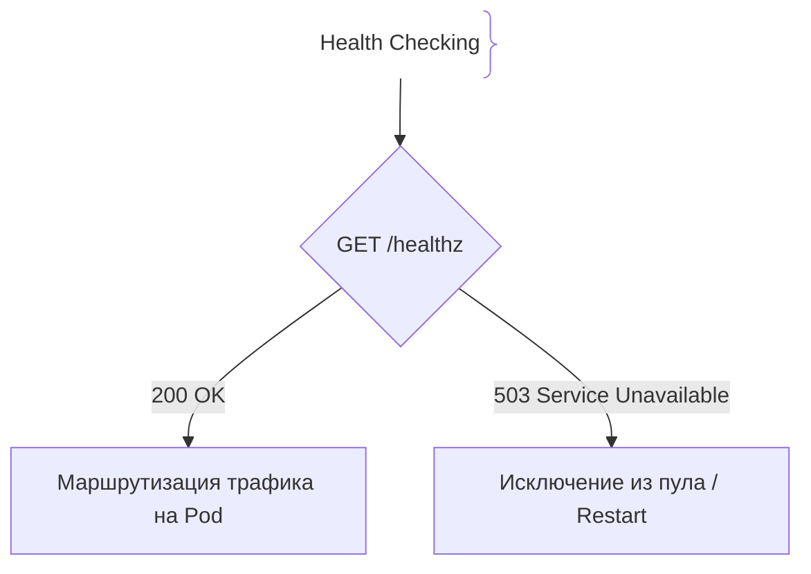
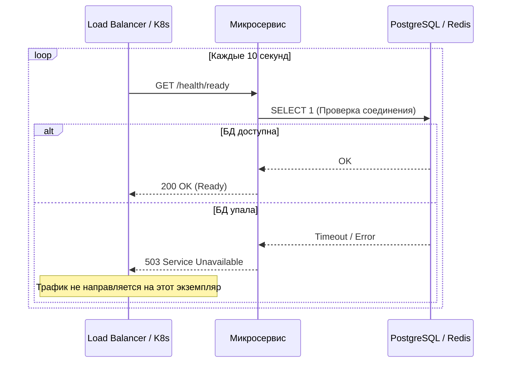

# Проверки здоровья (Health Checks)

## Определение

Проверки здоровья (Health Checks) — это стандартные HTTP-эндпоинты микросервиса (например, `/health`, `/ready`), которые оркестраторы (Kubernetes), балансировщики нагрузки (ALB/Nginx) и системы мониторинга используют для проверки работоспособности приложения.

## Зачем нужны Health Checks

В распределенных системах недостаточно просто запустить процесс приложения; нужно знать, готов ли он принимать трафик и жива ли его база данных.
- **Graceful Degradation / Routing:** Балансировщик нагрузки перестает отправлять трафик на инстанс, если его health check вернул ошибку.
- **Автоматическое восстановление:** Оркестраторы перезапускают зависшие контейнеры.
- **Разделение типов проверок:** Разделение на проверку жизни приложения (Liveness) и проверку готовности к работе (Readiness).

## Как работают Health Checks





## Примеры кода

> Ключевые сценарии: реализация эндпоинтов `/healthz` (liveness) и `/ready` (readiness) в TypeScript, Go и Java.

### TypeScript (Express Health Endpoint)

```typescript
import express from 'express';

const app = express();

// 1. Liveness: приложение просто запущено
app.get('/health/live', (req, res) => {
  res.status(200).json({ status: 'UP' });
});

// 2. Readiness: проверка зависимостей (БД, Redis)
app.get('/health/ready', async (req, res) => {
  try {
    // Эмуляция проверки соединения с БД
    await checkDatabaseConnection();
    res.status(200).json({ status: 'READY', database: 'connected' });
  } catch (error) {
    res.status(503).json({ status: 'NOT_READY', error: 'Database unreachable' });
  }
});

async function checkDatabaseConnection(): Promise<void> {
  // Проверка соединения
}
```

### Go (Fiber Health Check)

```go
package main

import (
	"context"
	"time"

	"github.com/gofiber/fiber/v2"
)

func main() {
	app := fiber.New()

	// Liveness
	app.Get("/health/live", func(c *fiber.Ctx) error {
		return c.JSON(fiber.Map{"status": "UP"})
	})

	// Readiness
	app.Get("/health/ready", func(c *fiber.Ctx) error {
		ctx, cancel := context.WithTimeout(context.Background(), 2*time.Second)
		defer cancel()

		if err := pingDatabase(ctx); err != nil {
			return c.Status(fiber.StatusServiceUnavailable).JSON(fiber.Map{
				"status": "NOT_READY",
				"error":  err.Error(),
			})
		}

		return c.JSON(fiber.Map{"status": "READY"})
	})

	app.Listen(":8080")
}

func pingDatabase(ctx context.Context) error {
	// Эмуляция проверки пинга БД
	return nil
}
```

### Java (Spring Boot Actuator HealthIndicator)

```java
package com.example.demo;

import org.springframework.boot.actuate.health.Health;
import org.springframework.boot.actuate.health.HealthIndicator;
import org.springframework.stereotype.Component;

@Component("customDB")
public class DatabaseHealthIndicator implements HealthIndicator {

    @Override
    public Health health() {
        boolean dbConnected = checkDb(); // логика проверки
        if (dbConnected) {
            return Health.up().withDetail("database", "PostgreSQL is running").build();
        }
        return Health.down().withDetail("database", "Connection timeout").build();
    }

    private boolean checkDb() {
        return true;
    }
}
```

## Пример использования: интеграция

Эндпоинт готовности проверяет реальные зависимости, а не только факт запущенного процесса:

```ts
app.get('/health/ready', async (_req, res) => {
  try {
    await db.query('SELECT 1')
    res.json({ status: 'ready' })
  } catch {
    res.status(503).json({ status: 'not-ready' })
  }
})
```

Ответ кэшируется на секунды и переиспользуется пробами, чтобы не долбить БД на каждый тик балансировщика.

## Паттерны использования

- **Разделять liveness и readiness** — жив ли процесс, и готов ли принимать трафик (зависимости, очередь).
- **Короткий таймаут пробы** — 200 мс–1 с: медленная проверка сама по себе проблема.
- **Проверять ключевую зависимость, но не все** — падение необязательного сервиса не должно ронять readiness.
- **Состояние рисуется в /metrics и логи** — health 200/503 само по себе мало информации.

## Антипаттерны и ловушки

- **«Ленивый» 200 всегда** — балансировщик шлёт трафик на мёртвый инстанс.
- **Здоровый ответ без проверки зависимостей** — «процесс жив», но БД недоступна.
- **Тяжёлые проверки на каждый тик** — сами создают нагрузку на БД/очередь.
- **Всё проверяется одним эндпоинтом** — нельзя отличить «погиб процесс» от «перестал принимать трафик».

## Когда использовать / когда НЕ использовать

- **Использовать:** любой сервис за балансировщиком или оркестратором; сервисы с зависимостями (БД, Redis, внешние API).
- **НЕ использовать:** разовые задачи и фоновые job'ы — для них важнее результат, а не endpoint'ы; там проверку делает orchestrator по логам/кодам выхода.

## Связанные темы

- **liveness-readiness-probes** — как те же проверки настраиваются в Kubernetes.
- **monitoring** — health checks как источник метрик доступности.
- **metrics** — метрики времени отклика и ошибок дополняют проверки.

## Вопросы

### Q1
**В чем разница между проверками Liveness и Readiness?**
- [ ] Между ними нет разницы
- [x] Liveness проверяет, работает ли сам процесс (и перезапускает его при сбое), а Readiness проверяет, готов ли сервис принимать входящий трафик (проверяя зависимости вроде БД)
- [ ] Readiness перезапускает сервер, а Liveness отключает интернет
- [ ] Liveness работает только в браузере

Пояснение: Liveness отвечает на вопрос «жив ли процесс?», а Readiness — «может ли он обслуживать запросы?».

### Q2
**Что должен вернуть эндпоинт `/health/ready`, если база данных, необходимая для работы сервиса, временно недоступна?**
- [ ] HTTP 200 OK
- [x] HTTP 503 Service Unavailable (чтобы балансировщик перестал направлять туда трафик)
- [ ] HTTP 404 Not Found
- [ ] HTTP 301 Moved Permanently

Пояснение: Код 503 сигнализирует внешним системам, что данный инстанс не готов принимать запросы.

### Q3
**Почему нельзя в проверке Liveness делать тяжелые запросы к внешним базам данных?**
- [ ] Базы данных не любят Liveness
- [x] Если база на секунду затормозит, оркестратор решит, что приложение зависло, и начнет бесконечный цикл перезагрузок (restart loop)
- [ ] Это запрещено спецификацией TypeScript
- [ ] Увеличится потребление диска

Пояснение: Liveness должна быть максимально легкой и быстрой проверкой состояния процесса, иначе ложные срабатывания вызовут шторм перезапусков.

### Q4
**Какой стандартный фреймворк в экосистеме Java Spring Boot из коробки предоставляет готовые эндпоинты `/actuator/health`?**
- [ ] Spring JDBC
- [x] Spring Boot Actuator
- [ ] Hibernate ORM
- [ ] Spring Security

Пояснение: Spring Boot Actuator включает в себя встроенные индикаторы здоровья диска, базы данных, памяти и кастомные проверки.

### Q5
**Что произойдет с трафиком балансировщика, если микросервис перестанет отвечать на Health Check запросы?**
- [ ] Трафик продолжит идти в полном объеме
- [x] Балансировщик исключит этот инстанс из пула живых серверов и перенаправит запросы на остальные экземпляры
- [ ] Выключится весь дата-центр
- [ ] Клиенты получат вечный лоадер

Пояснение: Исключение нездорового пода/инстанса из балансировки защищает пользователей от ошибок.

## Источники

- Kubernetes Probes Documentation: https://kubernetes.io/docs/tasks/configure-pod-container/configure-liveness-readiness-startup-probes/
- Spring Boot Actuator: https://docs.spring.io/spring-boot/docs/current/reference/html/actuator.html
