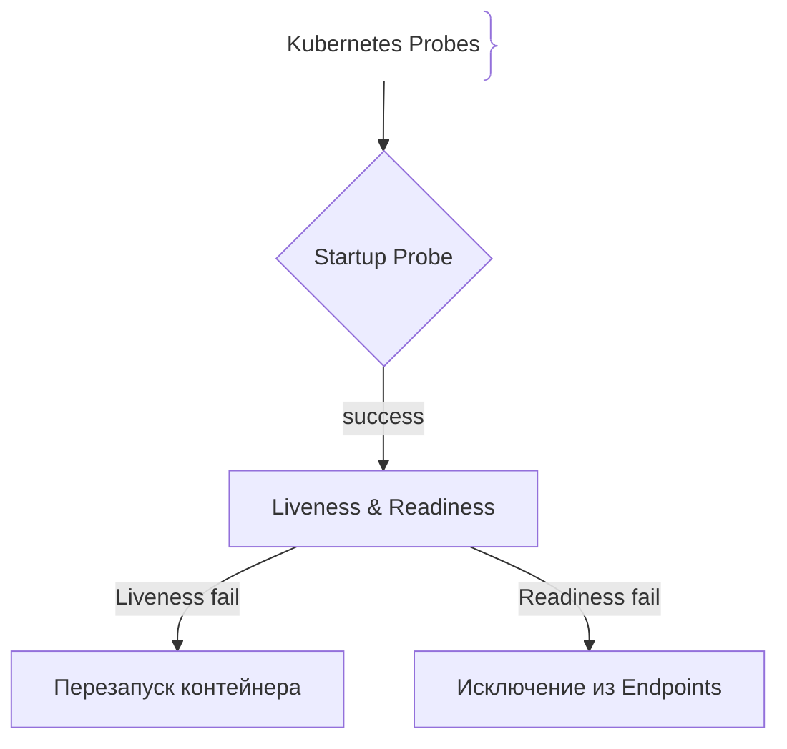
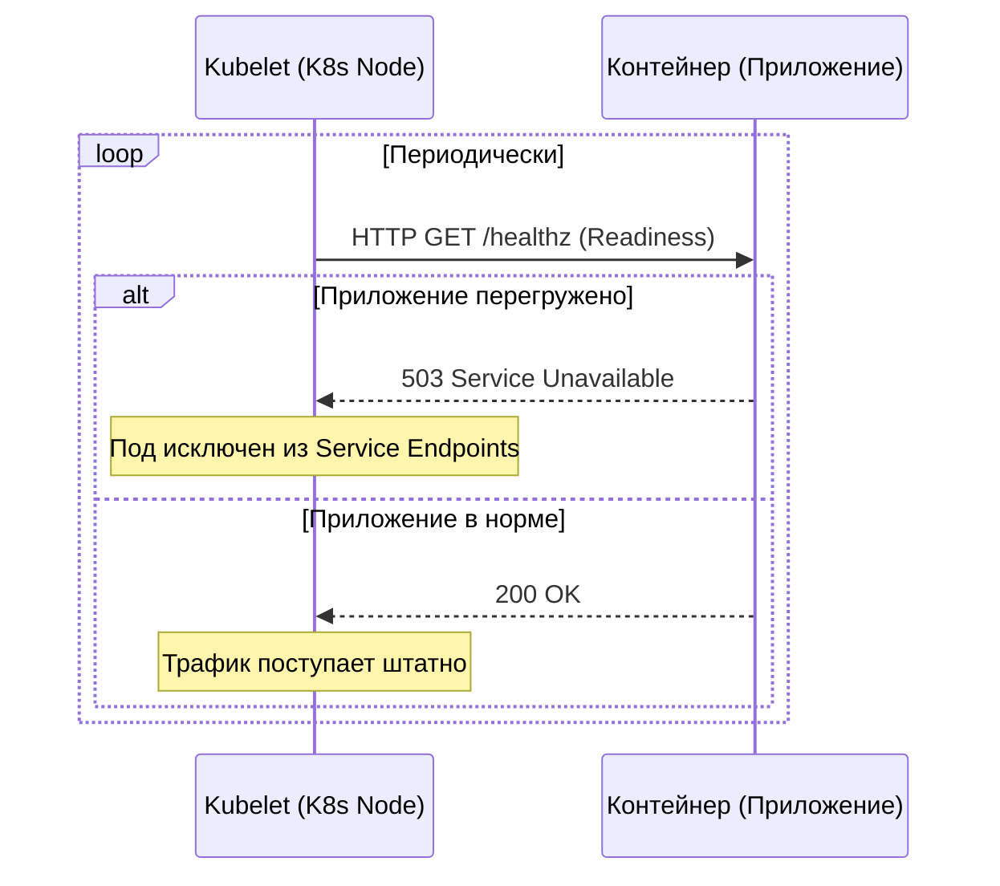

# Liveness и Readiness пробы в K8s

В Kubernetes (K8s) пробы (Probes) — это механизмы автоматического контроля состояния контейнеров в поде (Pod). Платформа периодически выполняет проверки, решая, когда перезапустить упавший контейнер (Liveness), а когда временно убрать его из балансировки сервиса (Readiness).

## Зачем нужны пробы в Kubernetes

Без проб Kubernetes не знает, что приложение внутри контейнера зависло (например, в deadlock), продолжая направлять на него пользовательский трафик.
- **Liveness Probe:** Проверяет, жив ли процесс. Если проба падает, K8s убивает контейнер и создает новый (`restartPolicy`).
- **Readiness Probe:** Проверяет, готов ли контейнер обрабатывать входящие запросы. Если проба падает, под удаляется из Endpoints сервиса, и трафик на него не поступает.
- **Startup Probe:** Используется для медленно стартующих приложений (например, тяжелых Java/JVM сервисов), отключая liveness/readiness до завершения инициализации.

## Как работают пробы в K8s





## Примеры кода

> Ключевые сценарии: конфигурация Liveness, Readiness и Startup проб в манифесте Kubernetes YAML.

### Kubernetes Deployment Manifest (YAML)

```yaml
apiVersion: apps/v1
kind: Deployment
metadata:
  name: core-api-service
spec:
  replicas: 3
  selector:
    matchLabels:
      app: core-api
  template:
    metadata:
      labels:
        app: core-api
    spec:
      containers:
      - name: api
        image: mycompany/core-api:v1.0.0
        ports:
        - containerPort: 8080
          
        # 1. Startup Probe
        startupProbe:
          httpGet:
            path: /health/startup
            port: 8080
          failureThreshold: 30
          periodSeconds: 10

        # 2. Liveness Probe
        livenessProbe:
          httpGet:
            path: /health/live
            port: 8080
          initialDelaySeconds: 5
          periodSeconds: 10
          timeoutSeconds: 2
          failureThreshold: 3

        # 3. Readiness Probe
        readinessProbe:
          httpGet:
            path: /health/ready
            port: 8080
          initialDelaySeconds: 5
          periodSeconds: 5
          timeoutSeconds: 2
          failureThreshold: 2
```

### TypeScript (Health Endpoints для K8s)

```typescript
import express from 'express';

const app = express();
let isReady = false;

setTimeout(() => {
  isReady = true;
}, 15000);

app.get('/health/startup', (req, res) => res.status(200).send('Started'));
app.get('/health/live', (req, res) => res.status(200).send('Alive'));
app.get('/health/ready', (req, res) => {
  if (isReady) {
    res.status(200).send('Ready');
  } else {
    res.status(503).send('Not Ready');
  }
});
```

### Go (Kubernetes Probes Server)

```go
package main

import (
	"net/http"
	"time"
)

var startTime = time.Now()

func main() {
	mux := http.NewServeMux()

	mux.HandleFunc("/health/live", func(w http.ResponseWriter, r *http.Request) {
		w.WriteHeader(http.StatusOK)
		w.Write([]byte("OK"))
	})

	mux.HandleFunc("/health/ready", func(w http.ResponseWriter, r *http.Request) {
		if time.Since(startTime) < 10*time.Second {
			w.WriteHeader(http.StatusServiceUnavailable)
			w.Write([]byte("Initializing"))
			return
		}
		w.WriteHeader(http.StatusOK)
		w.Write([]byte("Ready"))
	})

	http.ListenAndServe(":8080", mux)
}
```

## Вопросы

### Q1
**Что произойдет с подом в Kubernetes, если его `livenessProbe` трижды вернет HTTP ошибку (превышен `failureThreshold`)?**
- [ ] Под будет полностью удален из кластера навсегда
- [x] Kubernetes убьет (kill) этот контейнер и автоматически создаст новый в соответствии с политикой перезапуска
- [ ] Кластер переключится на резервный дата-центр
- [ ] Ничего не произойдет

Пояснение: Провал liveness пробы сигнализирует K8s о том, что процесс находится в нерабочем состоянии, и его необходимо перезапустить.

### Q2
**Какую проблему решает `startupProbe` в Kubernetes?**
- [ ] Ускоряет сборку Docker-образов
- [x] Защищает медленно стартующие приложения (например, Java/Spring) от преждевременного убийства liveness-пробой во время инициализации
- [ ] Шифрует трафик между подами
- [ ] Управляет версиями Helm-чартов

Пояснение: Пока выполняется startupProbe, остальные пробы отключены, что дает тяжелым приложениям время на поднятие.

### Q3
**В чем разница в поведении K8s при провале Liveness и Readiness проб?**
- [x] Liveness перезапускает под, а Readiness убирает под из эндпоинтов сервиса (снимает трафик), не перезапуская контейнер
- [ ] Readiness перезапускает под, а Liveness ничего не делает
- [ ] Между ними нет разницы
- [ ] Обе пробы всегда перезапускают ноду

Пояснение: Readiness управляет только маршрутизацией трафика (балансировкой), а Liveness отвечает за жизненный цикл процесса (перезапуск).

### Q4
**Какой параметр конфигурации в K8s определяет количество последовательных неудачных проверок до того, как действие будет применено?**
- [ ] `initialDelaySeconds`
- [x] `failureThreshold`
- [ ] `periodSeconds`
- [ ] `timeoutSeconds`

Пояснение: `failureThreshold` задает порог сбоев, защищая от ложных срабатываний при кратковременной сетевой помехе.

### Q5
**Что рекомендуется возвращать в эндпоинте readiness-пробы, если приложение еще загружает кэш или устанавливает соединения с БД?**
- [ ] HTTP 200 OK
- [x] HTTP 503 Service Unavailable
- [ ] HTTP 401 Unauthorized
- [ ] HTTP 400 Bad Request

Пояснение: Пока инициализация не завершена, инстанс не должен получать пользовательский трафик (код 503).

## Источники

- Kubernetes Configure Liveness, Readiness and Startup Probes: https://kubernetes.io/docs/tasks/configure-pod-container/configure-liveness-readiness-startup-probes/
- Google Cloud Kubernetes Best Practices: https://cloud.google.com/blog/products/containers-kubernetes/kubernetes-best-practices-setting-up-health-checks-with-readiness-and-liveness-probes
