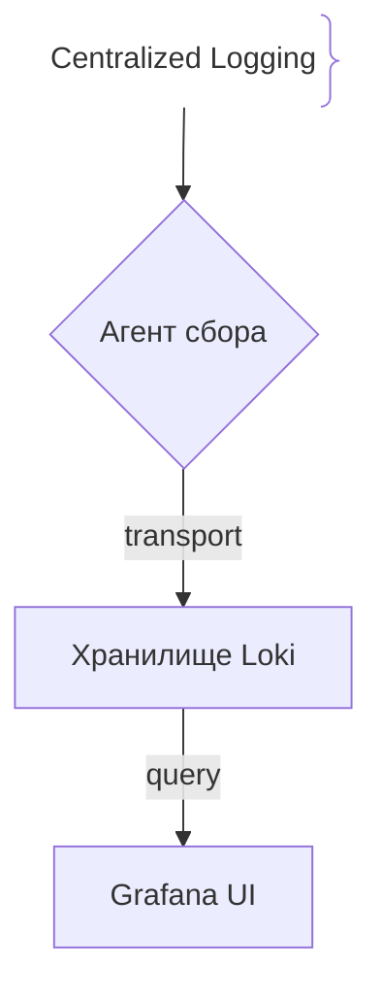
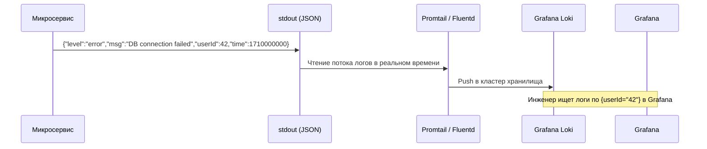

# Логирование (Logging)

## Определение

Логирование (Logging) — это запись дискретных текстовых или структурированных событий (логов), происходящих в приложении, с указанием временной метки (timestamp) и уровня важности (log level), что позволяет восстановить хронологию работы системы.

## Зачем нужно логирование

В отличие от метрик, которые показывают общие агрегированные показатели (например, «ошибок стало больше»), логи дают детальный контекст конкретного события или транзакции.
- **Диагностика ошибок:** Позволяет увидеть полный стек вызовов (stack trace) и входные параметры при падении запроса.
- **Структурированные логи (JSON):** Современные системы логирования (ELK, Grafana Loki) требуют логи в формате JSON для эффективной индексации и фильтрации по полям (userId, traceId, service).
- **Уровни логов (Log Levels):** `DEBUG`, `INFO`, `WARN`, `ERROR`, `FATAL` для фильтрации шума и фокусировки на критичных проблемах.

## Как работает сбор логов





## Примеры кода

> Ключевые сценарии: вывод структурированных JSON-логов с контекстом в TypeScript, Go и Java.

### TypeScript (Pino / Winston)

```typescript
import pino from 'pino';

// Инициализация структурированного JSON-логгера
const logger = pino({
  level: 'info',
  timestamp: pino.stdTimeFunctions.isoTime,
});

function processOrder(orderId: string, userId: number) {
  logger.info({ orderId, userId, action: 'order_started' }, 'Processing new order');

  try {
    // Эмуляция работы
    if (!orderId) throw new Error('Invalid order');
  } catch (error: any) {
    logger.error({ orderId, userId, err: error.message }, 'Failed to process order');
  }
}

processOrder('ord-999', 42);
```

### Go (Zap Structured Logger)

```go
package main

import (
	"go.uber.org/zap"
)

func main() {
	// Создаем быстрый структурированный логгер
	logger, _ := zap.NewProduction()
	defer logger.Sync()

	orderID := "ord-123"
	userID := 88

	logger.Info("Processing order",
		zap.String("orderId", orderID),
		zap.Int("userId", userID),
	)

	// Логирование ошибки с контекстом
	logger.Error("Database timeout",
		zap.String("orderId", orderID),
		zap.Duration("latency", 500),
	)
}
```

### Java (SLF4J + Logback / Structured MDC)

```java
package com.example.demo;

import org.slf4j.Logger;
import org.slf4j.LoggerFactory;
import org.slf4j.MDC;

public class OrderService {

    private static final Logger log = LoggerFactory.getLogger(OrderService.class);

    public void processOrder(String orderId, String userId) {
        // Добавление контекста в MDC (Mapped Diagnostic Context)
        MDC.put("orderId", orderId);
        MDC.put("userId", userId);

        try {
            log.info("Processing order started");
            // Бизнес-логика
        } catch (Exception e) {
            log.error("Failed to process order", e);
        } finally {
            MDC.clear(); // Обязательная очистка MDC во избежание утечки контекста в пуле потоков
        }
    }
}
```

## Пример использования: интеграция

Структурированные JSON-логи в stdout с traceId для корреляции и redact'ом секретов:

```ts
import pino from 'pino'

const logger = pino({
  base: { service: 'orders', env: process.env.NODE_ENV },
  redact: ['password', 'token', 'authorization'],
})

logger.error(
  { err, traceId: req.headers['traceparent'] },
  'DB connection failed',
)
```

Агент (Promtail/Fluentd) подхватывает поток из stdout и складывает в хранилище — приложение само не пишет в файлы.

## Паттерны использования

- **Структурированный JSON + traceId** — логи фильтруются и склеиваются с трейсами.
- **Писать в stdout**, сборку отдавать агенту — локализует и деплой, и масштабирование.
- **Умеренные уровни** — DEBUG — по требованию, WARN/ERROR — с контекстом ошибки.
- **Redact секретов в конфиге логгера** — пароль не попадёт в лог даже случайно.

## Антипаттерны и ловушки

- **Свободный текст вместо структуры** — строка не фильтруется по полям, парализует журнал.
- **Секреты и тела запросов в логах** — утечка данных при разборе инцидента.
- **Логирование на каждый запрос с body** — гигабайты шума на пустом месте.
- **Запись в локальные файлы без ротации** — контейнер растёт и умирает по диску вместе с сборщиком.

## Когда использовать / когда НЕ использовать

- **Использовать:** всегда, но прежде всего для дебага, аудита и разбора инцидентов.
- **НЕ использовать:** для агрегации счётчиков (это метрики); для высокочастотных значений — дешевле гистограмма.

## Связанные темы

- **monitoring** — мониторинг потребляет логи как один из сигналов.
- **distributed-tracing** — логи коррелируются с трейсами по traceId.
- **metrics** — числовые агрегаты вместо хранения всего в логах.

## Вопросы

### Q1
**Почему в современных облачных архитектурах рекомендуется писать логи в стандартный поток вывода (`stdout`/`stderr`) в формате JSON, а не в локальные файлы на диске?**
- [ ] Так требуют процессоры Intel
- [x] Контейнеризаторы (Docker, Kubernetes) автоматически перехватывают stdout и передают агентам сбора логов, упрощая ротацию и централизацию
- [ ] Формат JSON ускоряет работу базы данных в 10 раз
- [ ] Файлы на диске запрещены законом

Пояснение: Twelve-Factor App методология рассматривает логи как потоки событий (event streams), что идеально подходит для сбора из stdout контейнеров.

### Q2
**Что такое MDC (Mapped Diagnostic Context) в Java-логировании?**
- [ ] Механизм шифрования паролей
- [x] Потокобезопасный контейнер «ключ-значение» для автоматического добавления контекстных данных (например, `traceId`, `userId`) во все логи текущего потока
- [ ] Драйвер для подключения к Redis
- [ ] Инструмент сборки Maven

Пояснение: MDC избавляет от необходимости вручную передавать `userId` или `traceId` в каждый метод логирования.

### Q3
**Какой уровень логирования (Log Level) следует использовать для записи критических ошибок приложения, требующих немедленного вмешательства дежурного инженера?**
- [ ] `DEBUG`
- [ ] `INFO`
- [x] `ERROR` или `FATAL`
- [ ] `TRACE`

Пояснение: Уровни ERROR и FATAL сигнализируют о сбоях в работе бизнес-логики или авариях, которые триггерят алерты.

### Q4
**В чем главное преимущество структурированных логов (JSON) перед plain-text логами?**
- [ ] Они занимают больше места на диске
- [x] Их можно легко парсить, индексировать и фильтровать по конкретным полям в поисковых движках (Elasticsearch, Loki)
- [ ] Они работают только на TypeScript
- [ ] Они не требуют временной метки

Пояснение: Структурированные логи превращают неразборчивую строку текста в набор колонок/полей, доступных для моментального поиска.

### Q5
**Что такое сэмплирование логов (Log Sampling)?**
- [ ] Удаление всех логов без исключения
- [x] Метод уменьшения объема логирования путем сохранения только части однотипных успешных логов (например, 1 из 100 запросов `200 OK`), при этом сохраняя все ошибки
- [ ] Перевод логов на английский язык
- [ ] Сжатие файлов логов в ZIP

Пояснение: В условиях огромного RPS логирование каждого успешного запроса перегружает хранилища, поэтому успешные запросы сэмплируют, а ошибки пишут на 100%.

## Источники

- Twelve-Factor App - Logs: https://12factor.net/logs
- Pino Logger Docs: https://getpino.io/
- Grafana Loki Documentation: https://grafana.com/docs/loki/latest/
- Uber Zap Logger: https://github.com/uber-go/zap
