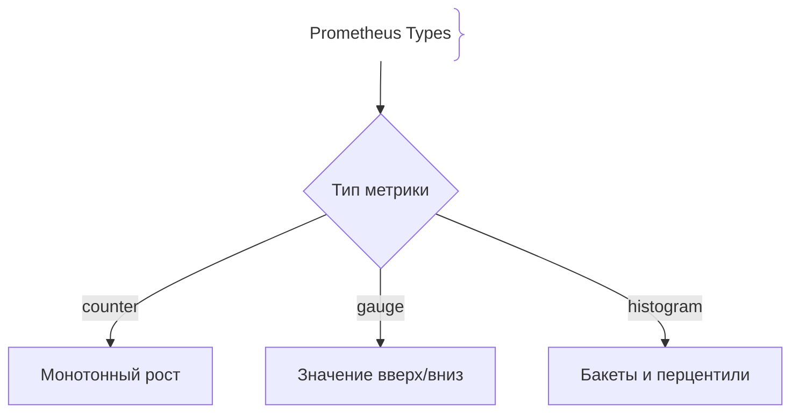
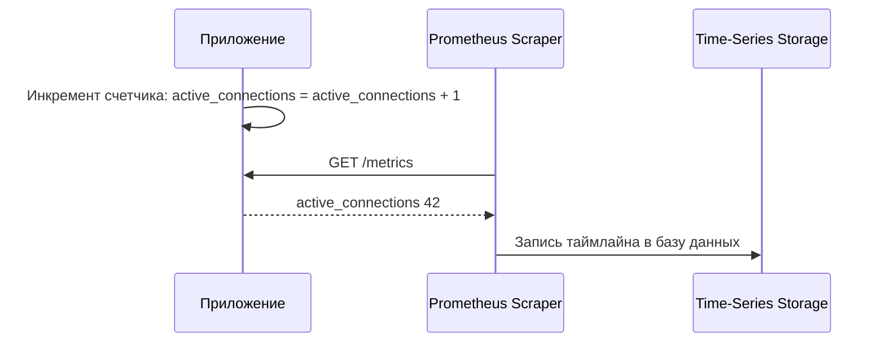

# Метрики (Metrics)

Метрики (Metrics) — это числовые показатели работы системы, агрегированные за определенные интервалы времени. В отличие от логов (события) и трейсов (путь запроса), метрики занимают минимум места и идеально подходят для построения графиков и алертов.

## Зачем нужны метрики и их типы

Метрики дают моментальный срез состояния системы и позволяют отслеживать тенденции без необходимости хранить гигабайты текстовых логов.
- **Counter (Счетчик):** Метрика, которая может только монотонно расти (или сбрасываться при рестарте). Пример: количество обработанных HTTP-запросов, число ошибок.
- **Gauge (Датчик):** Метрика, которая может как увеличиваться, так и уменьшаться. Пример: текущее использование памяти, количество активных соединений в пуле, температура CPU.
- **Histogram / Summary (Гистограмма / Сводка):** Измеряет распределение значений во времени (например, времени ответа API) с разбивкой по бакетам (buckets) и процентилям.

## Как работают метрики





## Примеры кода

> Ключевые сценарии: использование Counter, Gauge и Histogram в TypeScript, Go и Java.

### TypeScript (Prom-client Types)

```typescript
import client from 'prom-client';

// 1. Counter (только растет)
const counter = new client.Counter({
  name: 'db_queries_total',
  help: 'Total DB queries',
});

// 2. Gauge (растет и падает)
const activeUsers = new client.Gauge({
  name: 'active_websocket_users',
  help: 'Active WS users right now',
});

// 3. Histogram (распределение)
const latencyHistogram = new client.Histogram({
  name: 'http_request_duration_seconds',
  help: 'Request duration in seconds',
  buckets: [0.1, 0.5, 1, 2, 5],
});

// Использование
counter.inc();
activeUsers.set(150);
const timer = latencyHistogram.startTimer();
// ... выполнение задачи ...
timer();
```

### Go (Prometheus Go Client Types)

```go
package main

import (
	"github.com/prometheus/client_golang/prometheus"
	"github.com/prometheus/client_golang/prometheus/promauto"
)

var (
	// Counter
	jobsProcessed = promauto.NewCounter(prometheus.CounterOpts{
		Name: "jobs_processed_total",
		Help: "Total processed jobs",
	})

	// Gauge
	queueDepth = promauto.NewGauge(prometheus.GaugeOpts{
		Name: "queue_depth_current",
		Help: "Current items in queue",
	})

	// Histogram
	duration = promauto.NewHistogram(prometheus.HistogramOpts{
		Name:    "job_duration_seconds",
		Help:    "Job duration distribution",
		Buckets: prometheus.DefBuckets,
	})
)

func main() {
	jobsProcessed.Inc()
	queueDepth.Set(15)
	duration.Observe(0.35)
}
```

### Java (Micrometer Counters and Gauges)

```java
package com.example.demo;

import io.micrometer.core.instrument.Counter;
import io.micrometer.core.instrument.Gauge;
import io.micrometer.core.instrument.MeterRegistry;
import org.springframework.stereotype.Component;
import java.util.concurrent.atomic.AtomicInteger;

@Component
public class AppMetrics {

    private final Counter loginCounter;
    private final AtomicInteger activeSessions = new AtomicInteger(0);

    public AppMetrics(MeterRegistry registry) {
        this.loginCounter = registry.counter("app.logins.total");

        Gauge.builder("app.sessions.active", activeSessions, AtomicInteger::get)
                .register(registry);
    }

    public void onLogin() {
        loginCounter.increment();
        activeSessions.incrementAndGet();
    }

    public void onLogout() {
        activeSessions.decrementAndGet();
    }
}
```

## Вопросы

### Q1
**Какой тип метрики лучше всего использовать для подсчета общего количества успешно отправленных email-сообщений за все время работы приложения?**
- [ ] Gauge (Датчик)
- [x] Counter (Счетчик)
- [ ] Histogram (Гистограмма)
- [ ] String (Строка)

Пояснение: Счетчик (Counter) предназначен для монотонно возрастающих значений (событий, которые можно только прибавлять).

### Q2
**Какой тип метрики следует выбрать для отслеживания текущего объема свободной оперативной памяти (в байтах) на сервере?**
- [ ] Counter (Счетчик)
- [x] Gauge (Датчик)
- [ ] Summary
- [ ] TraceID

Пояснение: Память может как выделяться (уменьшаться свободная), так и освобождаться (увеличиваться свободная), поэтому подходит только Gauge.

### Q3
**Зачем в гистограммах (Histogram) используются бакеты (Buckets)?**
- [ ] Чтобы хранить логи в архиве
- [x] Для подсчета количества измерений, попавших в заданные интервалы значений (например, сколько запросов выполнилось быстрее 100мс, 500мс и т.д.)
- [ ] Для шифрования сетевых пакетов
- [ ] Для ограничения размера базы данных

Пояснение: Бакеты делят непрерывный диапазон значений на дискретные интервалы для построения перцентилей и распределений в Prometheus.

### Q4
**Что происходит со счетчиком (Counter) при перезагрузке приложения (рестарте процесса)?**
- [ ] Значение сохраняется вечно в оперативной памяти процессора
- [x] Значение сбрасывается в ноль (или к начальному состоянию), так как счетчик хранится в памяти процесса
- [ ] Сервер выключается навсегда
- [ ] Значение удваивается

Пояснение: Метрики хранятся в памяти приложения до опроса системою сбора, поэтому рестарт обнуляет счетчики (в Prometheus для этого используют функцию `rate()`).

### Q5
**Почему метрики требуют значительно меньше дискового пространства и памяти, чем логи?**
- [ ] Метрики сжимаются архиватором RAR
- [x] Метрики представляют собой простые числовые таймлайны (timestamp + число + теги), в то время как логи содержат многословный текстовый контекст
- [ ] Метрики не сохраняются на диск вообще
- [ ] В метриках запрещено использовать буквы

Пояснение: Числовые ряды с тегами сжимаются TSDB-базами до байтов на точку, тогда как текстовые логи требуют инвертированных индексов.

## Источники

- Prometheus Metrics Model: https://prometheus.io/docs/concepts/data_model/
- OpenTelemetry Metrics: https://opentelemetry.io/docs/specs/otel/metrics/
