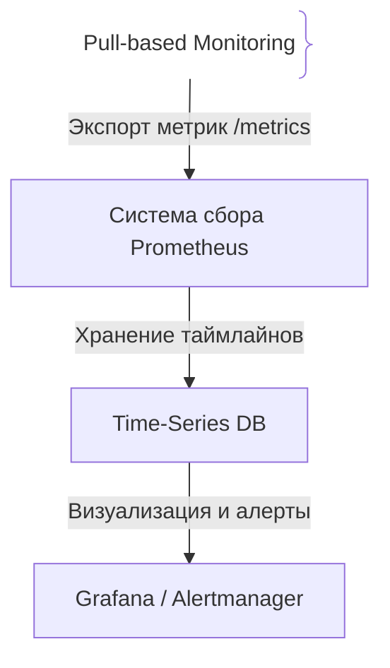
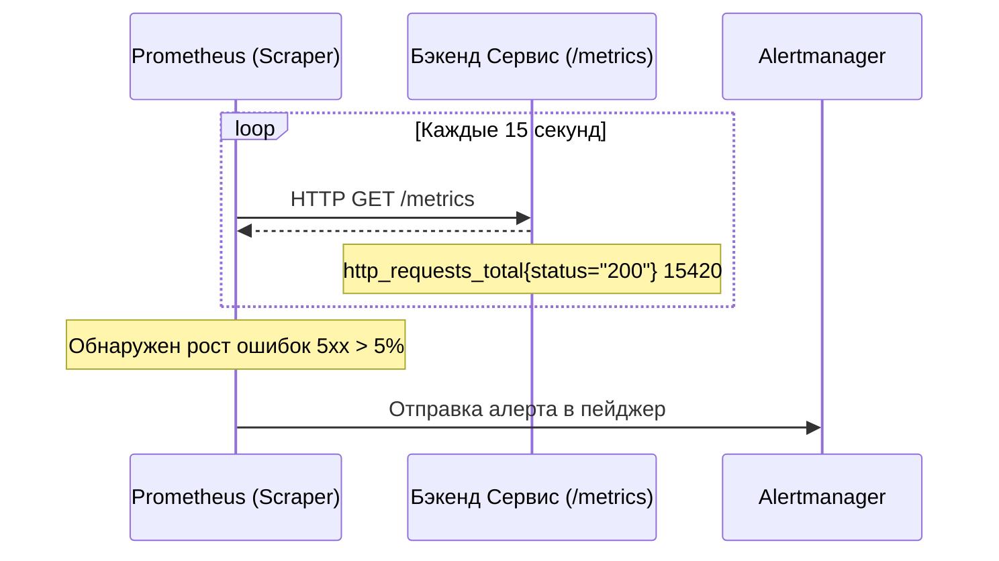

# Мониторинг (Monitoring)

## Определение

Мониторинг (Monitoring) — это процесс сбора, агрегации и анализа непрерывного потока метрик, логов и событий из программной системы с целью оценки её текущего состояния, производительности и своевременного обнаружения аномалий или сбоев.

## Зачем нужен мониторинг

В распределенных и высоконагруженных системах полагаться на ручные проверки невозможно. Мониторинг является фундаментом надежности (Reliability).
- **Обнаружение проблем до пользователей:** Получение алертов о деградации сервиса (рост ошибок 5xx, падение RPS) раньше, чем об этом сообщат клиенты.
- **Анализ тенденций (Capacity Planning):** Прогнозирование исчерпания ресурсов (диск, CPU, память) на основе исторических трендов.
- **Пост-анализ инцидентов:** Быстрый поиск причины аварии при разборе постмортемов (Postmortems).

## Как работает мониторинг





## Примеры кода

> Ключевые сценарии: экспорта метрик (Prometheus counter) в TypeScript, Go и Java.

### TypeScript (prom-client)

```typescript
import express from 'express';
import client from 'prom-client';

const app = express();
const register = new client.Registry();

// Создаем счетчик HTTP запросов
const httpRequestCounter = new client.Counter({
  name: 'http_requests_total',
  help: 'Total HTTP requests',
  labelNames: ['method', 'status'],
});

register.registerMetric(httpRequestCounter);

app.use((req, res, next) => {
  res.on('finish', () => {
    httpRequestCounter.labels(req.method, res.statusCode.toString()).inc();
  });
  next();
});

app.get('/metrics', async (req, res) => {
  res.setHeader('Content-Type', register.contentType);
  res.send(await register.metrics());
});

app.get('/api/test', (req, res) => res.send('OK'));
```

### Go (Prometheus Go Client)

```go
package main

import (
	"net/http"

	"github.com/prometheus/client_golang/prometheus"
	"github.com/prometheus/client_golang/prometheus/promhttp"
)

var httpRequestsTotal = prometheus.NewCounterVec(
	prometheus.CounterOpts{
		Name: "http_requests_total",
		Help: "Total HTTP requests in Go app",
	},
	[]string{"method", "status"},
)

func init() {
	prometheus.MustRegister(httpRequestsTotal)
}

func main() {
	http.HandleFunc("/api/test", func(w http.ResponseWriter, r *http.Request) {
		httpRequestsTotal.WithLabelValues("GET", "200").Inc()
		w.Write([]byte("OK"))
	})

	// Эндпоинт для сбора метрик Prometheus
	http.Handle("/metrics", promhttp.Handler())
	http.ListenAndServe(":8080", nil)
}
```

### Java (Micrometer / Spring Boot)

```java
package com.example.demo;

import io.micrometer.core.instrument.Counter;
import io.micrometer.core.instrument.MeterRegistry;
import org.springframework.web.bind.annotation.GetMapping;
import org.springframework.web.bind.annotation.RestController;

@RestController
public class MetricsController {

    private final Counter requestCounter;

    public MetricsController(MeterRegistry registry) {
        this.requestCounter = Counter.builder("http.requests.total")
                .description("Total HTTP requests in Java app")
                .tags("app", "core-service")
                .register(registry);
    }

    @GetMapping("/api/test")
    public String test() {
        requestCounter.increment();
        return "OK";
    }
}
```

## Пример использования: интеграция

Приложение отдаёт метрики по единому контракту пром-клиента, а мониторинг забирает их по расписанию:

```ts
import { Registry } from 'prom-client'
const registry = new Registry()

app.get('/metrics', async (_req, res) => {
  res.setHeader('Content-Type', registry.contentType)
  res.end(await registry.metrics())
})
```

На проде `/metrics` собираются Prometheus'ом, данные идут в TSDB, на их основе строятся дашборды и алерты.

## Паттерны использования

- **Единый контракт метрик у всех сервисов** — одинаковые имена, лейблы и endpoint'ы.
- **RED и USE** — Rate/Errors/Duration для трафика и Utilisation/Saturation/Errors для ресурсов.
- **Алерты от SLI/SLO** — сигналам нужны пороги из метрик, а не «график упал».
- **Дашборды с коротким контекстом** — время, ошибки, satурация: минимум для принятия решения.

## Антипаттерны и ловушки

- **Мониторинг только инфраструктуры** — CPU/диск смотреть легче, чем бизнес-метрики, но главные аварии — на уровне приложения.
- **Метрики без алертов** — «мониторим, но никто не узнает» значит не мониторим.
- **Дашборд как «галерея графиков»** — без SLO на нём невозможно понять, плохо или нормально.
- **Пустой `/metrics` у одного из сервисов** — контракт нарушен, алерты молчат, а метрики пустые.

## Когда использовать / когда НЕ использовать

- **Использовать:** любая production-система; начинается с метрик и алертов, потом надстраиваются логи и трейсы.
- **НЕ использовать:** когда нет ни потребителя метрик, ни алертов — собирать ради сбора бесполезно; для дебага одного запроса метрики неуместны (нужны логи).

## Связанные темы

- **metrics** — типы и устройство метрик, которые собирает мониторинг.
- **logging** — дискретные события для контекста, дополняющие графики.
- **distributed-tracing** — сквозной путь запроса, когда метрик мало.
- **observability** — следующая ступень после мониторинга.

## Вопросы

### Q1
**В чём главное отличие подхода Pull (используемого в Prometheus) от Push (используемого в старых системах мониторинга)?**
- [ ] Pull работает только по UDP
- [x] При Pull-модели сервер мониторинга сам опрашивает (сканирует) эндпоинты сервисов, что позволяет легко обнаруживать падения самих сервисов
- [ ] Push-модель не требует сети
- [ ] Между ними нет разницы

Пояснение: В Pull-модели сервер сбора знает обо всех таргетах и сразу замечает, если приложение перестает отвечать на `/metrics`.

### Q2
**Что такое временной ряд (Time-Series Data) в базах данных мониторинга?**
- [ ] Архив с логами в формате JSON
- [x] Набор точек данных, индексированных по времени (timestamp + метрика + значения + теги/лейблы)
- [ ] Таблица пользователей в PostgreSQL
- [ ] Список закоммиченных файлов в Git

Пояснение: Time-Series Database оптимизирована для быстрой записи и агрегации метрик во времени.

### Q3
**Какая метрика лучше всего отражает общую работоспособность веб-сервиса с точки зрения пользователя?**
- [ ] Загрузка оперативной памяти на сервере (RAM %)
- [x] Уровень успешности запросов (Error Rate) и задержка ответа (Latency)
- [ ] Количество запущенных потоков CPU
- [ ] Размер папки /var/log

Пояснение: Системные метрики (CPU, RAM) важны для инженеров, но пользовательский опыт определяют коды ответа (ошибки) и скорость.

### Q4
**Зачем нужны лейблы (теги) в метриках Prometheus (например, `status="500"`, `method="POST"`)?**
- [ ] Чтобы сделать код длиннее
- [x] Для многомерной фильтрации и группировки данных при построении графиков и алертов
- [ ] Для шифрования трафика
- [ ] Для автоматического удаления старых данных

Пояснение: Лейблы добавляют контекст к числовой метрике, позволяя разделять запросы по статусам, путям и методам.

### Q5
**Что такое Alertmanager в экосистеме мониторинга?**
- [ ] Компонент, который удаляет базы данных при сбое
- [x] Инструмент дедупликации, группировки и маршрутизации алертов (в Slack, PagerDuty, Telegram)
- [ ] Библиотека для логирования
- [ ] Инструмент для сборки Docker образов

Пояснение: Alertmanager принимает алерты от Prometheus, фильтрует дубликаты и отправляет уведомления дежурным инженерам.

## Источники

- Prometheus Documentation: https://prometheus.io/docs/
- Google SRE Book - Monitoring Distributed Systems: https://sre.google/sre-book/monitoring-distributed-systems/
- Micrometer Docs: https://micrometer.io/docs
