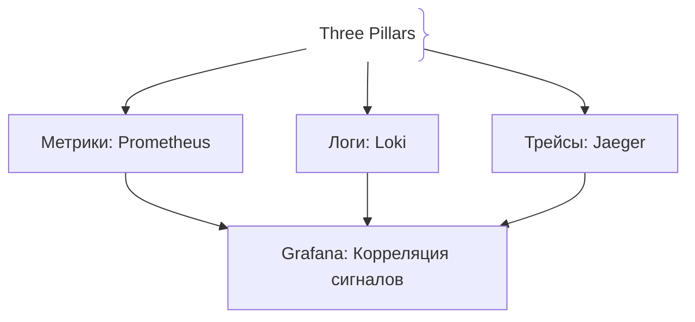
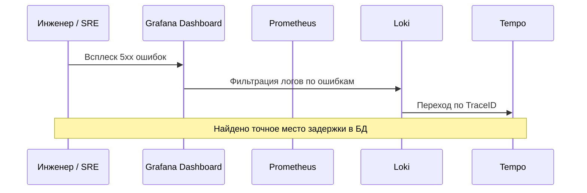

# Концепция Observability (Три кита)

Наблюдаемость (Observability) — это свойство системы, позволяющее по ее внешним выходным данным делать исчерпывающие выводы о ее внутренних проблемах и поведении без необходимости развертывания нового кода.

## Зачем нужна наблюдаемость

Традиционный мониторинг отвечает на вопрос: *«Сломалось ли что-нибудь?»*. Наблюдаемость отвечает на вопрос: *«Почему это сломалось и где именно?»*.
- **Три кита (Three Pillars of Observability):**
  1. **Метрики (Metrics):** Числовые ряды для обнаружения аномалий и алертинга.
  2. **Логи (Logs):** Дискретные события для глубокого контекста ошибки.
  3. **Трейсы (Traces):** Сквозной путь запроса по микросервисам для поиска узких мест.

## Как работает Observability





## Примеры кода

> Ключевые сценарии: объединение логов, метрик и трейсов с единым `TraceID` в TypeScript, Go и Java.

### TypeScript (OpenTelemetry + Pino Correlation)

```typescript
import { trace } from '@opentelemetry/api';
import pino from 'pino';

const logger = pino();

function logWithTraceContext(message: string) {
  const span = trace.getActiveSpan();
  const spanContext = span?.spanContext();

  logger.info({ traceId: spanContext?.traceId, spanId: spanContext?.spanId }, message);
}

logWithTraceContext('Executing database query');
```

### Go (Context Propagation with TraceId in Logs)

```go
package main

import (
	"context"
	"go.opentelemetry.io/otel/trace"
	"go.uber.org/zap"
)

func LogWithTrace(ctx context.Context, logger *zap.Logger, msg string) {
	spanCtx := trace.SpanContextFromContext(ctx)
	if spanCtx.IsValid() {
		logger.Info(msg,
			zap.String("traceId", spanCtx.TraceID().String()),
		)
	} else {
		logger.Info(msg)
	}
}

func main() {
	logger, _ := zap.NewProduction()
	defer logger.Sync()
	LogWithTrace(context.Background(), logger, "User authenticated")
}
```

### Java (SLF4J MDC automatic OTel injection)

```java
package com.example.demo;

import io.opentelemetry.api.trace.Span;
import org.slf4j.Logger;
import org.slf4j.LoggerFactory;
import org.springframework.stereotype.Service;

@Service
public class ObservabilityService {
    private static final Logger log = LoggerFactory.getLogger(ObservabilityService.class);

    public void doWork() {
        String traceId = Span.current().getSpanContext().getTraceId();
        log.info("Doing important work, traceId={}", traceId);
    }
}
```

## Вопросы

### Q1
**В чем принципиальное отличие между Monitoring и Observability?**
- [ ] Между ними нет разницы
- [x] Мониторинг говорит, *что* сломалось, а наблюдаемость позволяет понять, *почему* это сломалось и в чем причина новой проблемы
- [ ] Наблюдаемость работает только без интернета
- [ ] Мониторинг требует Kubernetes

Пояснение: Мониторинг ориентирован на известные аномалии, а Observability дает возможность исследовать любые непредвиденные состояния системы.

### Q2
**Какие три компонента составляют «три кита» наблюдаемости?**
- [ ] CPU, RAM, Disk
- [x] Метрики (Metrics), Логи (Logs) и Трейсы (Traces)
- [ ] HTML, CSS, JavaScript
- [ ] TCP, UDP, HTTP

Пояснение: Метрики, логи и трейсы дополняют друг друга, предоставляя полную картину поведения системы.

### Q3
**Почему корреляция логов и трейсов критически важна при разборе инцидентов?**
- [ ] Чтобы занимать больше места на диске
- [x] Позволяет из графиков метрик мгновенно провалиться в полный трейс и найти корневую причину (Root Cause)
- [ ] Это ускоряет компиляцию TypeScript
- [ ] Требование протокола TCP/IP

Пояснение: Единый TraceID связывает разрозненные источники данных в единую историю расследования.

### Q4
**Что такое «unknown-unknowns» в контексте Observability?**
- [ ] Неизвестные ошибки компиляции
- [x] Проблемы и сбои, с которыми система еще никогда не сталкивалась ранее и для которых невозможно заранее написать алерт
- [ ] Удаленные файлы кода
- [ ] Забытые пароли администраторов

Пояснение: Наблюдаемость создана для исследования новых багов, которые нельзя предсказать заранее.

### Q5
**Какой инструмент в стеке OpenTelemetry отвечает за сбор и экспорт всех трех телеметрических сигналов?**
- [ ] Docker Compose
- [x] OpenTelemetry Collector
- [ ] Nginx Reverse Proxy
- [ ] Webpack Bundler

Пояснение: OTel Collector принимает, обрабатывает и экспортирует метрики, логи и трейсы в любые бэкенды.

## Источники

- Charity Majors — Observability vs Monitoring: https://honeycomb.io/blog/observability-vs-monitoring
- OpenTelemetry Collector: https://opentelemetry.io/docs/collector/
