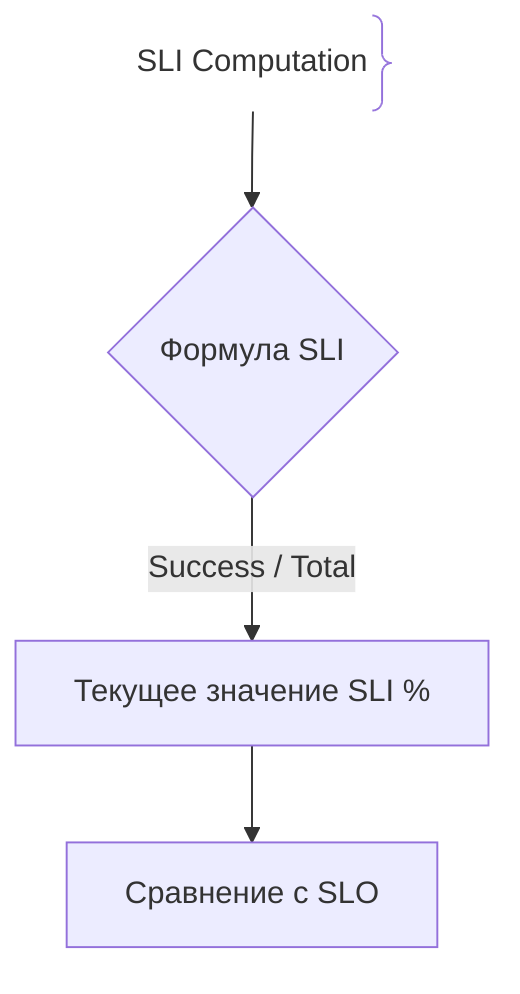
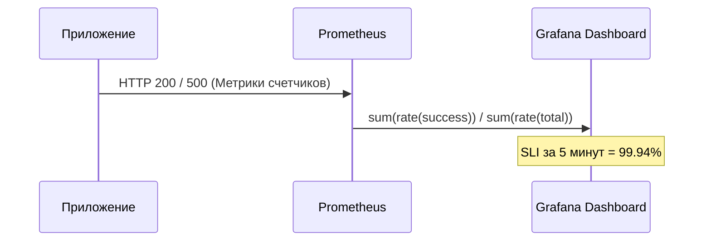

# Индикаторы уровня обслуживания (SLI)

SLI (Service Level Indicator, Индикатор уровня обслуживания) — это количественная метрика производительности или доступности системы, на основе которой вычисляется выполнение целей SLO.

## Зачем нужны SLI

Без правильно выбранных SLI невозможно объективно измерить, насколько хорошо работает приложение с точки зрения пользователя.
- **Основа для SLO:** SLI — это числитель и знаменатель формулы (например, успешные запросы / все запросы).
- **Пользовательский опыт:** SLI измеряет то, что важно клиенту (задержка ответа, процент успешных транзакций).

## Как работают SLI





## Примеры кода

> Ключевые сценарии: формулы расчета SLI в TypeScript, Go и Java.

### TypeScript (SLI Calculator Helper)

```typescript
function calculateAvailabilitySLI(successCount: number, totalCount: number): number {
  if (totalCount === 0) return 100.0;
  return (successCount / totalCount) * 100.0;
}

console.log(`Availability SLI: ${calculateAvailabilitySLI(9995, 10000).toFixed(3)}%`);
```

### Go (SLI percentage calculator)

```go
package main

import "fmt"

func CalculateLatencySLI(fastRequests, totalRequests int) float64 {
	if totalRequests == 0 {
		return 100.0
	}
	return (float64(fastRequests) / float64(totalRequests)) * 100.0
}

func main() {
	fmt.Printf("Latency SLI: %.2f%%\n", CalculateLatencySLI(9910, 10000))
}
```

### Java (SLI Evaluator)

```java
package com.example.demo;

import org.springframework.stereotype.Component;

@Component
public class SliCalculator {
    public double computeAvailability(long success, long total) {
        if (total == 0) return 100.0;
        return ((double) success / total) * 100.0;
    }
}
```

## Вопросы

### Q1
**Что такое SLI (Service Level Indicator)?**
- [ ] Имя сервера в продакшене
- [x] Количественная метрика, измеряющая реальную производительность или доступность системы (например, доля успешных запросов)
- [ ] Бюджет компании на маркетинг
- [ ] Документ с техническим заданием

Пояснение: SLI — это сырая метрика или формула, показывающая текущий уровень сервиса.

### Q2
**Какой из следующих примеров лучше всего подходит в качестве хорошего SLI для веб-приложения?**
- [ ] Процент использования дискового пространства
- [x] Доля HTTP-запросов, выполненных быстрее 200 мс
- [ ] Количество закоммиченных строк в день
- [ ] Температура процессора

Пояснение: Хороший SLI ориентирован на пользователя (latency, success rate), а не на ресурсы железа.

### Q3
**Как соотносятся SLI и SLO?**
- [ ] SLO — это формула SLI
- [x] SLI — это измеренное значение метрики, а SLO — целевое пороговое значение для этой метрики
- [ ] Это синонимы без разницы
- [ ] SLI настраивается в Kubernetes, а SLO в Docker

Пояснение: SLI дает цифру, а SLO задает стандарт («должно быть не менее 99.9%»).

### Q4
**Почему замер SLI по задержке обычно формулируется как «процент запросов быстрее X миллисекунд», а не как среднее время ответа?**
- [ ] Среднее значение легче подделать
- [x] Среднее значение маскирует хвостовые задержки (outliers), в то время как процентное соотношение явно показывает долю медленных пользователей
- [ ] Так требует язык Go
- [ ] Среднее арифметическое запрещено математикой

Пояснение: Процент попадания в интервал дает точное понимание качества обслуживания для большинства клиентов.

### Q5
**Где чаще всего вычисляются и отображаются SLI в современных SRE-практиках?**
- [ ] В текстовых блокнотах инженеров
- [x] В системах визуализации и мониторинга (например, Grafana dashboards на базе Prometheus)
- [ ] Внутри файлов package.json
- [ ] В почтовых клиентах

Пояснение: Дашборды Grafana отображают текущие значения SLI в сравнении с линиями SLO в реальном времени.

## Источники

- Google SRE Book - Service Level Objectives: https://sre.google/sre-book/service-level-objectives/
- Alex Hidalgo — Implementing Service Level Objectives: https://www.oreilly.com/library/view/implementing-service-level/9781492076803/
