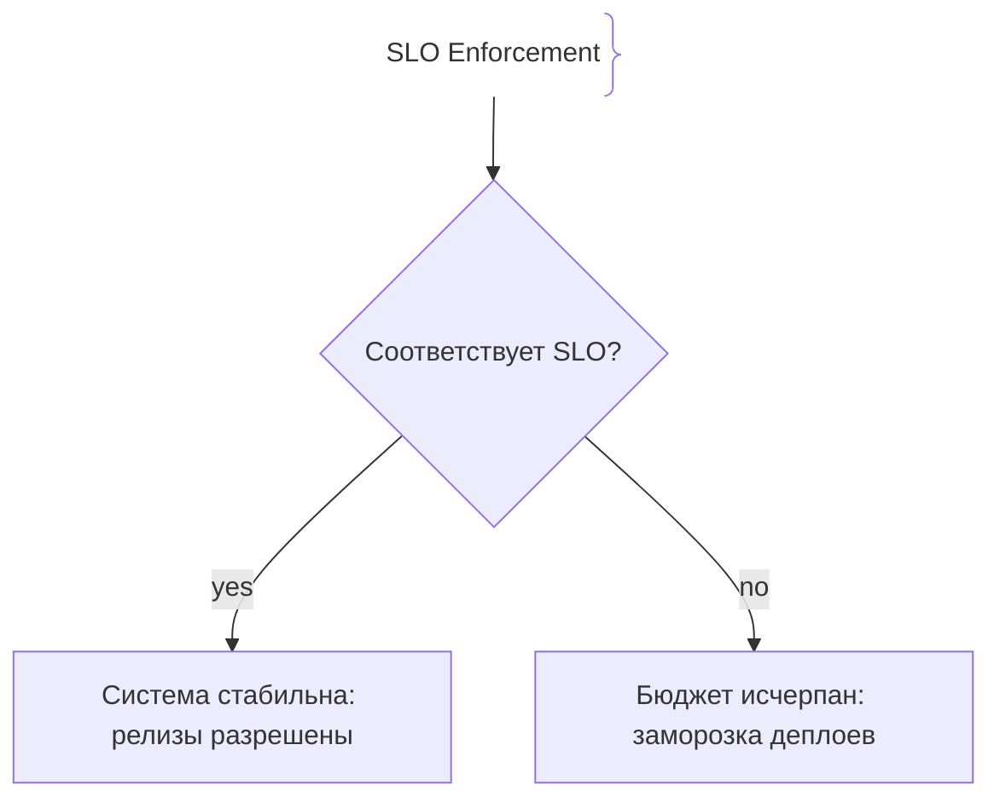
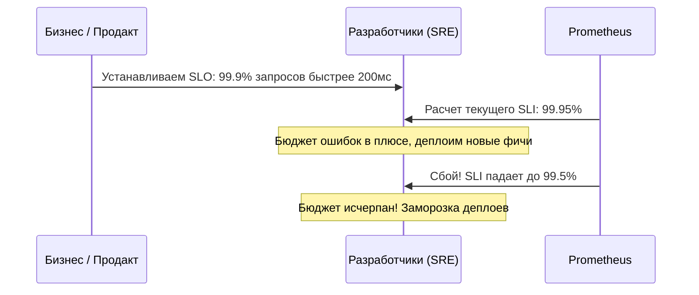

# Цели уровня обслуживания (SLO)

SLO (Service Level Objective, Цель уровня обслуживания) — это целевое значение или диапазон допустимых значений для надежности и производительности сервиса, устанавливаемое внутренне командой разработки и бизнеса на основе метрик SLI.

## Зачем нужны SLO

Установка SLO переводит споры о качестве программного обеспечения в плоскость математики и бизнес-целей.
- **Договор с бизнесом:** Четкое понимание того, какой уровень надежности (например, 99.9% успешных запросов) является достаточным.
- **Управление бюджетом ошибок (Error Budget):** SLO определяет остаток допустимых сбоев, позволяя балансировать между скоростью поставки фич и стабильностью.

## Как работают SLO





## Примеры кода

> Ключевые сценарии: расчет SLO по метрикам в TypeScript, Go и Java.

### TypeScript (Prometheus SLO Query Helper)

```typescript
function evaluateSlo(currentRatio: number, targetSlo: number = 99.9): boolean {
  console.log(`Current SLI: ${currentRatio.toFixed(3)}%, Target SLO: ${targetSlo}%`);
  return currentRatio >= targetSlo;
}

const currentSlm = 99.85;
if (!evaluateSlo(currentSlm)) {
  console.warn('ALERT: SLO violation! Freezing feature deployments.');
}
```

### Go (SLO evaluation function)

```go
package main

import "fmt"

func CheckSLO(successfulRequests, totalRequests int, targetSLO float64) bool {
	if totalRequests == 0 {
		return true
	}
	sli := (float64(successfulRequests) / float64(totalRequests)) * 100.0
	return sli >= targetSLO
}

func main() {
	passed := CheckSLO(99850, 100000, 99.9)
	if !passed {
		fmt.Println("SLO breached!")
	}
}
```

### Java (SLO Compliance Checker)

```java
package com.example.demo;

import org.springframework.stereotype.Service;

@Service
public class SloService {
    public boolean isSloCompliant(long successfulRequests, long totalRequests, double targetPercentage) {
        if (totalRequests == 0) return true;
        double sli = ((double) successfulRequests / totalRequests) * 100.0;
        return sli >= targetPercentage;
    }
}
```

## Вопросы

### Q1
**Что такое SLO (Service Level Objective)?**
- [ ] Имя разработчика системы
- [x] Целевое значение надежности или производительности сервиса, согласованное командой и бизнесом на основе метрик SLI
- [ ] Бюджет на покупку серверов в AWS
- [ ] Максимальное количество строк кода в репозитории

Пояснение: SLO — это конкретная количественная цель (например, «99.9% запросов быстрее 300мс»), которой должна соответствовать система.

### Q2
**В чем разница между SLA и SLO?**
- [ ] Между ними нет разницы
- [x] SLA (Service Level Agreement) — юридический договор с клиентами с финансовыми штрафами за нарушение, а SLO — внутреннее целевое значение для команды
- [ ] SLO — это договор с судом, а SLA — для разработчиков
- [ ] SLA измеряется только в байтах

Пояснение: SLA всегда связано с юридической и финансовой ответственностью перед клиентами, в то время как SLO служит внутренним ориентиром.

### Q3
**Почему установка SLO равного 100% является антипаттерном в SRE?**
- [ ] Это слишком дешево в реализации
- [x] Достижение 100% надежности требует экспоненциально возрастающих затрат и полностью блокирует скорость выпуска новых релизов (velocity)
- [ ] 100% не поддерживается в Prometheus
- [ ] Браузеры не отображают 100%

Пояснение: Законы физики и распределенных систем делают 100% доступность невозможной; любая попытка достичь её останавливает разработку.

### Q4
**Связь между SLI и SLO формулируется как:**
- [ ] SLO — это формула SLI
- [x] SLO устанавливает целевой порог для метрики SLI (например, SLI — это доля успешных запросов, а SLO — требование, чтобы она была не ниже 99.9%)
- [ ] Они никак не связаны
- [ ] SLO вычисляется из логина пользователя

Пояснение: SLO задает числовой рубеж для метрики SLI.

### Q5
**Что происходит с процессом разработки при регулярном нарушении SLO (исчерпании бюджета ошибок)?**
- [ ] Команда получает дополнительные отгулы
- [x] Вводится мораторий на выпуск новых продуктовых фич (feature freeze), пока надежность не будет восстановлена
- [ ] Удаляется вся база данных
- [ ] Увеличивается зарплата менеджеров

Пояснение: При исчерпании бюджета ошибок релизы фич замораживаются до стабилизации системы.

## Источники

- Google SRE Book - SLOs: https://sre.google/sre-book/service-level-objectives/
- Alex Hidalgo — Implementing Service Level Objectives
