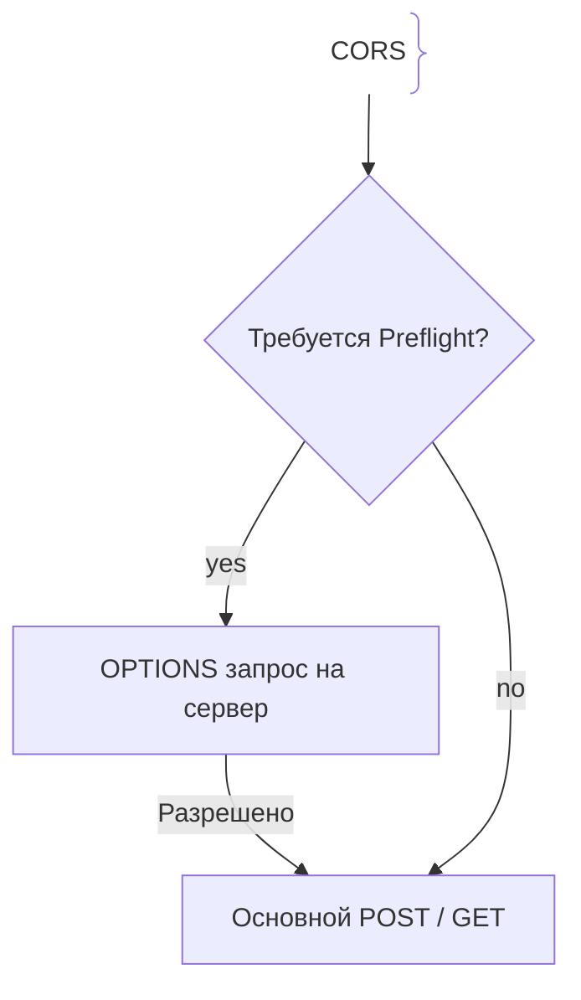
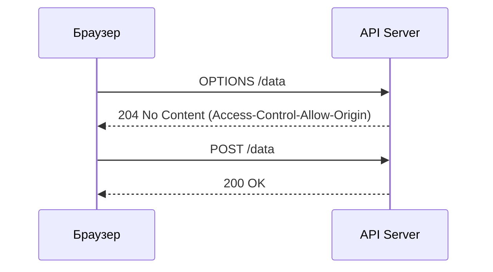

# CORS (Cross-Origin Resource Sharing)

CORS — это механизм безопасности на основе HTTP-заголовков, реализованный в браузерах, позволяющий странице одного домена запрашивать ресурсы с другого домена.

## Зачем нужен CORS

По умолчанию действует **Same-Origin Policy (SOP)**. Браузер запрещает скриптам одного домена читать ответы от другого, если домен, протокол или порт различаются.
- **Защита от кражи данных:** SOP/CORS защищает пользователя от вредоносных сайтов, ворующих сессии.
- **Preflight (OPTIONS):** Предварительный запрос для проверки разрешений сервера.

## Как работает CORS Preflight





## Примеры кода

> Ключевые сценарии: настройка CORS в TypeScript, Go и Java.

### TypeScript (Express CORS)

```typescript
import express from 'express';
import cors from 'cors';

const app = express();
app.use(cors({ origin: 'https://trusted.com', credentials: true }));
```

### Go (rs/cors)

```go
package main

import (
	"net/http"
	"github.com/rs/cors"
)

func main() {
	mux := http.NewServeMux()
	handler := cors.New(cors.Options{
		AllowedOrigins: []string{"https://trusted.com"},
		AllowCredentials: true,
	}).Handler(mux)
	http.ListenAndServe(":8080", handler)
}
```

### Java (Spring Boot)

```java
package com.example.demo;

import org.springframework.context.annotation.Bean;
import org.springframework.context.annotation.Configuration;
import org.springframework.web.filter.CorsFilter;
import org.springframework.web.cors.CorsConfiguration;
import org.springframework.web.cors.UrlBasedCorsConfigurationSource;

@Configuration
public class CorsConfig {
    @Bean
    public CorsFilter corsFilter() {
        UrlBasedCorsConfigurationSource source = new UrlBasedCorsConfigurationSource();
        CorsConfiguration config = new CorsConfiguration();
        config.addAllowedOrigin("https://trusted.com");
        config.setAllowCredentials(true);
        source.registerCorsConfiguration("/**", config);
        return new CorsFilter(source);
    }
}
```

## Вопросы

### Q1
**Что защищает политика Same-Origin Policy (SOP)?**
- [ ] Скорость интернета
- [x] Изоляцию веб-приложений, запрещая скриптам одного сайта читать данные других сайтов
- [ ] Отключение рекламы
- [ ] Работу БД

Пояснение: SOP предотвращает кражу данных через браузер.

### Q2
**Что такое preflight-запрос (OPTIONS) в CORS?**
- [ ] Ошибка
- [x] Предварительный запрос браузера для проверки разрешений перед отправкой основного запроса
- [ ] Обновление страницы
- [ ] Шифрование TLS

Пояснение: Preflight отправляется автоматически для нестандартных запросов.

### Q3
**Почему нельзя использовать `Access-Control-Allow-Origin: *` с `credentials: true`?**
- [ ] Перегрев CPU
- [x] Спецификация CORS запрещает звездочку при отправке кук из соображений безопасности
- [ ] Ошибка в Go
- [ ] Браузер сотрет историю

Пояснение: Разрешение '*' для всех с куками позволило бы любому сайту красть сессии.

### Q4
**Что определяет понятие «Origin»?**
- [ ] Только домен
- [x] Протокол, домен и порт
- [ ] IP и маска
- [ ] Логин и пароль

Пояснение: Различие в любом из трех параметров делает источники разными.

### Q5
**Срабатывает ли CORS на бэкенд-серверах (например, при запросе из Node.js в Go)?**
- [ ] Да
- [x] Нет, CORS — это механизм безопасности исключительно веб-браузеров
- [ ] Только при HTTPS
- [ ] Под Windows

Пояснение: CORS защищает браузер, а серверы обмениваются запросами напрямую.

## Источники

- MDN - CORS: https://developer.mozilla.org/en-US/docs/Web/HTTP/CORS
- OWASP CORS: https://cheatsheetseries.owasp.org/cheatsheets/CORS_Cheat_Sheet.html
