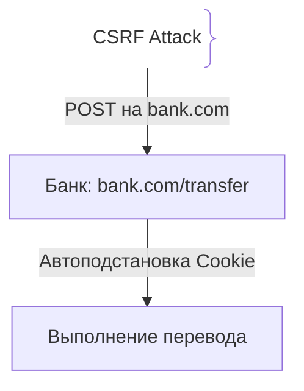
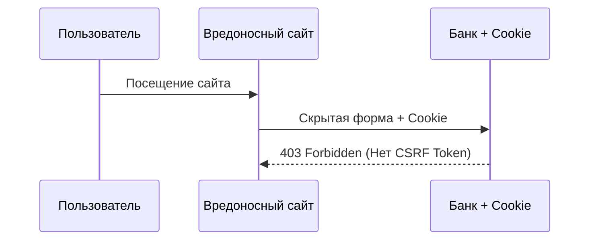

# CSRF (Cross-Site Request Forgery)

CSRF — уязвимость, при которой злоумышленник заставляет авторизованного пользователя выполнить нежелательные действия (перевод денег, смена пароля) без его ведома.

## Зачем нужна защита от CSRF

Браузеры автоматически прикрепляют сессионные куки к любому запросу на целевой домен.
- **SameSite Cookies:** Защита браузера (`SameSite=Lax/Strict`).
- **CSRF Tokens:** Случайный токен, привязанный к сессии.

## Как работает CSRF-атака





## Примеры кода

> Ключевые сценарии: защита SameSite и CSRF токенами в TypeScript, Go и Java.

### TypeScript (SameSite Cookie)

```typescript
import express from 'express';
import cookieParser from 'cookie-parser';

const app = express();
app.use(cookieParser());

app.post('/api/login', (req, res) => {
  res.cookie('session_id', 'token', {
    httpOnly: true,
    secure: true,
    sameSite: 'strict',
  });
  res.json({ ok: true });
});
```

### Go (gorilla/csrf)

```go
package main

import (
	"net/http"
	"github.com/gorilla/csrf"
)

func main() {
	r := http.NewServeMux()
	CSRF := csrf.Protect([]byte("32-byte-long-auth-key-secret-abc"))
	http.ListenAndServe(":8080", CSRF(r))
}
```

### Java (Spring Security CSRF)

```java
package com.example.demo;

import org.springframework.context.annotation.Bean;
import org.springframework.context.annotation.Configuration;
import org.springframework.security.config.annotation.web.builders.HttpSecurity;
import org.springframework.security.web.SecurityFilterChain;

@Configuration
public class SecurityConfig {
    @Bean
    public SecurityFilterChain filterChain(HttpSecurity http) throws Exception {
        http.csrf(csrf -> csrf.ignoringRequestMatchers("/api/public/**"));
        return http.build();
    }
}
```

## Вопросы

### Q1
**В чем суть уязвимости CSRF?**
- [ ] Чтение пароля с экрана
- [x] Использование автоподстановки браузером кук при кросс-доменных запросах для выполнения действий от имени пользователя
- [ ] Ошибка TypeScript
- [ ] Перехват HTTP

Пояснение: CSRF заставляет браузер жертвы отправить запрос со своими куками.

### Q2
**Что делает `SameSite=Strict`?**
- [ ] Удаляет куку
- [x] Запрещает отправку куки при любых кросс-доменных запросах, обеспечивая защиту от CSRF
- [ ] Разрешает JS доступ
- [ ] Отключает шифрование

Пояснение: SameSite=Strict блокирует куку при переходах со сторонних сайтов.

### Q3
**Почему для Stateless API на JWT атака CSRF не актуальна?**
- [ ] JWT невозможно украсть
- [x] Браузеры не подставляют заголовки `Authorization` автоматически при запросах со сторонних сайтов
- [ ] JWT шифруется
- [ ] API без интернета

Пояснение: CSRF опирается на автоподстановку кук.

### Q4
**Что такое Synchronizer Token (CSRF Token)?**
- [ ] Пароль от БД
- [x] Случайный токен, требуемый в теле или заголовке каждого изменяющего запроса
- [ ] Токен Google
- [ ] Скрипт кэша

Пояснение: Злоумышленник на стороннем сайте не знает этот токен.

### Q5
**Какой HTTP-метод обычно используется для CSRF-атаки через форму?**
- [ ] GET
- [x] POST
- [ ] OPTIONS
- [ ] TRACE

Пояснение: HTML-формы нативно отправляют только GET и POST; POST — типовой вектор CSRF. PUT/DELETE требуют fetch/XHR, которые на чужом домене блокируются CORS-префлайтом.

## Источники

- OWASP CSRF: https://cheatsheetseries.owasp.org/cheatsheets/Cross-Site_Request_Forgery_Prevention_Cheat_Sheet.html
- MDN - SameSite cookies: https://developer.mozilla.org/
