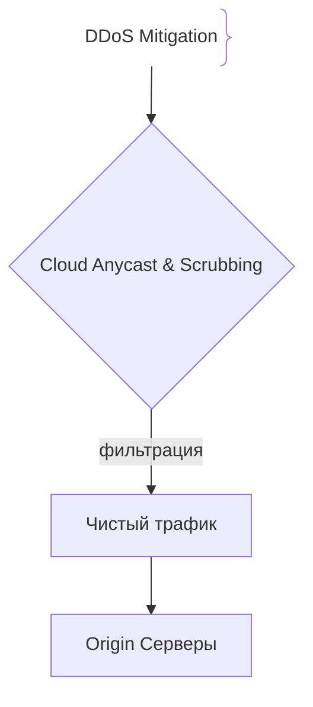
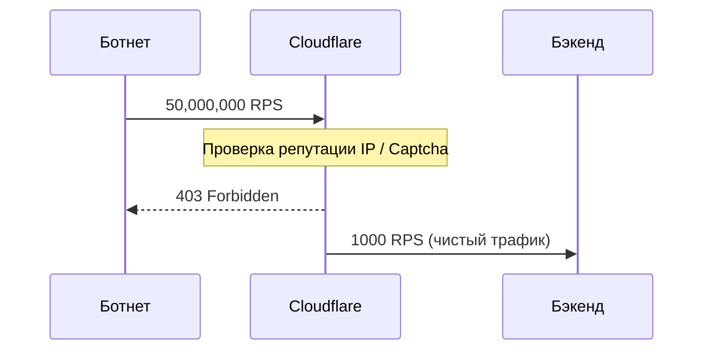

# Защита от DDoS-атак

## Определение

Защита от DDoS — это комплекс мер (Anycast, фильтрация SYN-флуда, Rate Limiting), направленных на отражение распределенных атак на истощение ресурсов.

## Зачем нужна защита от DDoS

Масштабные DDoS-атаки забивают каналы связи и перегружают бэкенд миллионами RPS.
- **L3/L4 атаки:** Забивают пропускную способность (SYN Flood).
- **L7 атаки:** Выжигают пул потоков и БД (HTTP Flood).

## Как работает защита от DDoS





## Примеры кода

> Ключевые сценарии: Rate Limiting для защиты от DDoS в TypeScript, Go и Java.

### TypeScript (express-rate-limit)

```typescript
import rateLimit from 'express-rate-limit';

const limiter = rateLimit({
  windowMs: 60 * 1000,
  max: 100,
});
// app.use('/api/', limiter);
```

### Go (Token Bucket Rate Limiter)

```go
package main

import (
	"net/http"
	"golang.org/x/time/rate"
)

var limiter = rate.NewLimiter(5, 10)

func DdosMiddleware(next http.Handler) http.Handler {
	return http.HandlerFunc(func(w http.ResponseWriter, r *http.Request) {
		if !limiter.Allow() {
			http.Error(w, "Too Many Requests", http.StatusTooManyRequests)
			return
		}
		next.ServeHTTP(w, r)
	})
}
```

### Java (Resilience4j RateLimiter)

```java
package com.example.demo;

import io.github.resilience4j.ratelimiter.RateLimiter;
import io.github.resilience4j.ratelimiter.RateLimiterConfig;
import java.time.Duration;

public class DdosFilter {
    private final RateLimiter limiter = RateLimiter.of("api", RateLimiterConfig.custom()
            .limitPeriod(Duration.ofSeconds(1))
            .limitForPeriod(50).build());
}
```

## Пример использования: интеграция

Первый эшелон на прикладном уровне — rate limiting на входе, до бизнес-логики:

```ts
import rateLimit from 'express-rate-limit'

app.use('/api', rateLimit({
  windowMs: 60_000,
  limit: 300,
  standardHeaders: true,
}))

app.get('/api/price', (req, res) => { /* … */ })
```

Такой лимит снимает с бэкенда аномальную нагрузку от одной из атак L7, но масштабные флуды забивают канал раньше приложения — тогда нужен Anycast/scrubbing у провайдера.

## Паттерны использования

- **Многослойность** — Anycast и фильтрация L3/L4 на уровне CDN/провайдера, Rate Limit на L7 внутри.
- **Ограничение по зонам риска** — публичные эндпоинты строже внутренних.
- **Автоскейлинг с запасом** — даже при фильтрации лишние RPS достигают origin.
- **Мониторинг трафика и алерты на аномалии** — без замеров не понять, что атака началась.

## Антипаттерны и ловушки

- **Защита только на L7 внутри приложения** — SYN-флуд и гигабитные атаки просто не доходят до кода, съедая канал.
- **Единая точка входа без CDN** — любой всплеск валит origin целиком.
- **Rate limit без исключений для легитимного пика** — всплеск ботов/ажиотажа уронит свой же сервис.
- **Один сервер-фильтр** — фильтрация сама становится объектом атаки.

## Когда использовать / когда НЕ использовать

- **Использовать:** публичные интернет-сервисы, особенно с репутацией у злоумышленников; любые бэкенды за CDN.
- **НЕ использовать:** внутренние сервисы в изолированной сети без публичного адреса — там риск DDoS невелик, а накладные расходы да.

## Связанные темы

- **waf** — L7-фильтрация HTTP-трафика дополняет защиту от DDoS.
- **tls** — шифрование канала не спасает от DDoS, но обязательно для любого публичного приложения.

## Вопросы

### Q1
**В чем разница между L3/L4 и L7 DDoS-атаками?**
- [ ] Нет разницы
- [x] L3/L4 забивают канал на сетевом уровне, а L7 имитируют легитимные HTTP-запросы, выжигая CPU и БД
- [ ] L7 без интернета
- [ ] L3/L4 только в браузере

Пояснение: Объемные атаки требуют канальной фильтрации, а L7 — прикладного анализа.

### Q2
**Что такое Scrubbing Center?**
- [ ] Мойка серверов
- [x] Центр очистки трафика провайдера для фильтрации вредоносных пакетов
- [ ] Бэкап БД
- [ ] Антивирус

Пояснение: Принимает удар на себя и пропускает только чистый трафик.

### Q3
**Что такое атака Slowloris?**
- [ ] Скачивание файлов
- [x] L7 атака с медленной отправкой HTTP-заголовков для удержания пула соединений занятыми
- [ ] Удаление таблиц
- [ ] Перехват Wi-Fi

Пояснение: Исчерпывает пул соединений веб-сервера.

### Q4
**Какую роль играет Anycast в отражении DDoS?**
- [ ] Увеличивает задержку
- [x] Распределяет нагрузку атакующих по всему миру на сотни PoP-нод
- [ ] Отключает интернет
- [ ] Шифрует FTP

Пояснение: Размывает удар DDoS-атаки по глобальной сети.

### Q5
**Почему простой блокировки по IP недостаточно против L7 DDoS?**
- [ ] IP запрещены
- [x] Ботнеты состоят из сотен тысяч зараженных устройств, постоянно меняющих IP
- [ ] IP не передаются по HTTPS
- [ ] Ускоряет сайт

Пояснение: Распределенный ботнет с ротацией IP делает простую IP-фильтрацию неэффективной.

## Источники

- Cloudflare DDoS Guide: https://www.cloudflare.com/learning/ddos/
- AWS Shield: https://aws.amazon.com/shield/
