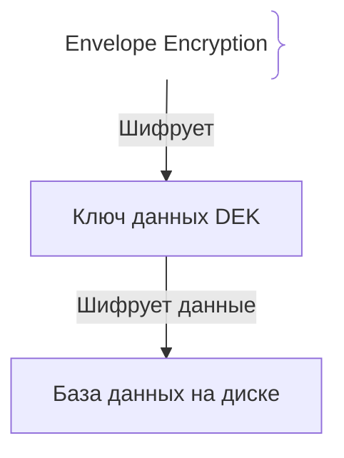
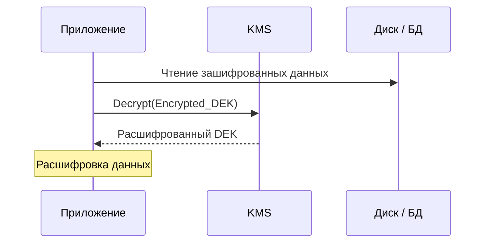

# Шифрование в покое (Encryption at Rest)

Шифрование в покое защищает данные (файлы, БД, бэкапы), когда они физически записаны на носители (SSD, HDD, S3).

## Зачем нужно Encryption at Rest

В случае физической кражи диска злоумышленник получит лишь зашифрованные байты.
- **Envelope Encryption:** Ключ данных (DEK) шифруется мастер-ключом (KEK) в KMS.

## Как работает Envelope Encryption





## Примеры кода

> Ключевые сценарии: шифрование AES в TypeScript, Go и Java.

### TypeScript (AES-256-GCM)

```typescript
import crypto from 'crypto';
const key = crypto.randomBytes(32);

function encrypt(text: string) {
  const iv = crypto.randomBytes(12); // 96 бит — стандарт для GCM
  const cipher = crypto.createCipheriv('aes-256-gcm', key, iv);
  let enc = cipher.update(text, 'utf8', 'hex');
  enc += cipher.final('hex');
  return { iv: iv.toString('hex'), enc, tag: cipher.getAuthTag().toString('hex') };
}
```

### Go (AES-GCM)

```go
package main

import (
	"crypto/aes"
	"crypto/cipher"
	"crypto/rand"
)

func Encrypt(plain, key []byte) ([]byte, error) {
	block, err := aes.NewCipher(key)
	if err != nil {
		return nil, err
	}
	gcm, err := cipher.NewGCM(block)
	if err != nil {
		return nil, err
	}
	// nonce должен быть случайным и уникальным для каждого шифрования
	nonce := make([]byte, gcm.NonceSize())
	if _, err := rand.Read(nonce); err != nil {
		return nil, err
	}
	// возвращаем nonce + ciphertext (nonce нужен для расшифровки)
	return gcm.Seal(nonce, nonce, plain, nil), nil
}
```

### Java (AES/GCM)

```java
package com.example.demo;

import javax.crypto.Cipher;
import javax.crypto.SecretKey;

public class Encryption {
    public static byte[] encrypt(byte[] data, SecretKey key) throws Exception {
        Cipher c = Cipher.getInstance("AES/GCM/NoPadding");
        c.init(Cipher.ENCRYPT_MODE, key);
        return c.doFinal(data);
    }
}
```

## Вопросы

### Q1
**Что такое Encryption at Rest по сравнению с In-Transit?**
- [ ] At-Rest для сети
- [x] At-Rest защищает данные на носителях (дисках), а In-Transit — при передаче по сети
- [ ] At-Rest быстрее
- [ ] In-Transit для файлов

Пояснение: Различие в состоянии данных (хранятся или передаются).

### Q2
**Что такое конвертное шифрование (Envelope Encryption)?**
- [ ] Отправка ключей в конверте
- [x] Иерархия ключей, где KEK шифрует DEK, а DEK шифрует данные
- [ ] Сжатие файлов
- [ ] Шифрование заголовков

Пояснение: Снижает нагрузку на KMS при шифровании больших объемов данных.

### Q3
**Какой алгоритм симметричного шифрования является стандартом для At-Rest?**
- [ ] MD5
- [x] AES-256
- [ ] ROT13
- [ ] Base64

Пояснение: AES-256 надежный стандарт защиты конфиденциальных данных.

### Q4
**Зачем нужен случайный вектор инициализации (IV / Nonce) в AES-GCM?**
- [ ] Уменьшить файл
- [x] Чтобы одинаковый текст давал разный шифротекст при повторении
- [ ] Авторизация OAuth
- [ ] Ускорение CPU

Пояснение: Повторное использование IV с тем же ключом компрометирует шифрование.

### Q5
**Требуется ли шифрование бэкапов баз данных?**
- [ ] Нет
- [x] Да, бэкапы содержат те же чувствительные данные и часто хранятся в менее защищенных хранилищах
- [ ] Только если база > 1ТБ
- [ ] Автоматически без ключей

Пояснение: Бэкапы — частая точка утечки, требующая шифрования.

## Источники

- NIST SP 800-111: https://csrc.nist.gov/
- AWS KMS Concepts: https://docs.aws.amazon.com/kms/
