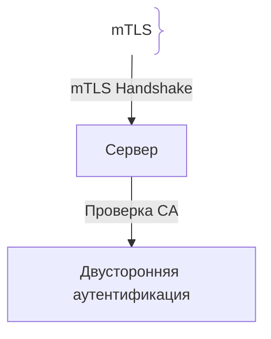
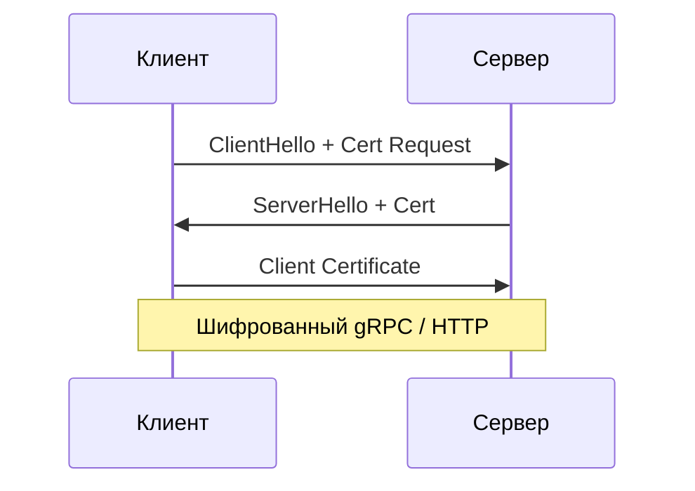

# Шифрование при передаче (Encryption in Transit)

Шифрование при передаче защищает данные во время их перемещения по сетям (между клиентом и сервером, между микросервисами).

## Зачем нужно Encryption in Transit

Сетевые узлы могут перехватывать незашифрованные пакеты (Sniffing).
- **mTLS:** Двухсторонняя аутентификация для Zero Trust архитектуры микросервисов.

## Как работает mTLS





## Примеры кода

> Ключевые сценарии: mTLS и редирект в TypeScript, Go и Java.

### TypeScript (Express HTTPS Redirect)

```typescript
import { Request, Response, NextFunction } from 'express';

function requireHttps(req: Request, res: Response, next: NextFunction) {
  if (req.headers['x-forwarded-proto'] && req.headers['x-forwarded-proto'] !== 'https') {
    return res.redirect(`https://${req.headers.host}${req.url}`);
  }
  next();
}
```

### Go (mTLS Server)

```go
package main

import (
	"crypto/tls"
	"crypto/x509"
	"net/http"
	"os"
)

func main() {
	caCert, _ := os.ReadFile("ca.pem")
	pool := x509.NewCertPool()
	pool.AppendCertsFromPEM(caCert)

	server := &http.Server{
		Addr: ":443",
		TLSConfig: &tls.Config{
			ClientCAs:  pool,
			ClientAuth: tls.RequireAndVerifyClientCert,
		},
	}
	server.ListenAndServeTLS("cert.pem", "key.pem")
}
```

### Java (Spring Boot RestTemplate mTLS)

```java
package com.example.demo;

import org.springframework.context.annotation.Bean;
import org.springframework.context.annotation.Configuration;
import org.springframework.boot.web.client.RestTemplateBuilder;
import org.springframework.web.client.RestTemplate;

@Configuration
public class MtlsConfig {
    @Bean
    public RestTemplate restTemplate(RestTemplateBuilder builder) {
        return builder.build();
    }
}
```

## Вопросы

### Q1
**Что такое mTLS?**
- [ ] Быстрый TLS
- [x] Двусторонняя аутентификация, где клиент и сервер проверяют сертификаты друг друга
- [ ] TLS без сертификатов
- [ ] Отключение шифрования

Пояснение: mTLS обеспечивает взаимную проверку на транспортном уровне.

### Q2
**Какой протокол является стандартом защиты трафика в интернете?**
- [ ] HTTP/1.0
- [x] TLS 1.3
- [ ] Telnet
- [ ] FTP

Пояснение: TLS 1.3 обеспечивает максимальную скорость и криптостойкость.

### Q3
**Что делает Service Mesh (Istio) в отношении Encryption in Transit?**
- [ ] Удаляет БД
- [x] Автоматически настраивает mTLS между подами без изменения кода
- [ ] Ускоряет Docker
- [ ] Блокирует интернет

Пояснение: Service Mesh шифрует межсервисный трафик прозрачно.

### Q4
**Почему отключение проверки SSL-сертификатов опасно?**
- [ ] Замедляет сеть
- [x] Делает приложение уязвимым к MitM-атакам
- [ ] Код не компилируется
- [ ] БД удалит данные

Пояснение: Игнорирование проверки уничтожает гарантию подлинности.

### Q5
**Нужно ли шифровать трафик внутри VPC между своими микросервисами?**
- [ ] Нет
- [x] Да, согласно концепции Zero Trust, периметр сети может быть скомпрометирован
- [ ] Только по выходным
- [ ] Запрещено AWS

Пояснение: Zero Trust требует шифрования даже внутри закрытого контура.

## Источники

- NIST SP 800-52
- Istio Security: https://istio.io/
