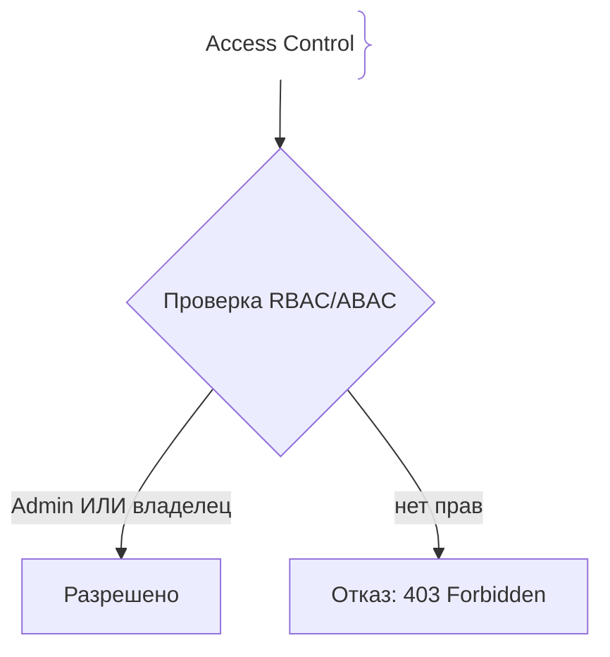
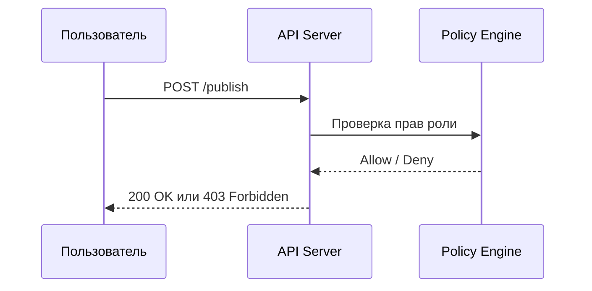

# Управление доступом (IAM, RBAC, ABAC)

IAM управляет цифровыми идентификаторами и правами доступа. Основными моделями являются RBAC (Role-Based) и ABAC (Attribute-Based).

## Зачем нужны RBAC и ABAC

Принцип наименьших привилегий (Least Privilege) гарантирует, что пользователи имеют доступ только к необходимым ресурсам.
- **RBAC:** Права привязываются к ролям (`Admin`, `Editor`), а роли — к пользователям.
- **ABAC:** Доступ принимается на основе атрибутов (пользователь, ресурс, контекст, время).

## Как работает проверка прав





## Примеры кода

> Ключевые сценарии: RBAC проверка в TypeScript, Go и Java.

### TypeScript (RBAC Middleware)

```typescript
import { Request, Response, NextFunction } from 'express';

interface AuthReq extends Request {
  user?: { roles: string[] };
}

function checkRole(requiredRole: string) {
  return (req: AuthReq, res: Response, next: NextFunction) => {
    if (!req.user?.roles?.includes(requiredRole)) {
      return res.status(403).json({ error: 'Access denied' });
    }
    next();
  };
}
```

### Go (RBAC Permission Checker)

```go
package main

import "errors"

type User struct {
	Roles []string
}

func HasRole(user User, targetRole string) bool {
	for _, r := range user.Roles {
		if r == targetRole {
			return true
		}
	}
	return false
}

func DeleteResource(user User) error {
	if !HasRole(user, "Admin") {
		return errors.New("forbidden")
	}
	return nil
}
```

### Java (Spring Security @PreAuthorize)

```java
package com.example.demo;

import org.springframework.security.access.prepost.PreAuthorize;
import org.springframework.web.bind.annotation.*;

@RestController
public class AdminController {
    @DeleteMapping("/api/admin/{id}")
    @PreAuthorize("hasRole('ADMIN')")
    public String delete(@PathVariable Long id) {
        return "Deleted";
    }
}
```

## Вопросы

### Q1
**В чем главное различие между RBAC и ABAC?**
- [ ] Между ними нет разницы
- [x] В RBAC права на основе ролей, а в ABAC — динамически на основе контекстных атрибутов
- [ ] ABAC работает без сети
- [ ] RBAC не использует авторизацию

Пояснение: ABAC гибче, так как учитывает множество контекстных факторов.

### Q2
**Что такое принцип наименьших привилегий?**
- [ ] Выдача всем прав администратора
- [x] Предоставление только минимально необходимых прав для текущей задачи
- [ ] Отключение паролей
- [ ] Удаление логов

Пояснение: Минимизация прав снижает ущерб при компрометации.

### Q3
**Какой HTTP-статус возвращается при нарушении RBAC (нет прав)?**
- [ ] 401 Unauthorized
- [x] 403 Forbidden
- [ ] 500 Error
- [ ] 200 OK

Пояснение: 401 — нет аутентификации, 403 — нет прав доступа.

### Q4
**Что является примером атрибута в ABAC?**
- [ ] Только имя
- [x] Время суток, уровень секретности документа, геопозиция
- [ ] Версия Node.js
- [ ] Размер кэша

Пояснение: ABAC оценивает комплекс атрибутов окружения и субъекта.

### Q5
**Как часто рекомендуется проводить аудит прав доступа?**
- [ ] Никогда
- [x] Регулярно (например, раз в квартал) для удаления неактуальных доступов
- [ ] Каждый час
- [ ] При смене ОС

Пояснение: Регулярный аудит предотвращает накопление избыточных привилегий.

## Источники

- NIST RBAC Standard: https://csrc.nist.gov/projects/rbac
- OWASP Access Control: https://cheatsheetseries.owasp.org/cheatsheets/Access_Control_Cheat_Sheet.html
