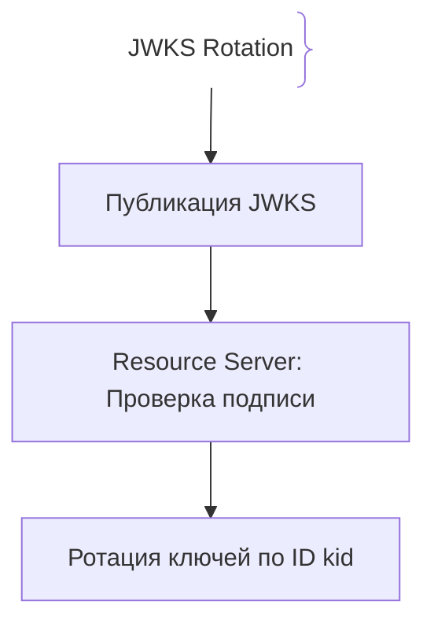
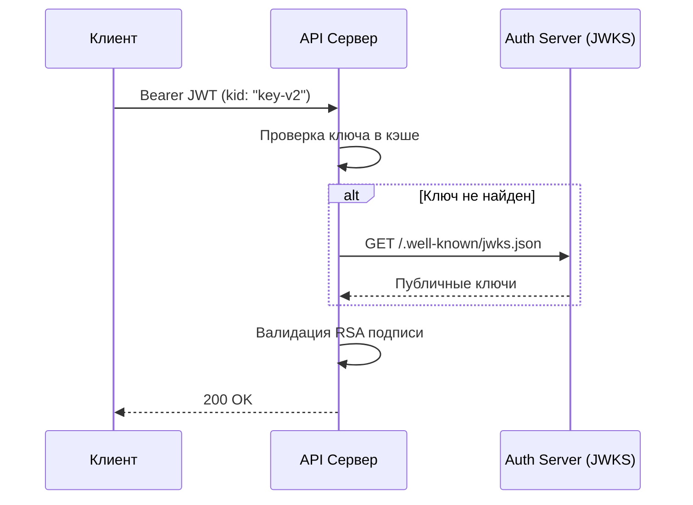

# Ротация JWT и подпись токенов (JWT Rotation & Signing)

JWT содержит цифровую подпись. Ротация ключей подписи (Key Rotation) критически важна для предотвращения подделки токенов при компрометации секретов.

## Зачем нужна ротация ключей JWT

Если секретный ключ утечет, злоумышленник сможет подписать любой произвольный JWT.
- **JWKS:** Стандарт публикации публичных ключей подписи через HTTP-эндпоинт (`.well-known/jwks.json`).
- **Алгоритм `none`:** Исторические уязвимости, когда злоумышленники меняли алгоритм на `none`.

## Как работает ротация по JWKS





## Примеры кода

> Ключевые сценарии: валидация JWT по JWKS в TypeScript, Go и Java.

### TypeScript (jwks-rsa с Express)

```typescript
import express from 'express';
import { expressjwt } from 'express-jwt';
import jwksRsa from 'jwks-rsa';

const app = express();
const checkJwt = expressjwt({
  secret: jwksRsa.expressJwtSecret({
    cache: true,
    rateLimit: true,
    jwksUri: 'https://auth.example.com/.well-known/jwks.json',
  }),
  algorithms: ['RS256'],
});

app.get('/api/secure', checkJwt, (req: any, res) => {
  res.json({ message: 'Token valid' });
});
```

### Go (lestrrat-go/jwx JWKS Validation)

```go
package main

import (
	"context"
	"net/http"

	"github.com/lestrrat-go/jwx/v2/jwks"
	"github.com/lestrrat-go/jwx/v2/jwt"
)

func main() {
	cache := jwks.NewCache(context.Background())
	cache.Register("https://auth.example.com/.well-known/jwks.json")

	http.HandleFunc("/api/secure", func(w http.ResponseWriter, r *http.Request) {
		_, err := jwt.ParseRequest(r, jwt.WithKeySet(cache.Get("...")))
		if err != nil {
			http.Error(w, "Unauthorized", http.StatusUnauthorized)
			return
		}
		w.Write([]byte("Verified"))
	})
	http.ListenAndServe(":8080", nil)
}
```

### Java (Spring Security OAuth2 JWKS)

```java
package com.example.demo;

import org.springframework.context.annotation.Bean;
import org.springframework.context.annotation.Configuration;
import org.springframework.security.config.annotation.web.builders.HttpSecurity;
import org.springframework.security.web.SecurityFilterChain;

@Configuration
public class JwtConfig {
    @Bean
    public SecurityFilterChain filterChain(HttpSecurity http) throws Exception {
        http.authorizeHttpRequests(auth -> auth.anyRequest().authenticated())
            .oauth2ResourceServer(oauth2 -> oauth2.jwt(jwt -> jwt.jwkSetUri("...")));
        return http.build();
    }
}
```

## Вопросы

### Q1
**Зачем в структуре JWT используется поле `kid` (Key ID)?**
- [ ] Для указания возраста
- [x] Для идентификации конкретного ключа подписи в JWKS, позволяя ротировать ключи без простоя
- [ ] Для шифрования пароля
- [ ] Для сжатия

Пояснение: Поле `kid` помогает ресурсному серверу понять, каким ключом подписан токен.

### Q2
**В чем главное преимущество асимметричных подписей (RS256) перед симметричными (HS256)?**
- [ ] RS256 быстрее
- [x] Auth-сервер подписывает закрытым ключом, а остальные проверяют по открытому, не зная секретного
- [ ] RS256 не использует JWT
- [ ] HS256 запрещен

Пояснение: При RS256 секрет хранится только у генератора токенов.

### Q3
**Что такое JWKS (JSON Web Key Set)?**
- [ ] База данных пользователей
- [x] JSON-документ с массивом публичных ключей для верификации JWT
- [ ] Протокол шифрования дисков
- [ ] Список токенов

Пояснение: JWKS публикуется по стандартизированному URL для проверки подписей.

### Q4
**Какую уязвимость представляет собой атака «alg: none» в JWT?**
- [ ] Увеличение размера
- [x] Злоумышленник мог указать алгоритм `none` и удалить подпись, а сервер доверял такому токену
- [ ] Удаление БД
- [ ] Перехват HTTPS

Пояснение: Ранние библиотеки принимали токены без проверки подписи при отсутствии алгоритма.

### Q5
**Как часто рекомендуется проводить ротацию ключей подписи JWT?**
- [ ] Никогда
- [x] Регулярно (раз в 30-90 дней) с поддержкой нескольких активных ключей одновременно
- [ ] Каждую секунду
- [ ] Только после взлома

Пояснение: Регулярная ротация минимизирует ущерб при утечке ключа.

## Источники

- RFC 7517 (JSON Web Key): https://datatracker.ietf.org/doc/html/rfc7517
- OWASP JWT Cheat Sheet: https://cheatsheetseries.owasp.org/cheatsheets/JSON_Web_Token_Cheat_Sheet.html
