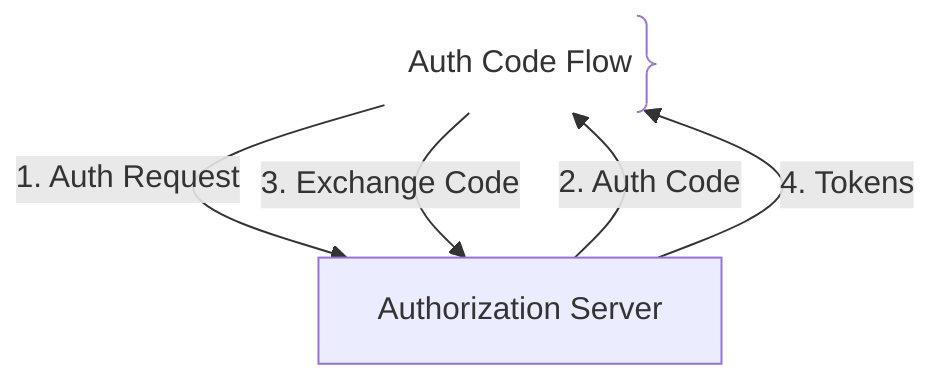
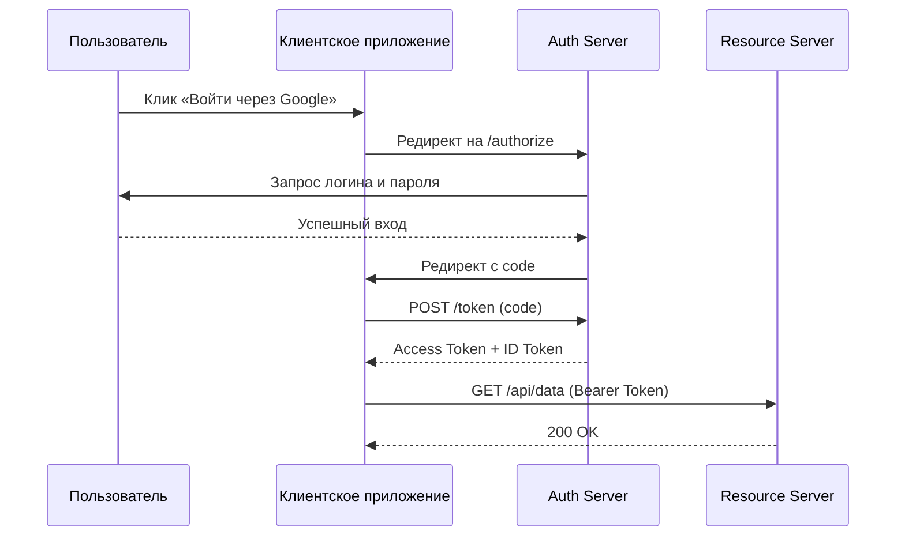

# OAuth 2.0 & OIDC (Авторизация и аутентификация)

OAuth 2.0 — это открытый стандарт авторизации, позволяющий сторонним приложениям получать ограниченный доступ к защищенным ресурсам пользователя без передачи его учетных данных. OpenID Connect (OIDC) — надстройка над OAuth 2.0, добавляющая стандартизированный слой аутентификации.

## Зачем нужны OAuth 2.0 и OIDC

Современные веб-приложения делегируют аутентификацию централизованным провайдерам (Keycloak, Auth0, Google).
- **Делегирование доступа:** Пользователь разрешает приложению читать профиль через Access Token.
- **Разделение ролей:** OAuth 2.0 отвечает за *«что клиент может делать»*, а OIDC — за *«кто этот пользователь»* (ID Token).

## Как работает OAuth 2.0 Authorization Code Flow





## Примеры кода

> Ключевые сценарии: валидация OAuth2 Access Token в TypeScript, Go и Java.

### TypeScript (Express JWT Bearer Validation)

```typescript
import express, { Request, Response, NextFunction } from 'express';
import jwt, { GetPublicKeyOrSecret } from 'jsonwebtoken';
import jwksClient from 'jwks-rsa';

const app = express();

interface AuthRequest extends Request {
  user?: any;
}

// Resource Server проверяет подпись токена публичным ключом (RS256)
// авторизационного сервера, который он получает из JWKS
const client = jwksClient({
  jwksUri: 'https://auth.example.com/.well-known/jwks.json',
});

const getJwksKey: GetPublicKeyOrSecret = (header, callback) => {
  client.getSigningKey(header.kid!, (err, key) => {
    if (err) return callback(err);
    callback(null, key?.getPublicKey());
  });
};

function requireAuth(req: AuthRequest, res: Response, next: NextFunction) {
  const authHeader = req.headers.authorization;
  if (!authHeader?.startsWith('Bearer ')) {
    return res.status(401).json({ error: 'Missing token' });
  }
  jwt.verify(
    authHeader.split(' ')[1],
    getJwksKey,
    { algorithms: ['RS256'] },
    (err, decoded) => {
      if (err) return res.status(403).json({ error: 'Invalid token' });
      req.user = decoded;
      next();
    },
  );
}

app.get('/api/protected', requireAuth, (req: AuthRequest, res: Response) => {
  res.json({ message: 'Access granted', user: req.user });
});
```

### Go (JWT Token Validation)

```go
package main

import (
	"log"
	"net/http"
	"strings"
	"time"

	"github.com/MicahParks/keyfunc"
	"github.com/golang-jwt/jwt/v5"
)

const jwksURL = "https://auth.example.com/.well-known/jwks.json"

// Проверка токена по ключам авторизационного сервера (JWKS, RS256)
func tokenValid(tokenStr string) bool {
	jwtKeyfunc, err := keyfunc.Get(jwksURL, keyfunc.Options{RefreshInterval: time.Hour})
	if err != nil {
		return false
	}
	defer jwtKeyfunc.End()

	_, err = jwt.Parse(tokenStr, jwtKeyfunc.Keyfunc, jwt.WithValidMethods([]string{"RS256"}))
	return err == nil
}

func AuthMiddleware(next http.HandlerFunc) http.HandlerFunc {
	return func(w http.ResponseWriter, r *http.Request) {
		authHeader := r.Header.Get("Authorization")
		if !strings.HasPrefix(authHeader, "Bearer ") {
			http.Error(w, "Unauthorized", http.StatusUnauthorized)
			return
		}
		tokenStr := strings.TrimPrefix(authHeader, "Bearer ")
		if !tokenValid(tokenStr) {
			http.Error(w, "Forbidden", http.StatusForbidden)
			return
		}
		next(w, r)
	}
}

func main() {
	http.HandleFunc("/api/protected", AuthMiddleware(func(w http.ResponseWriter, r *http.Request) {
		w.Write([]byte("OK"))
	}))
	log.Fatal(http.ListenAndServe(":8080", nil))
}
```

### Java (Spring Security OAuth2 Resource Server)

```java
package com.example.demo;

import org.springframework.context.annotation.Bean;
import org.springframework.context.annotation.Configuration;
import org.springframework.security.config.annotation.web.builders.HttpSecurity;
import org.springframework.security.web.SecurityFilterChain;

@Configuration
public class SecurityConfig {
    @Bean
    public SecurityFilterChain securityFilterChain(HttpSecurity http) throws Exception {
        http.authorizeHttpRequests(auth -> auth.anyRequest().authenticated())
            .oauth2ResourceServer(oauth2 -> oauth2.jwt());
        return http.build();
    }
}
```

## Вопросы

### Q1
**В чем главное различие между OAuth 2.0 и OpenID Connect (OIDC)?**
- [ ] Между ними нет разницы
- [x] OAuth 2.0 предназначен для авторизации, а OIDC — надстройка для аутентификации через ID Token
- [ ] OIDC работает только без сети
- [ ] OAuth 2.0 не использует токены

Пояснение: OAuth 2.0 решает задачу *что разрешено делать*, а OIDC — *кто вошел в систему*.

### Q2
**Что такое PKCE в OAuth 2.0?**
- [ ] Шифрование БД
- [x] Расширение для защиты публичных клиентов от перехвата Authorization Code
- [ ] Протокол сжатия токенов
- [ ] Хеширование паролей

Пояснение: PKCE генерирует одноразовый верификатор, исключая уязвимости в SPA и моб. приложениях.

### Q3
**Каково назначение Refresh Token в OAuth 2.0?**
- [ ] Для входа под чужим аккаунтом
- [x] Для получения нового Access Token без повторного ввода логина и пароля
- [ ] Для удаления аккаунта
- [ ] Для кэширования статики

Пояснение: Refresh Token продлевает сессию, пока Access Token живет недолго.

### Q4
**Где в безопасном веб-приложении рекомендуется хранить Access Token в браузере?**
- [ ] В `localStorage`
- [x] В защищенных `HttpOnly` `Secure` куках
- [ ] В глобальной переменной
- [ ] В URL

Пояснение: HttpOnly куки защищают токены от кражи через XSS.

### Q5
**Что такое Resource Server в OAuth 2.0?**
- [ ] Сервер картинок
- [x] API-сервер, принимающий запросы с Access Token и отдающий защищенные данные
- [ ] Сервер авторизации Google
- [ ] Браузер

Пояснение: Resource Server проверяет валидность токена и возвращает данные.

## Источники

- RFC 6749 (OAuth 2.0): https://datatracker.ietf.org/doc/html/rfc6749
- OpenID Connect Specification: https://openid.net/connect/
