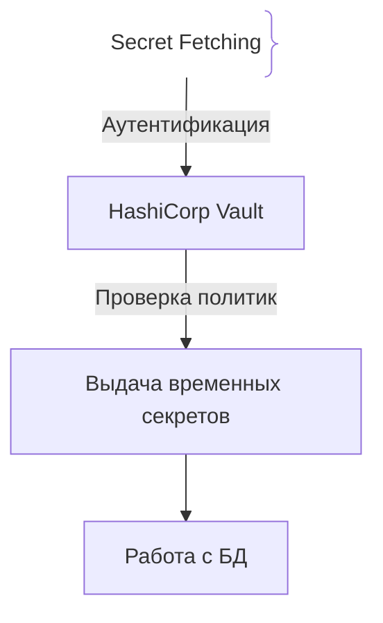
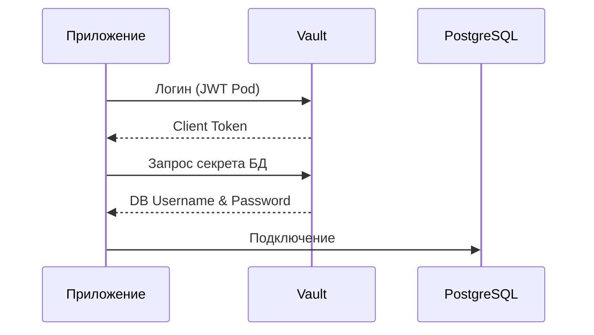

# Управление секретами (Secret Management)

## Определение

Управление секретами — это практика безопасного хранения, ротации и доступа к конфиденциальным данным (паролям БД, API-ключам) с исключением их попадания в репозитории (Hardcoding).

## Зачем нужен Secret Management

Жесткое кодирование секретов в коде или `.env` файлах — критическая уязвимость.
- **HashiCorp Vault / AWS KMS:** Специализированные хранилища с шифрованием и динамической генерацией доступов.
- **Динамические секреты:** Автоматическая генерация временных учетных данных.

## Как работает безопасное получение секретов





## Примеры кода

> Ключевые сценарии: получение секретов в TypeScript, Go и Java.

### TypeScript (dotenv)

```typescript
import dotenv from 'dotenv';
dotenv.config();

const dbPassword = process.env.DB_PASSWORD;
if (!dbPassword) throw new Error('Missing DB_PASSWORD');
```

### Go (Vault API)

```go
package main

import (
	"context"
	"fmt"

	vault "github.com/hashicorp/vault/api"
)

func readDBPassword(addr, token string) (string, error) {
	config := vault.DefaultConfig()
	config.Address = addr
	client, err := vault.NewClient(config)
	if err != nil {
		return "", err
	}
	// токен выдаётся Vault при входе приложения (в Kubernetes — по JWT пода)
	client.SetToken(token)

	secret, err := client.Logical().ReadWithContext(context.Background(), "secret/data/db")
	if err != nil {
		return "", err
	}
	data, ok := secret.Data["data"].(map[string]interface{})
	if !ok {
		return "", fmt.Errorf("secret data missing")
	}
	password, _ := data["password"].(string)
	return password, nil
}
```

### Java (Spring Cloud Vault)

```java
package com.example.demo;

import org.springframework.beans.factory.annotation.Value;
import org.springframework.stereotype.Component;

@Component
public class VaultLoader {
    @Value("${db.password}")
    private String dbPassword;
}
```

## Пример использования: интеграция

Секреты приезжают из хранилища в среду запуска, а не из репозитория:

```ts
import { SecretManagerServiceClient } from '@google-cloud/secret-manager'

const client = new SecretManagerServiceClient()

async function getSecret(name: string): Promise<string> {
  const [version] = await client.accessSecretVersion({
    name: `projects/p/secrets/${name}/versions/latest`,
  })
  return version.payload.data.toString()
}

const DB_PASSWORD = process.env.DB_PASSWORD ?? await getSecret('db_password')
```

Access-логи и ротация версий в таком хранилище видны; в коде нет ни одного литерального секрета.

## Паттерны использования

- **Секреты в хранилище, не в git** — репозиторий не содержит ключей ни в `.env`, ни в конфигах.
- **Динамическая выдача по запросу** — доступ к секрету строго минимален и логируется.
- **Ротация версий** — смена секрета не требует перезаливки кода, старые версии отзываются.
- **Inject в env/подключение на старте** — приложение не реализует собственную схему хранения секретов.

## Антипаттерны и ловушки

- **Секреты в репозитории** — утечка в тегах/форках сразу же роняет систему.
- **Один секрет на всё окружение** — прод и тест связаны общим ключом.
- **Ротация вручную «раз в год»** — как только секрет протёк — катастрофа.
- **Кэшировать секреты в логах/обработчиках исключений** — при инциденте утекает больше, чем при атаке.

## Когда использовать / когда НЕ использовать

- **Использовать:** любые деплои с паролями/ключами/токенами; всегда, когда в проде есть окружение.
- **НЕ использовать:** для несекретной конфигурации — хранилища секретов медленнее и дороже, их место только там, где данные ценны.

## Связанные темы

- **oauth** — токены и клиентские секреты, которыми управляют по тем же правилам.
- **jwt-rotation** — частный случай ротации секретов (ключи подписи).
- **iam** — кто имеет право читать секрет.

## Вопросы

### Q1
**Почему хранение паролей в файлах `.env` в репозитории рискованно?**
- [ ] Файлы большие
- [x] История Git сохраняет секреты навсегда, их случайный пуш скомпрометирует систему
- [ ] Node.js их не читает
- [ ] Замедляет компиляцию

Пояснение: История коммитов Git сохраняет все файлы навсегда.

### Q2
**Что такое динамические секреты в Vault?**
- [ ] Пароли, меняющиеся при печати
- [x] Учетные данные, создаваемые под запрос и автоматически уничтожаемые по истечении срока жизни
- [ ] Шифрование WebSocket
- [ ] Обновление Node.js

Пояснение: Динамические секреты исключают долгоживущие пароли.

### Q3
**Какой инструмент используется для защиты секретов в AWS?**
- [ ] Redis
- [x] AWS Secrets Manager / KMS
- [ ] Nginx
- [ ] Webpack

Пояснение: AWS Secrets Manager предоставляет хранение и ротацию кредов.

### Q4
**Чем динамический секрет Vault отличается от статического в конфиге?**
- [ ] Ничем
- [x] Динамический создаётся под конкретную задачу с коротким сроком жизни и автоматически отзывается
- [ ] Статический шифрует сетевое соединение
- [ ] Динамический нельзя использовать для БД

Пояснение: динамические секреты живут ровно столько, сколько нужно задаче — нет долгоживущих паролей.

### Q5
**Что делать при случайном пуше боевого пароля в GitHub?**
- [ ] Удалить файл в след. коммите
- [x] Экстренно отозвать пароль, проверить логи и очистить историю Git
- [ ] Перезагрузить ПК
- [ ] Купить домен

Пояснение: Единственная надежная защита — немедленная смена скомпрометированного пароля.

## Источники

- HashiCorp Vault Docs: https://www.vaultproject.io/docs
- OWASP Secrets Management: https://cheatsheetseries.owasp.org/cheatsheets/Secrets_Management_Cheat_Sheet.html
