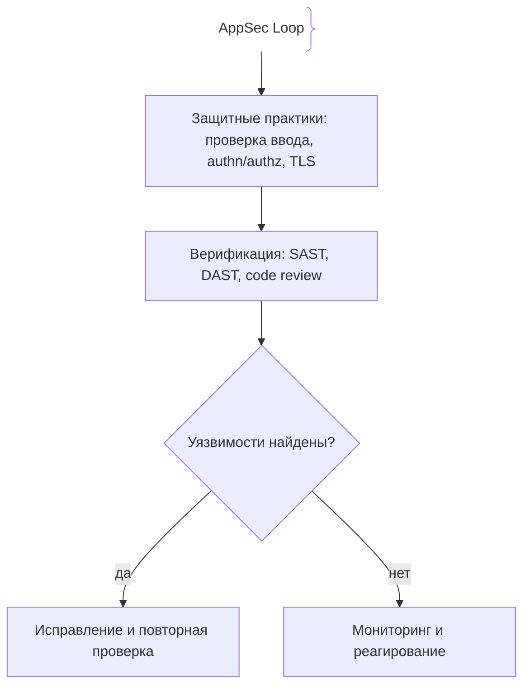
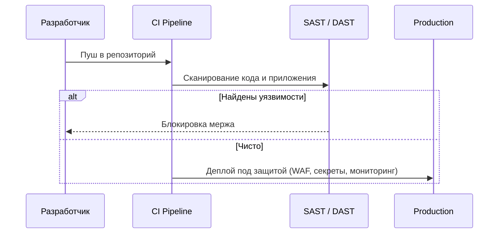

# Безопасность веб-приложений (Application Security)

Безопасность приложений — это системный процесс выявления и устранения уязвимостей и внедрения защитных практик на всех этапах жизненного цикла ПО.

## Определение

Application Security (AppSec) — практика проектирования, разработки и эксплуатации приложений так, чтобы исключить возможности их компрометации: аутентификация, авторизация, обработка ввода, хранение секретов и реакция на уязвимости.

## Зачем нужна безопасность приложений

Каждая дыра в коде — это путь к данным, деньгам и репутации продукта.
- **Защита данных:** Неправильная авторизация и открытый ввод дают прямой доступ к пользовательским данным.
- **Комплаенс:** Требования регуляторов (GDPR, PCI DSS) делают безопасность обязательной.
- **Экономика:** Исправление уязвимости до релиза в разы дешевле инцидента после него.

## Как работает подход к безопасности





## Примеры кода

### TypeScript (проверка ввода в middleware)

```ts
const SAFE_TAIL = new Set(['/health', '/version'])

app.use((req, res, next) => {
  if (req.method !== 'GET' || SAFE_TAIL.has(req.path)) return next()
  if (typeof req.body?.amount !== 'number' || !Number.isFinite(req.body.amount)) {
    return res.status(400).json({ error: 'invalid amount' })
  }
  next()
})
```

Валидация на входе — первый барьер; параметризованные запросы и экранирование вывода — следующие.

## Пример использования: интеграция

Базовая настройка HTTP-заголовков безопасности:

```ts
import helmet from 'helmet'

app.use(helmet({
  contentSecurityPolicy: {
    directives: {
      defaultSrc: ["'self'"],
      scriptSrc: ["'self'"],
    },
  },
  hsts: { maxAge: 31536000, includeSubDomains: true },
  frameguard: { action: 'deny' },
}))
```

CSP/HSTS/X-Frame-Options закрывают последствия XSS и кликджекинг на стороне браузера, но не заменяют обработку ввода и коррекную авторизацию.

## Паттерны использования

- **Threat modeling на старте** — активы, категории угроз (STRIDE), приоритет контрмер.
- **Defence in depth** — защита на нескольких уровнях: ввод → фреймворк → WAF → сеть.
- **Проверка ввода и экранирование вывода** — единственная устойчивая защита от инъекций.
- **SAST/DAST в CI** — статическое и динамическое сканирование до деплоя.
- **Least privilege** — минимальные права у ролей, сервисов и секретов.

## Антипаттерны и ловушки

- **Безопасность «по работе»** — «и так работает» вместо защиты ввода и авторизации.
- **WAF как единственная защита** — правила обходятся, parameterized запросы — нет.
- **Секреты в коде и логах** — при инциденте ущерб умножается.
- **Threat modeling «на бумаге» раз в год** — без его применения в циклах разработки защита деградирует.
- **Только SAST/DAST без ревью логики** — регулярные сканеры не видят кривые ролевые модели.

## Когда использовать / когда НЕ использовать

- **Использовать:** всё, где есть пользовательский ввод, аутентификация и данные; обязательно при требованиях регуляторов.
- **НЕ использовать:** подход «весь арсенал сразу» избыточен для внутренних утилит без чувствительных данных — там достаточно базовых проверок ввода и авторизации.

## Связанные темы

- **iam** — авторизация и ролевые модели как основа защиты.
- **oauth** — аутентификация через сторонние IdP без хранения паролей.
- **sql-injection** — типичная инъекция ввода, закрываемая параметризацией.
- **xss** — рендеринг ввода, требующий экранирования.
- **secret-management** — безопасное хранение ключей и токенов.

## Вопросы

### Q1
**Что означает аббревиатура CIA в контексте безопасности?**
- [ ] Криптография, идентификация, аудит
- [x] Конфиденциальность, целостность, доступность
- [ ] Контроль, изоляция, аутентификация
- [ ] Клиент, инфраструктура, архив

Пояснение: CIA (Confidentiality, Integrity, Availability) — базовые цели безопасности данных и сервисов.

### Q2
**Для чего используется STRIDE?**
- [ ] Для сборки Docker-образов
- [x] Для систематической классификации угроз в threat modeling
- [ ] Для расчёта метрик производительности
- [ ] Для ротации секретов

Пояснение: STRIDE — классификация угроз (spoofing, tampering, repudiation и т.д.) при моделировании угроз.

### Q3
**Что является основной защитой от SQL-инъекций?**
- [ ] Много комментариев в коде
- [x] Параметризованные запросы / prepared statements
- [ ] Сложный пароль к базе данных
- [ ] Отключение логирования

Пояснение: параметризация отделяет данные от SQL-кода, не позволяя вводу изменить запрос.

### Q4
**Принцип least privilege означает:**
- [ ] Максимально возможное число запросов к API
- [x] Выдачу субъекту только тех прав, которые необходимы для выполнения его задачи
- [ ] Самый короткий срок жизни секрета не обязателен
- [ ] Самый экономичный тариф в облаке

Пояснение: наименьшие привилегии ограничивают поверхность атаки и ущерб при компрометации.

### Q5
**Что делает HTTP Strict Transport Security (HSTS)?**
- [ ] Шифрует трафик внутри кластера
- [x] Заставляет браузер общаться с сайтом только по HTTPS и отсекает HTTP
- [ ] Предотвращает SQL-инъекции на сервере
- [ ] Заменяет Content-Security-Policy

Пояснение: HSTS сообщает браузеру «только HTTPS», защищая от даунгрейда на HTTP после первого ответа.

## Источники

- OWASP Top Ten: https://owasp.org/www-project-top-ten/
- OWASP Cheat Sheets: https://cheatsheetseries.owasp.org/
- Microsoft Threat Modeling Fundamentals: https://learn.microsoft.com/en-us/training/paths/tm-threat-modeling-fundamentals/