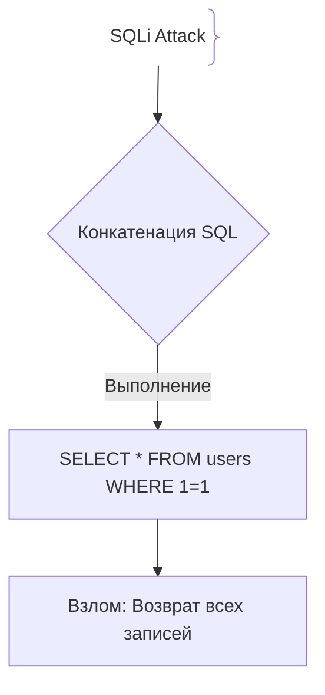
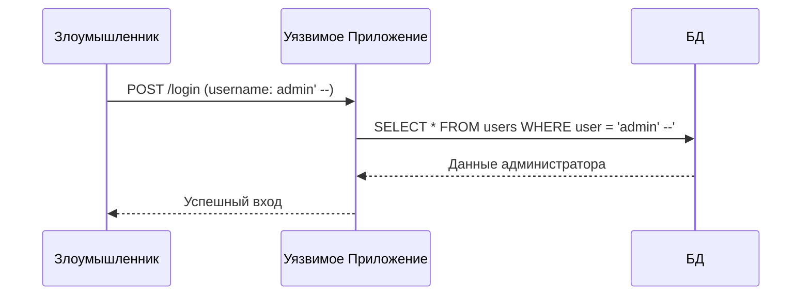

# SQL-инъекции (SQL Injection)

## Определение

SQL-инъекция (SQLi) — это уязвимость внедрения кода, при которой злоумышленник передает вредоносные SQL-фрагменты через входные параметры.

## Зачем нужна защита от SQLi

SQLi входит в топ критических уязвимостей (OWASP Top 10).
- **Утечка и модификация данных:** Выгрузка всей базы или удаление таблиц (`DROP TABLE`).

## Как работает SQL-инъекция





## Примеры кода

> Ключевые сценарии: параметризованные запросы в TypeScript, Go и Java.

### TypeScript (pg parameterized query)

```typescript
import { Pool } from 'pg';
const pool = new Pool();

async function safeSearch(username: string) {
  const query = 'SELECT * FROM users WHERE username = $1';
  return pool.query(query, [username]);
}
```

### Go (database/sql parameterized)

```go
package main

import "database/sql"

func GetUser(db *sql.DB, username string) *sql.Row {
	return db.QueryRow("SELECT id FROM users WHERE username = $1", username)
}
```

### Java (Spring Data JPA)

```java
package com.example.demo;

import org.springframework.data.jpa.repository.JpaRepository;

public interface UserRepository extends JpaRepository<User, Long> {
    User findByUsername(String username);
}
```

## Пример использования: интеграция

Параметризованные запросы: ввод никогда не попадает в текст SQL:

```ts
import pg from 'pg'

async function getUser(id: string) {
  const { rows } = await pool.query(
    'SELECT * FROM users WHERE id = $1',
    [id],
  )
  return rows[0]
}
```

Значение уходит как параметр, а не как фрагмент запроса — подставляет хоть `1 OR 1=1`, сервер воспримет его как строку.

## Паттерны использования

- **Всегда prepared statements / параметризация** — единственная рабочая защита от SQLi.
- **ORM/SQL-builderс параметрами** — убирает ручную склейку строк по умолчанию.
- **Минимальные права на SQL-роль приложения** — ограничение ущерба при пробитии.
- **Валидация типов на входе** — как следствие стандарт ввода; но НЕ как защита от инъекций.

## Антипаттерны и ловушки

- **Конкатенация пользовательского ввода в SQL** — классическое условие инъекции.
- **Экранирование как защита** — экранирование кавычек проще обходится и хуже параметризации.
- **`SELECT *` с неограниченным фильтром** — утечка данных при инъекции одного символа.
- **Динамический ORDER BY / LIMIT из клиента** — идентификаторы таблиц/колонок параметризовать нельзя — белый список.

## Когда использовать / когда НЕ использовать

- **Использовать:** всё, что пишет в БД по умолчанию; функции генерации запросов — обязательно параметризованные.
- **НЕ использовать:** только «санитайзинг» строк — это не защита; ужесточение валидации не заменяет параметризацию.

## Связанные темы

- **xss** — инъекция в HTML по аналогии с инъекцией в SQL.
- **waf** — блокировка на L7 до достижения приложения.

## Вопросы

### Q1
**Какой самый надежный способ предотвратить SQL-инъекции?**
- [ ] Использование RegExp для фильтрации кавычек
- [x] Использование параметризованных запросов (Prepared Statements), отделяющих структуру запроса от данных
- [ ] Переход на NoSQL
- [ ] Запрет метода POST

Пояснение: Параметризованные запросы гарантируют, что ввод не станет частью кода.

### Q2
**В чем главная опасность конкатенации строк в SQL?**
- [ ] Медленные запросы
- [x] Пользовательский ввод может изменить логику SQL-запроса, внедрив вредоносные операторы
- [ ] Больше памяти
- [ ] Режим чтения БД

Пояснение: Конкатенация смешивает код и данные в единую строку.

### Q3
**Что делает оператор комментария (`--`) при SQLi?**
- [ ] Ускоряет запрос
- [x] Заставляет БД игнорировать всю оставшуюся часть оригинального SQL-запроса
- [ ] Шифрует ответ
- [ ] Удаляет кэш

Пояснение: Комментарий отсекает хвост запроса (например, проверку пароля).

### Q4
**Защищают ли современные ORM от SQLi?**
- [ ] Нет
- [x] Да, при использовании стандартных методов, но уязвимость может появиться при конкатенации в сырых запросах
- [ ] Только в Java
- [ ] Только для записи

Пояснение: ORM по умолчанию используют параметризацию, но сырые запросы требуют аккуратности.

### Q5
**Что такое UNION-based SQLi?**
- [ ] Объединение таблиц в бэкапе
- [x] Оператор, позволяющий присоединить результаты своего вредоносного SELECT к результатам приложения
- [ ] Перезагрузка сервера
- [ ] Сжатие БД

Пояснение: Используется для выгрузки данных через видимый ответ приложения.

## Источники

- OWASP SQL Injection: https://cheatsheetseries.owasp.org/cheatsheets/SQL_Injection_Prevention_Cheat_Sheet.html
- PortSwigger SQLi: https://portswigger.net/web-security/sql-injection
