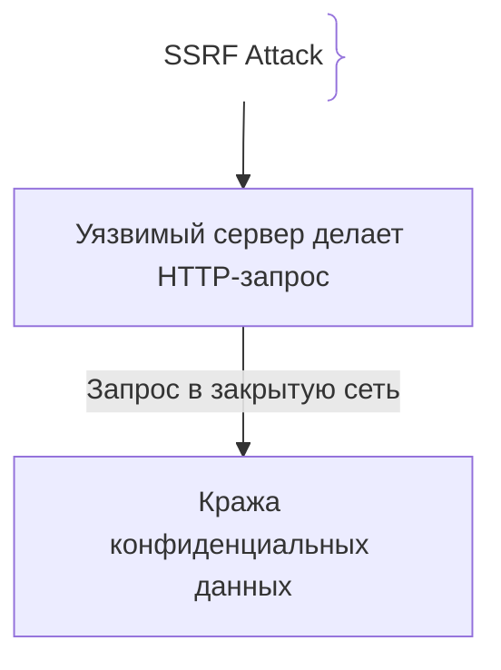
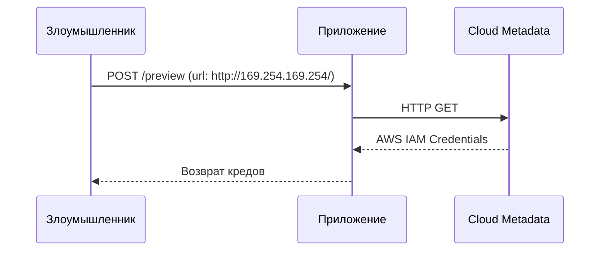

# SSRF (Server-Side Request Forgery)

## Определение

SSRF — уязвимость, при которой приложение отправляет произвольные HTTP-запросы во внутреннюю или внешнюю сеть от своего имени.

## Зачем нужна защита от SSRF

В облачной архитектуре SSRF позволяет сканировать внутренний контур сети и красть метаданные облака.
- **Кража метаданных AWS:** Запрос к `http://169.254.169.254/` позволяет выкрасть временные IAM-креды инстанса (роль EC2).
- **IMDSv2** — доступ к метаданным по PUT-токену усложняет эксплуатацию, но не заменяет сетевую фильтрацию исходящих запросов (egress).

## Как работает SSRF-атака





## Примеры кода

> Ключевые сценарии: валидация URL и проверка IP в TypeScript, Go и Java.

### TypeScript (Safe URL Fetcher)

```typescript
import { URL } from 'url';
import dns from 'dns/promises';

async function safeFetch(rawUrl: string) {
  const parsed = new URL(rawUrl);
  if (!['http:', 'https:'].includes(parsed.protocol)) throw new Error('Invalid protocol');

  // DNS-резолвинг перед запросом — защита от DNS Rebinding
  const ips = await dns.resolve4(parsed.hostname);
  const isPrivate = (ip: string) =>
    ip.startsWith('10.') ||
    ip.startsWith('127.') ||
    ip.startsWith('169.254.') ||
    ip.startsWith('192.168.') ||
    ip.startsWith('172.');
  if (ips.some(isPrivate)) throw new Error('Private/link-local IP blocked');
}
```

### Go (SSRF Safe URL Client)

```go
package main

import (
	"errors"
	"net"
	"net/url"
)

func IsSafeURL(rawURL string) error {
	parsed, _ := url.Parse(rawURL)
	ips, _ := net.LookupIP(parsed.Hostname()) // резолвим заранее — защита от DNS Rebinding
	for _, ip := range ips {
		if ip.IsLoopback() || ip.IsPrivate() || ip.IsLinkLocalUnicast() {
			return errors.New("forbidden internal IP")
		}
	}
	return nil
}
```

### Java (URL Validator)

```java
package com.example.demo;

import java.net.URI;
import java.net.InetAddress;

public class SsrfValidator {
    public static boolean isAllowed(String urlString) throws Exception {
        URI uri = URI.create(urlString);
        // резолвим до запроса — защита от DNS Rebinding
        InetAddress addr = InetAddress.getByName(uri.getHost());
        return !addr.isLoopbackAddress()
            && !addr.isSiteLocalAddress()
            && !addr.isLinkLocalAddress();
    }
}
```

## Пример использования: интеграция

Валидация URL, на который приложение ходит от своего имени — разрешены только внешние хосты:

```ts
import { lookup } from 'node:dns/promises'

const DENY_LIST = ['169.254.169.254', 'metadata.google.internal']

async function safeFetch(rawUrl: string) {
  const url = new URL(rawUrl)
  if (url.protocol !== 'https:') throw new Error('only https')

  const addresses = await lookup(url.hostname)
  for (const addr of addresses) {
    if (addr.address.startsWith('10.') || addr.address.startsWith('192.168.')
        || DENY_LIST.some((d) => addr.address === d)) {
      throw new Error('forbidden destination')
    }
  }
  return fetch(url)
}
```

Дополнительно исходящий трафик ограничен на уровне сети (egress), чтобы даже ошибка в коде не достала до внутренних ресурсов.

## Паттерны использования

- **Белый список доменов/протоколов** — внешние API явно объявляются, else — reject.
- **Двойное DNS-разрешение** — «один DNS — другой IP» в момент установки соединения обходит проверку.
- **Ограничение egress на уровне сети** — защита работает, даже если приложение ошибается.
- **Отключение редиректов или их repeat-валидация** — обход через `Location`.

## Антипаттерны и ловушки

- **Просто `fetch(url)` из ввода** — весь внутренний контур и облачная метаданные открыты.
- **Проверять только схему** — `https://169.254.169.254/` пройдёт проверку.
- **Доверять редиректам** — становится middle-man на пути к заблокированному хосту.
- **Разрешать `localhost`, loopback, приватные диапазоны** — сервис сам открывает себе двери внутрь.

## Когда использовать / когда НЕ использовать

- **Использовать:** фичи, принимающие URL от пользователя (preview, webhooks, PDF-генерация, ссылочные картинки).
- **НЕ использовать:** статичные вызовы к известным внешним сервисам — там достаточно фиксированного списка URL без всякого `fetch` из произвольного ввода.

## Связанные темы

- **waf** — L7-фильтрация вызовов как дополнительный барьер.
- **xss** — соседняя по OWASP инъекционная уязвимость веба.

## Вопросы

### Q1
**В чем суть уязвимости SSRF?**
- [ ] Подделка cookie
- [x] Принуждение сервера отправлять произвольные сетевые запросы к внутренним или внешним ресурсам от своего имени
- [ ] Внедрение SQL
- [ ] Перехват Wi-Fi

Пояснение: Злоумышленник использует сервер как прокси для доступа к закрытым частям сети.

### Q2
**Что такое AWS Instance Metadata Service (IMDS)?**
- [ ] База данных
- [x] Локальный IP (`169.254.169.254`), отдающий временные IAM-учетные данные инстанса
- [ ] Конфиг Nginx
- [ ] Сервис логирования

Пояснение: Доступ к IMDS через SSRF позволяет захватить облачную инфраструктуру.

### Q3
**Какой подход наименее надежен при защите от SSRF?**
- [ ] Черный список приватных IP
- [x] Черный список (Blacklist), так как злоумышленники используют обходные пути (DNS Rebinding, альтернативные нотации IP)
- [ ] Белый список
- [ ] Запрет внешних вызовов

Пояснение: Черные списки легко обходятся кодированием IP или DNS-ребиндингом.

### Q4
**Что такое DNS Rebinding?**
- [ ] Перезагрузка роутера
- [x] Техника подмены ответа DNS: сначала безопасный IP для прохождения проверки, затем мгновенный переход на `127.0.0.1`
- [ ] Смена пароля
- [ ] Очистка Route53

Пояснение: Обманывает проверки на стороне приложения.

### Q5
**Какой лучший сетевой уровень защиты против SSRF?**
- [ ] Надежда на пользователей
- [x] Изоляция бэкенда в VPC с запретом исходящего трафика (egress filtering) к внутренним эндпоинтам и метаданным
- [ ] Использование Java
- [ ] Отключение логов

Пояснение: Строгая сетевая фильтрация блокирует запросы к закрытым ресурсам.

## Источники

- OWASP SSRF: https://cheatsheetseries.owasp.org/cheatsheets/Server_Side_Request_Forgery_Prevention_Cheat_Sheet.html
- PortSwigger SSRF: https://portswigger.net/web-security/ssrf
