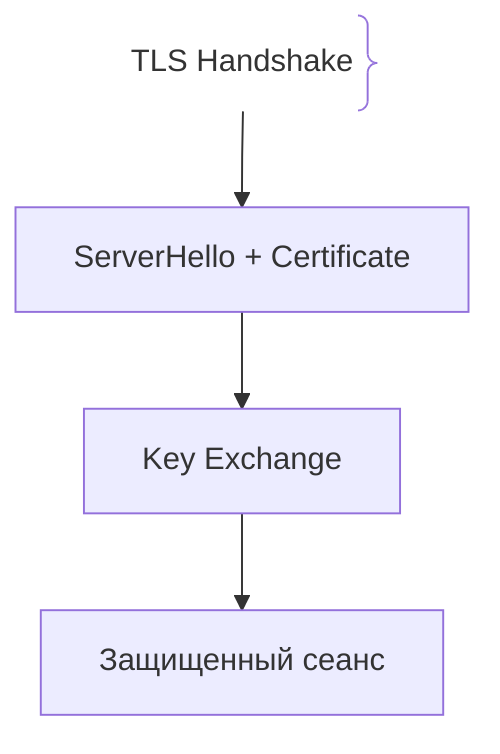
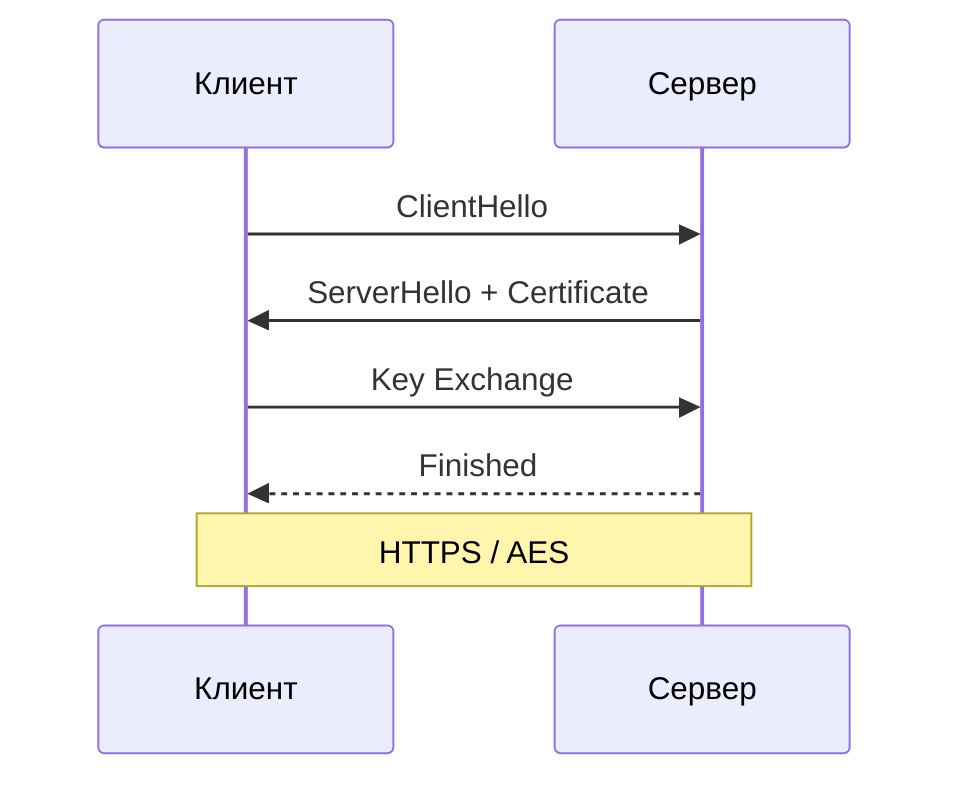

# TLS/SSL и шифрование в транспорте

## Определение

TLS (Transport Layer Security) — это криптографический протокол, обеспечивающий безопасную конфиденциальную и целостную передачу данных по сети.

## Зачем нужен TLS

Без TLS весь трафик передается в открытом виде, допуская атаки Man-in-the-Middle (MitM).
- **Конфиденциальность:** Симметричное шифрование защищает данные.
- **Аутентификация:** Цифровые сертификаты доказывают подлинность сервера.

## Как работает TLS Handshake





## Примеры кода

> Ключевые сценарии: создание HTTPS сервера в TypeScript, Go и Java.

### TypeScript (HTTPS Server)

```typescript
import https from 'https';
import fs from 'fs';
import express from 'express';

const app = express();
const options = {
  key: fs.readFileSync('key.pem'),
  cert: fs.readFileSync('cert.pem'),
};
https.createServer(options, app).listen(443);
```

### Go (TLS Server)

```go
package main

import "net/http"

func main() {
	http.HandleFunc("/", func(w http.ResponseWriter, r *http.Request) {
		w.Write([]byte("TLS OK"))
	})
	http.ListenAndServeTLS(":443", "cert.pem", "key.pem", nil)
}
```

### Java (Spring Boot application.yml)

```yaml
server:
  port: 443
  ssl:
    enabled: true
    key-store: classpath:keystore.p12
    key-store-password: secret
```

## Пример использования: интеграция

Отпечаток сертификата, принудительный HTTPS и валидные настройки на сервере:

```ts
import https from 'node:https'
import path from 'node:path'

const server = https.createServer({
  cert: readFileSync(path.join(process.cwd(), 'certs/fullchain.pem')),
  key: readFileSync(path.join(process.cwd(), 'certs/privkey.pem')),
}, app)

server.listen(443)
```

На проде сертификат от Lets Encrypt/сетевого CA, HSTS включён, TLS 1.2+ — слабые версии и небезопасные шифры отключены.

## Паттерны использования

- **Сертификаты от публичного CA + автопродление** — letsencrypt/certbot без ручных операций.
- **HSTS и принудительный HTTPS** — no plaintext перехода.
- **TLS 1.2+ и современные cipher suites** — слабые версии отключаются.
- **Разное шифрование для edge и внутренних сервисов** — mTLS внутри сети при TLS на периметре.

## Антипаттерны и ловушки

- **SSL с устаревшим протоколом** — TLS 1.0/1.1 ломается известными атаками.
- **Истёкший сертификат без автопродления** — инцидент выше приоритета, чем любой фича.
- **Протокол перед терминацией на edge** — если трафик внутри открыт — вшиток не шифрует между узлами.
- **Самоподписанные сертификаты на проде** — экономия на CA, а результат — недоверие и паника.

## Когда использовать / когда НЕ использовать

- **Использовать:** весь публичный трафик — HTTPS обязателен; внутренние взаимодействия — желательно, с mTLS для чувствительного.
- **НЕ использовать:** только для переписки без нагрузки — никаких оправданий для производительности: TLS 1.3 быстрый, а проигрыш в скорости не стоит утечки данных.

## Связанные темы

- **encryption-at-rest** — данные на диске и бэкапы.
- **encryption-in-transit** — mTLS и шифрование между сервисами.

## Вопросы

### Q1
**Какую главную задачу решает сертификат X.509 в TLS?**
- [ ] Ускоряет картинки
- [x] Подтверждает подлинность сервера, удостоверяя принадлежность ключа домену
- [ ] Сжимает ответы
- [ ] Заменяет пароли

Пояснение: Сертификат связывает публичный ключ с доменным именем через CA.

### Q2
**Что такое атака Man-in-the-Middle (MitM)?**
- [ ] DDoS
- [x] Перехват трафика между клиентом и сервером; TLS защищает от нее шифрованием
- [ ] Удаление БД
- [ ] Подбор паролей

Пояснение: TLS делает перехват невозможным без валидного сертификата.

### Q3
**Почему симметричное шифрование используется после Handshake?**
- [ ] Симметричное слабее
- [x] Асимметричная криптография медленная, она используется только для Handshake, а сами данные шифруются быстрым AES
- [ ] Работает без сети
- [ ] Требование HTML5

Пояснение: Гибридный подход объединяет безопасность асимметрии и скорость симметрии.

### Q4
**Что делает механизм SNI?**
- [ ] Шифрует пароли
- [x] Передает домен в начале Handshake для выбора правильного SSL-сертификата при хостинге сайтов
- [ ] Сжимает пакеты
- [ ] Тайм-ауты

Пояснение: SNI решает хостинг множества HTTPS-сайтов на одном IP.

### Q5
**Что означает ошибка «ERR_CERT_DATE_INVALID»?**
- [ ] Нет интернета
- [x] Срок действия SSL-сертификата истек или неверное время на клиенте
- [ ] Сайт заблокирован
- [ ] Неверный пароль БД

Пояснение: Сертификаты имеют ограниченный срок действия.

## Источники

- RFC 8446 (TLS 1.3): https://datatracker.ietf.org/doc/html/rfc8446
- MDN Web Docs - TLS: https://developer.mozilla.org/en-US/docs/Web/Security/Transport_Layer_Security
