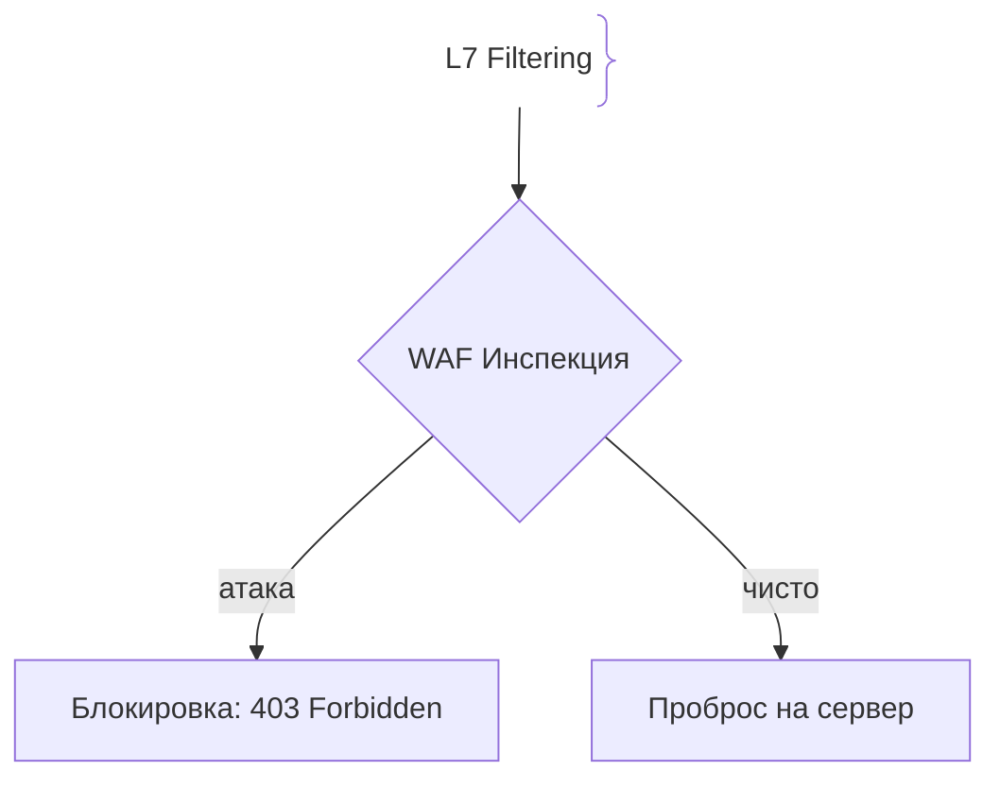
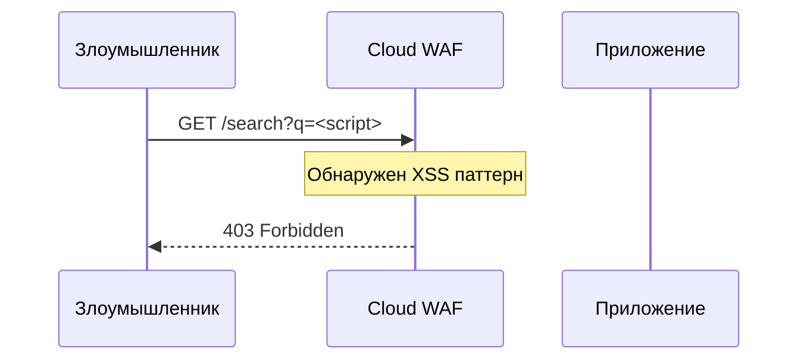

# WAF (Web Application Firewall)

## Определение

WAF анализирует и блокирует HTTP/HTTPS трафик, защищая приложения от атак L7 (OWASP Top 10, SQLi, XSS).

## Зачем нужен WAF

Сетевые файрволы (L3/L4) не могут обнаружить SQL-инъекцию внутри легитимного HTTP-запроса.
- **Виртуальный патчинг:** Закрытие уязвимостей в коде до выпуска официального патча.

## Как работает WAF





## Примеры кода

> Ключевые сценарии: базовая фильтрация запросов в TypeScript, Go и Java.

### TypeScript (WAF-like Middleware)

```typescript
import { Request, Response, NextFunction } from 'express';

function basicWaf(req: Request, res: Response, next: NextFunction) {
  if (JSON.stringify(req.query).includes('UNION SELECT')) {
    return res.status(403).json({ error: 'Blocked by WAF' });
  }
  next();
}
```

### Go (WAF Filter)

```go
package main

import (
	"net/http"
	"strings"
)

func WafFilter(next http.Handler) http.Handler {
	return http.HandlerFunc(func(w http.ResponseWriter, r *http.Request) {
		if strings.Contains(r.URL.RawQuery, "<script>") {
			http.Error(w, "Blocked", http.StatusForbidden)
			return
		}
		next.ServeHTTP(w, r)
	})
}
```

### Java (Servlet Filter)

```java
package com.example.demo;

import jakarta.servlet.*;
import jakarta.servlet.http.HttpServletRequest;
import java.io.IOException;

public class WafFilter implements Filter {
    public void doFilter(ServletRequest req, ServletResponse res, FilterChain chain) throws IOException, ServletException {
        HttpServletRequest request = (HttpServletRequest) req;
        String qs = request.getQueryString();
        if (qs != null && qs.toLowerCase().contains("drop table")) {
            res.setStatus(403);
            res.setContentType("application/json");
            res.getWriter().write("{\"error\":\"Blocked by WAF\"}");
            return;
        }
        chain.doFilter(req, res);
    }
}
```

## Пример использования: интеграция

Cloudflare / NGINX WAF правила: блокировать паттерны SQLi/XSS на входе в приложение:

```ts
const WAF_RULES = [
  { name: 'sqli', pattern: /(\bOR\b\s+\d+\s*=\s*\d+|\bUNION\b\s+SELECT)/i, action: 'block' },
  { name: 'xss', pattern: /<script|javascript:/i, action: 'block' },
]

app.use((req, res, next) => {
  const combined = `${req.url} ${JSON.stringify(req.query)} ${req.body ?? ''}`
  for (const rule of WAF_RULES) {
    if (rule.pattern.test(combined)) return res.status(403).json({ error: 'blocked' })
  }
  next()
})
```

Правила живут в полноценном WAF (AWS WAF, Cloudflare, ModSecurity), которые обновляют сигнатуры и отдают метрики блокировок.

## Паттерны использования

- **WAF до приложения** — фильтр на edge/в точке входа, а не внутри бизнес-логики.
- **Виртуальный патчинг** — закрыть известную уязвимость до выхода официального фикса.
- **Rate limiting и блокировки IP/гео** — только как дополнение, не вместо кода.
- **Тюнинг правил и мониторинг ложных срабатываний** — WAF должен учиться на реальном трафике.

## Антипаттерны и ловушки

- **WAF как единственная защита** — правила не заменяют prepared statements/экранирование: обходные пути есть всегда.
- **Слишком агрессивные правила** — блок легитимного трафика хуже, чем атака.
- **Не логировать блокировки** — не видно ни эффективности, ни ложных срабатываний.
- **Правила из одного источника без обновлений** — стареют вместе с редактором сигнатур.

## Когда использовать / когда НЕ использовать

- **Использовать:** публичные web-приложения; первый эшелон на L7 и «заплатка» до обновления кода.
- **НЕ использовать:** как замену качественной разработке и безопасности кода; для интернета/внутренних сервисов можно обойтись — но тогда ответственность за фильтрацию целиком лежит на коде.

## Связанные темы

- **ddos-protection** — L7-фильтрация и rate limiting соседствуют с WAF.
- **sql-injection** — атака, которую WAF обычно фильтрует в первую очередь.
- **xss** — вторая классическая мишень WAF.

## Вопросы

### Q1
**На каком уровне OSI работает WAF?**
- [ ] L2
- [x] L7 (прикладной / HTTP)
- [ ] L3/L4
- [ ] Физический

Пояснение: WAF анализирует содержимое HTTP-запросов (L7).

### Q2
**Что такое виртуальный патчинг?**
- [ ] Удаление вирусов
- [x] Блокировка уязвимости в коде на уровне WAF до исправления разработчиками
- [ ] Обновление Node.js
- [ ] Перезагрузка

Пояснение: Дает защиту от zero-day атак и время на исправление кода.

### Q3
**Какая база уязвимостей является стандартом для WAF?**
- [ ] ISO 9001
- [x] OWASP Top 10
- [ ] IEEE 802.3
- [ ] RFC 7231

Пояснение: Описывает критические риски веб-приложений.

### Q4
**Что такое False Positive у WAF?**
- [ ] Успешная атака
- [x] Ошибочная блокировка легитимного запроса
- [ ] Падение БД
- [ ] Ошибка авторизации

Пояснение: Ложное срабатывание защитных сигнатур.

### Q5
**Чем WAF отличается от сетевого файрвола?**
- [ ] Скоростью
- [x] Сетевой фильтрует по IP/портам (L3/L4), а WAF инспектирует синтаксис HTTP (L7)
- [ ] Питанием
- [ ] Стоимостью

Пояснение: Сетевой firewall не понимает структуру HTTP-запроса.

## Источники

- OWASP WAF Cheat Sheet: https://cheatsheetseries.owasp.org/cheatsheets/Web_Application_Firewall_Cheat_Sheet.html
- Cloudflare WAF: https://developers.cloudflare.com/waf/
