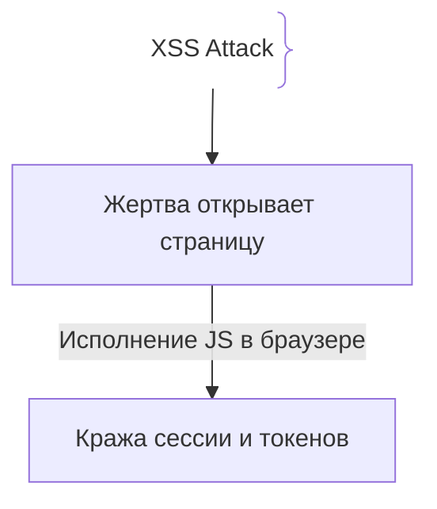
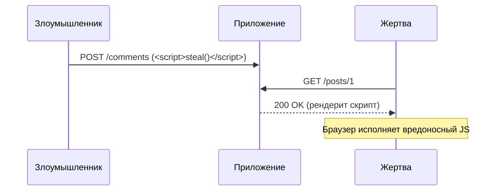

# XSS (Cross-Site Scripting)

## Определение

XSS — уязвимость, при которой злоумышленник внедряет вредоносный JavaScript-код на веб-страницу, просматриваемую другими пользователями.

## Зачем нужна защита от XSS

Выполнение произвольного JS в браузере жертвы приводит к захвату сессии и похищению данных.
- **Кража сессии:** Доступ к кукам или `localStorage`.
- **Виды XSS:** Stored (сохраненный), Reflected (отраженный), DOM-based.

## Как работает XSS-атака





## Примеры кода

> Ключевые сценарии: санитизация и экранирование в TypeScript, Go и Java.

### TypeScript (React / DOMPurify)

```typescript
import DOMPurify from 'dompurify';

function SafeHtml({ dirtyHtml }: { dirtyHtml: string }) {
  const cleanHtml = DOMPurify.sanitize(dirtyHtml);
  return <div dangerouslySetInnerHTML={{ __html: cleanHtml }} />;
}
```

### Go (html/template)

```go
package main

import (
	"html/template"
	"net/http"
)

var tmpl = template.Must(template.New("").Parse(`<h1>{{.Name}}</h1>`))

func handler(w http.ResponseWriter, r *http.Request) {
	tmpl.Execute(w, map[string]string{"Name": r.URL.Query().Get("name")})
}
```

### Java (OWASP Java HTML Sanitizer)

```java
package com.example.demo;

import org.owasp.html.HtmlPolicyBuilder;
import org.owasp.html.PolicyFactory;

public class Sanitizer {
    private static final PolicyFactory POLICY = new HtmlPolicyBuilder().allowElements("b", "i").toFactory();
    public String sanitize(String input) { return POLICY.sanitize(input); }
}
```

## Пример использования: интеграция

Хранение/рендеринг ввода как данных, а не как HTML:

```ts
function escapeHtml(s: string): string {
  return s
    .replaceAll('&', '&amp;')
    .replaceAll('<', '&lt;')
    .replaceAll('>', '&gt;')
    .replaceAll('"', '&quot;')
    .replaceAll("'", '&#39;')
}

app.get('/comment', (_req, res) => {
  const text = escapeHtml(comment.userText)
  res.send(`<div>${text}</div>`) // текст, не HTML
})
```

Дополнительно sanitizer + Content-Security-Policy перекрывают схему: даже при утечке script-строки браузер его не выполнит.

## Паттерны использования

- **Экранирование на контекст вывода** — HTML-теги отдельно от атрибутов и JS-контекстов.
- **Никогда `innerHTML` с пользовательскими данными** — использовать textContent/escape.
- **Фреймворки с экранированием по умолчанию** — React/Vue — но только при правильных API (не dangerouslySetInnerHTML).
- **CSP + HttpOnly cookie** — ограничение ущерба, если инъекция всё же прошла.

## Антипаттерны и ловушки

- **Валидация ввода как защита** — валидация не заменяет экранирование на выходе.
- **Экранировать один контекст, рендерить в другой** — контекст (HTML/атрибут/URL/JS) разный, и один эскейп не спасает.
- **`dangerouslySetInnerHTML` / `v-html`** — явный обход защит фреймворка.
- **Доверять санитайзеру слепо** — sanitizer сам становится целью обхода.

## Когда использовать / когда НЕ использовать

- **Использовать:** любой рендеринг пользовательского контента — комментарии, профили, поиск.
- **НЕ использовать:** вывод данных, которыми управляет только сервер, без пользовательского ввода — там XSS-вектор минимален, но всё равно стоит общий принцип.

## Связанные темы

- **sql-injection** — сестринская инъекция в базу; подходы к защите общие.
- **waf** — L7-фильтрация как ранний барьер для XSS-полезной нагрузки.

## Вопросы

### Q1
**В чем разница между Stored и Reflected XSS?**
- [ ] Нет разницы
- [x] Stored сохраняется в БД и атакует всех, а Reflected передается через URL и отражается для открывшего ссылку
- [ ] Reflected только в мобильных
- [ ] Stored без JS

Пояснение: Различие в векторе доставки (БД против сиюминутного ответа).

### Q2
**Какой заголовок защищает от XSS, ограничивая загрузку скриптов?**
- [ ] `X-Frame-Options`
- [x] `Content-Security-Policy` (CSP)
- [ ] `Access-Control-Allow-Origin`
- [ ] `Server`

Пояснение: CSP разрешает выполнение только доверенных скриптов.

### Q3
**Почему современные фреймворки (React, Vue) защищают от XSS?**
- [ ] AI
- [x] Автоматически экранируют весь текст в шаблонах (например, `<` в `&lt;`)
- [ ] Не поддерживают JS
- [ ] Работают на сервере

Пояснение: Экранирование предотвращает интерпретацию ввода как HTML/JS.

### Q4
**Что делает санитизация (DOMPurify)?**
- [ ] Удаляет все символы
- [x] Удаляет опасные теги (`<script>`) и атрибуты, оставляя безопасное подмножество
- [ ] Шифрует AES
- [ ] Сжимает картинки

Пояснение: Очищает HTML от вредоносного кода перед вставкой в DOM.

### Q5
**Почему хранение токенов в `localStorage` опасно при XSS?**
- [x] `localStorage` доступен любому JS-коду на странице, включая внедренный через XSS
- [ ] Стирается каждую секунду
- [ ] Блокируется по HTTP
- [ ] Только для бэкенда

Пояснение: Любой XSS-скрипт может прочитать `localStorage`.

## Источники

- OWASP XSS: https://cheatsheetseries.owasp.org/cheatsheets/Cross_Site_Scripting_Prevention_Cheat_Sheet.html
- MDN - XSS: https://developer.mozilla.org/
