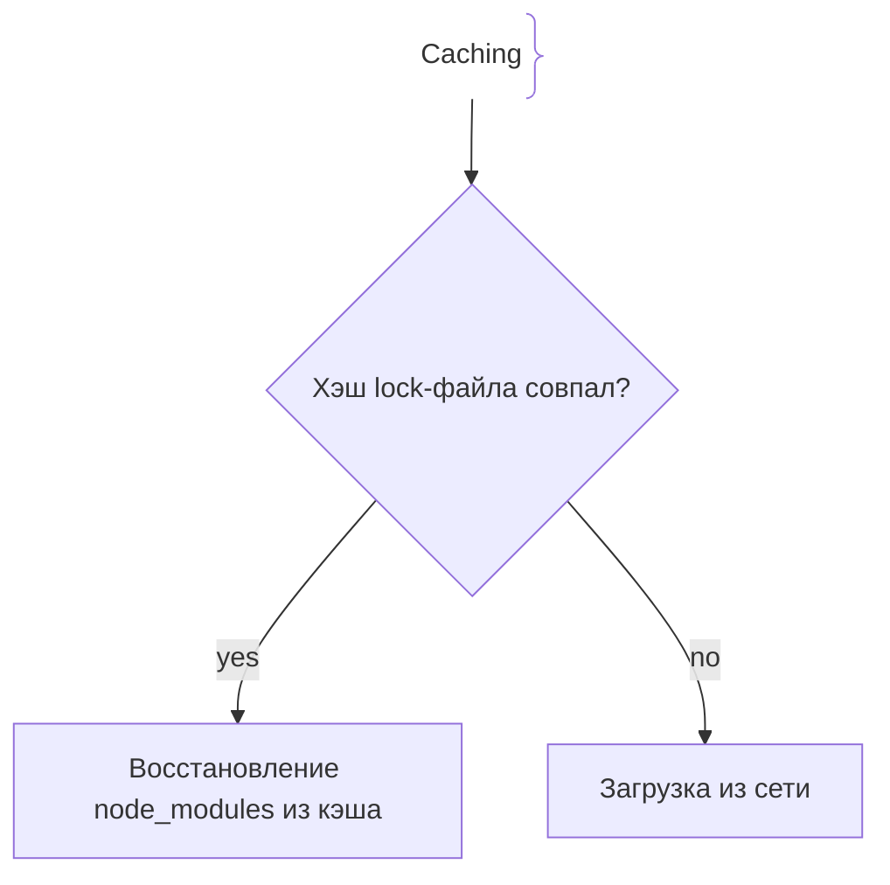
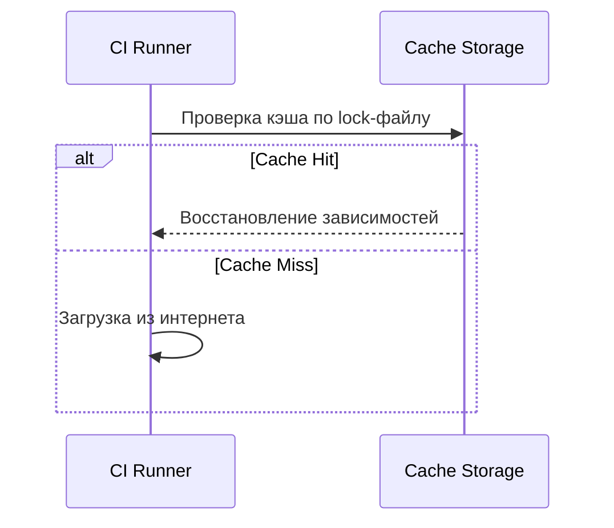

# Кэширование сборок и артефактов (Build Caching)

## Определение

Оптимизация CI/CD и Docker-сборок, при которой неизмененные зависимости не компилируются заново.

## Зачем нужно кэширование сборок

Экономия времени и ресурсов раннеров.
- **Ускорение CI/CD:** Сокращение времени сборки.
- **Docker Layer Caching:** Переиспользование слоев с зависимостями.

## Как работает кэширование





## Примеры кода

> Ключевые сценарии: кэширование в GitHub Actions.

### GitHub Actions (Node.js npm Cache)

```yaml
- uses: actions/setup-node@v4
  with:
    node-version: '20'
    cache: 'npm'
- run: npm ci
```

## Пример использования: интеграция

Кэш зависимостей в GitHub Actions по ключу от lock-файла:

```yaml
- uses: actions/cache@v4
  with:
    path: ~/.cache/go-build
    key: go-build-${{ hashFiles('go.sum') }}
    restore-keys: |
      go-build-
```

Совпадение lock-файла даёт прямое попадание; частичное восстановление — быстрый доклей без полной пересборки.

## Паттерны использования

- **Ключ от lock-файла** — только изменения зависимостей инвалидируют кэш.
- **Частичное восстановление через префикс-ключи** — old hash → быстрый доклей вместо полной пересборки.
- **Порядок Docker-слоёв: зависимости до кода** — правка исходников не ломает кэш тяжёлых слоёв.
- **Периодическая чистка stale-кэша** — устаревшие записи едят место в хранилище.

## Антипаттерны и ловушки

- **Кэш без ключа от зависимостей** — инвалидация не происходит, в прод уходит старая версия пакета.
- **Доверять кэшу как «святыне»** — кэш отравленный/неполный даёт ложные успехи сборки.
- **Кэшировать всё подряд** — огромные бакеты замедляют восстановление и выходят из лимитов.
- **Артефакты без версии/метаданных** — невозможно понять, что именно восстановлено.

## Когда использовать / когда НЕ использовать

- **Использовать:** CI с частыми сборками одинаковых зависимостей; Docker-сборки с большими слоями node_modules/Go pkg.
- **НЕ использовать:** короткие одноразовые задачи и тривиальные сборки без затрат на зависимости; когда выгода кэша меньше накладных расходов на его обслуживание.

## Связанные темы

- **docker** — слой кэширования образов.
- **ci-cd** — пайплайн, который использует кэши.
- **kubernetes** — кэш и инвалидация в деплоях.

## Вопросы

### Q1
**Главный критерий для обновления кэша в CI/CD?**
- [ ] Температура CPU
- [x] Хэш lock-файла (`package-lock.json`, `go.sum`)
- [ ] Случайное число
- [ ] Время суток

Пояснение: Изменение хэша lock-файла инвалидирует кэш.

### Q2
**Правильный порядок в Dockerfile для кэша?**
- [ ] Сначала код, потом зависимости
- [x] Сначала копировать зависимости и ставить их, потом копировать остальной код
- [ ] Порядок не важен
- [ ] Удалять кэш

Пояснение: Установка зависимостей реже меняется, чем код, и кэшируется первой.

### Q3
**Что происходит при Cache Miss?**
- [ ] Ошибка 500
- [x] Загрузка зависимостей из сети и сохранение в новый кэш
- [ ] Удаление репозитория
- [ ] Сброс пароля

Пояснение: При промахе кэш обновляется.

### Q4
**Какую проблему решает Build Caching?**
- [ ] Перегрев видеокарт
- [x] Долгое время сборки в CI/CD и расход трафика
- [ ] Ошибки TypeScript
- [ ] Версии Java

Пояснение: Ускоряет feedback loop разработчиков.

### Q5
**Что такое Docker Layer Caching?**
- [ ] Хранение паролей
- [x] Сохранение результатов выполнения инструкций Dockerfile для пропуска шагов
- [ ] Очистка диска
- [ ] Сжатие tar

Пояснение: Docker кэширует слои образов для мгновенной пересборки.

## Источники

- GitHub Actions Caching: https://docs.github.com/
- Docker Build Cache: https://docs.docker.com/