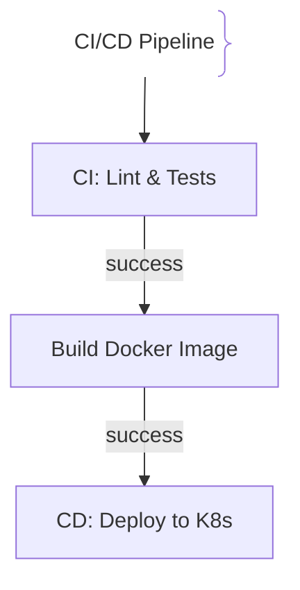
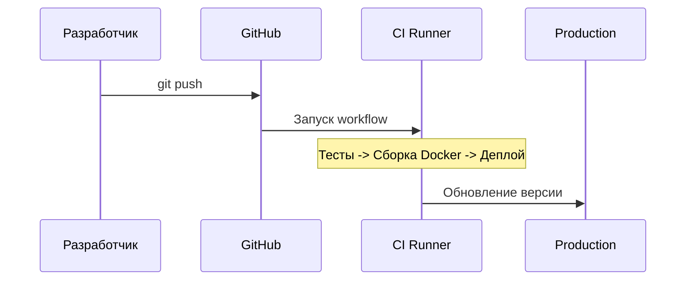

# CI/CD пайплайны (Continuous Integration / Delivery)

## Определение

CI/CD — это практика автоматизации сборки, тестирования и доставки ПО в продакшн с помощью конвейеров.

## Зачем нужен CI/CD

Ручной деплой ведет к человеческим ошибкам и простоям.
- **CI:** Автозапуск тестов и линтеров при каждом пуше.
- **CD:** Автодоставка собранных артефактов на стейджинг и продакшн.

## Как работает CI/CD пайплайн





## Примеры кода

> Ключевые сценарии: конфигурация пайплайна в GitHub Actions.

### GitHub Actions Workflow (YAML)

```yaml
name: CI/CD
on: [push]
jobs:
  build:
    runs-on: ubuntu-latest
    steps:
      - uses: actions/checkout@v4
      - uses: actions/setup-node@v4
        with:
          node-version: '20'
      - run: npm ci && npm test
```

## Пример использования: интеграция

GitHub Actions: проверки, сборка и публикация образа по триггеру:

```yaml
on:
  push:
    branches: [main]
jobs:
  build:
    runs-on: ubuntu-latest
    steps:
      - uses: actions/checkout@v4
      - run: npm ci && npm run lint && npm test
      - run: docker build -t app:${{ github.sha }} .
      - run: docker push registry.example.com/app:${{ github.sha }}
    permissions:
      id-token: write
      contents: read
```

Все проверки выполняются до выхода артifакта на прод: красный пайплайн = остановка деплоя.

## Паттерны использования

- **Проверки раньше доставки** — lint + тесты + сборка до любого изменения окружений.
- **Необратимость артефакта** — один sha-тег на образ, переиспользуемый между окружениями.
- **Окружения с защитой** — ручной approve для прод, дев обходится без него.
- **Идемпотентность шагов** — повторный прогон не ломает деплой.

## Антипаттерны и ловушки

- **Проверки в деплое, а не в пайплайне** — ошибки всплывают на проде.
- **Пересборка образа на каждом окружении** — то, что деплоится, не равно тому, что тестировалось.
- **Секреты в шагах** — креды утекают в логи раннеров.
- **«Зелёный» пайплайн с пройденным skip** — обесценивает всю автоматизацию.

## Когда использовать / когда НЕ использовать

- **Использовать:** любые репозитории с регулярными правками; обязательный минимум — lint + тесты.
- **НЕ использовать:** время на пайплайн избыточно для экспериментов/одноразовых скриптов — там достаточно обычных команд и ручного запуска.

## Связанные темы

- **docker** — сборка и публикация образов в пайплайне.
- **kubernetes** — куда доставляются артефакты.
- **build-caching** — ускорение сборок CI.

## Вопросы

### Q1
**В чем разница между CI и CD?**
- [ ] Нет разницы
- [x] CI отвечает за сборку и тесты, а CD — за доставку на стейджинг или продакшн
- [ ] CD без тестов
- [ ] CI только для Java

Пояснение: CI проверяет код, CD доставляет его до пользователя.

### Q2
**Что такое непрерывный деплой (Continuous Deployment)?**
- [ ] Медленный процесс
- [x] Автоматическая отправка в продакшн каждого изменения, прошедшего тесты, без участия человека
- [ ] Требует одобрения менеджера
- [ ] Работает ночью

Пояснение: Continuous Deployment не требует ручного одобрения для релиза.

### Q3
**Зачем нужно кэширование слоев в CI/CD?**
- [ ] Забить диск
- [x] Чтобы не/download зависимости заново, ускоряя сборку
- [ ] Требование GitHub
- [ ] Шифрование

Пояснение: Кэширование экономит время сборки и ресурсы раннеров.

### Q4
**Где должны храниться секреты в CI/CD?**
- [ ] В репозитории
- [x] В зашифрованном хранилище секретов платформы (GitHub Actions Secrets)
- [ ] В Telegram
- [ ] В `/tmp`

Пояснение: Нельзя помещать секреты в открытый код репозитория.

### Q5
**Что такое артефакт в CI/CD?**
- [ ] Находка
- [x] Скомпилированный бинарник или Docker-образ, созданный на этапе сборки
- [ ] Ошибка линтера
- [ ] SQL-запрос

Пояснение: Артефакт — это готовый к релизу результат сборки.

## Источники

- GitHub Actions: https://docs.github.com/en/actions
- Continuous Delivery by Jez Humble