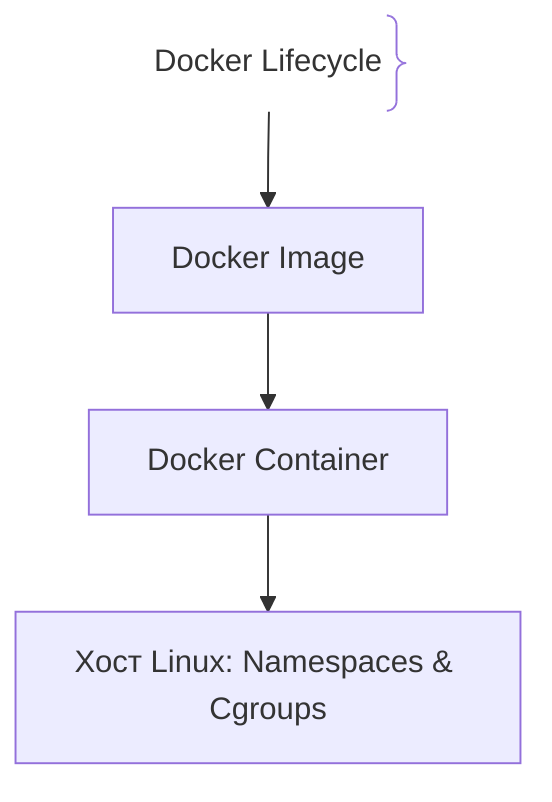
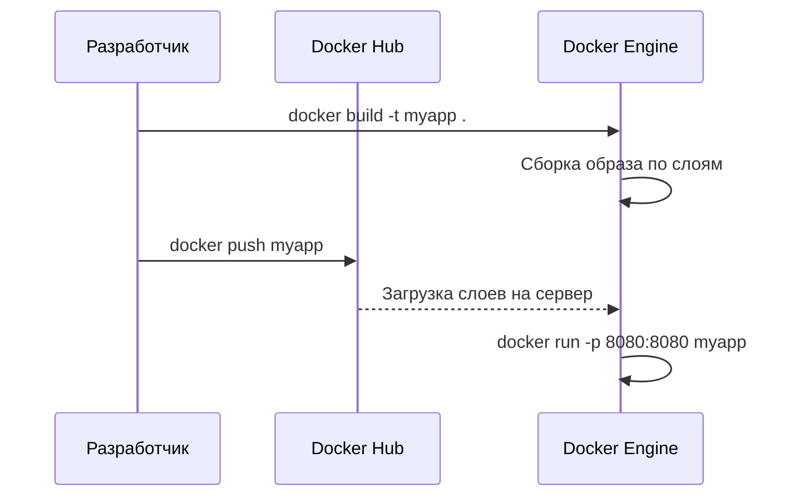

# Контейнеризация и Docker (Containerization)

## Определение

Docker — это инструмент виртуализации на уровне операционной системы, позволяющий упаковать приложение со всеми зависимостями в изолированный контейнер.

## Зачем нужен Docker

Проблема *«у меня на машине работает, а на сервере нет»* решается инкапсуляцией окружения.
- **Изоляция:** Контейнеры делят ядро Linux хоста через `namespaces` и `cgroups`.
- **Воспроизводимость:** Dockerfile описывает сборку по шагам, гарантируя идентичность сред.

## Как работает Docker архитектура





## Примеры кода

> Ключевые сценарии: многоэтапная сборка (Multi-stage build) в Dockerfile для TypeScript, Go и Java.

### Dockerfile (TypeScript Multi-stage)

```dockerfile
FROM node:20-alpine AS builder
WORKDIR /app
COPY package*.json ./
RUN npm ci
COPY . .
RUN npm run build

FROM node:20-alpine AS runner
WORKDIR /app
COPY --from=builder /app/dist ./dist
EXPOSE 8080
CMD ["node", "dist/index.js"]
```

### Dockerfile (Go Multi-stage)

```dockerfile
FROM golang:1.22-alpine AS builder
WORKDIR /app
COPY . .
RUN CGO_ENABLED=0 go build -o /app/server .

FROM alpine:3.19
COPY --from=builder /app/server /app/server
EXPOSE 8080
CMD ["/app/server"]
```

### Dockerfile (Java)

```dockerfile
FROM eclipse-temurin:21-jdk-alpine AS builder
WORKDIR /app
COPY . .
RUN ./mvnw clean package -DskipTests

FROM eclipse-temurin:21-jre-alpine
COPY --from=builder /app/target/*.jar app.jar
EXPOSE 8080
ENTRYPOINT ["java", "-jar", "app.jar"]
```

## Пример использования: интеграция

Multi-stage Dockerfile: собираем в одном образе, в рантайме — только исполняемое:

```dockerfile
FROM node:20-alpine AS build
WORKDIR /app
COPY package*.json ./
RUN npm ci
COPY . .
RUN npm run build

FROM node:20-alpine AS runtime
ENV NODE_ENV=production
COPY --from=build /app/dist ./dist
COPY --from=build /app/node_modules ./node_modules
USER node
EXPOSE 3000
CMD ["node", "dist/server.js"]
```

Итоговый образ тонкий и не содержит инструментов сборки — меньше поверхность атаки и загрузка.

## Паттерны использования

- **Multi-stage сборки** — зависимости компиляции не попадают в прод-образ.
- **Порядок слоёв: деп-зависимости до кода** — правки кода не инвалидируют кэш тяжёлых слоёв.
- **Непривилегированный пользователь** — `USER node`, а не root.
- **Фиксация версий базового образа** — стабильность среды и предсказуемые обновления.

## Антипаттерны и ловушки

- **Всё в одном слое с исходниками и секретами** — образ public/registry светит данными.
- **Монолитный Dockerfile без этапов** — боевой слой весит как dev-окружение.
- **Установка пакетов каждый раз** — без кэш-френдли порядка слоёв декстрой каждую секунду переустанавливает зависимости.
- **Запуск от root** — контейнерный user по умолчанию расширяет ущерб при компрометации.

## Когда использовать / когда НЕ использовать

- **Использовать:** любые приложения, которые деплоятся (микросервисы, batch, workerы); особенно где нужен контроль версии окружения.
- **НЕ использовать:** серверless-функции без собственного рантайма; контейнеры избыточны там, где хостится бес-станковый сервис.

## Связанные темы

- **kubernetes** — оркестрация контейнеров поверх Docker-образов.
- **helm-charts** — упаковка и деплой образов в K8s.
- **ci-cd** — пайплайн, который собирает и публикует образы.

## Вопросы

### Q1
**В чем главное отличие контейнеров от виртуальных машин (VM)?**
- [ ] Контейнеры только для Windows
- [x] Контейнеры делят ядро хоста через namespaces, в то время как VM запускают собственную гостевую ОС с hypervisor
- [ ] VM легче
- [ ] Docker не требует CPU

Пояснение: Контейнеры легче и быстрее виртуальных машин, так как не дублируют ядро ОС.

### Q2
**Что такое Multi-stage build в Dockerfile?**
- [ ] Запуск контейнеров
- [x] Использование нескольких инструкций `FROM`, позволяющее собрать артефакт на тяжелом образе, а в продакшн скопировать бинарник
- [ ] Тестирование кода
- [ ] Шифрование

Пояснение: Позволяет оставлять тяжелые инструменты сборки за бортом легковесного образа.

### Q3
**Какие технологии ядра Linux обеспечивают изоляцию контейнеров?**
- [ ] TCP и UDP
- [x] Namespaces (изоляция) и Cgroups (ограничение ресурсов)
- [ ] Systemd и Bash
- [ ] Ext4 и XFS

Пояснение: Namespaces и Cgroups создают изолированное «окружение» для процессов.

### Q4
**Что такое слои (Layers) в образах Docker?**
- [ ] Уровни доступа
- [x] Каждая инструкция в Dockerfile создает неизменяемый слой, кэшируемый при сборке
- [ ] Ошибки компиляции
- [ ] Сетевые порты

Пояснение: Послойная архитектура обеспечивает эффективное кэширование.

### Q5
**Почему в продакшене рекомендуется запускать приложения от непривилегированного пользователя?**
- [ ] Требование процессоров
- [x] Для минимизации рисков безопасности при взломе
- [ ] Приложения под root не работают
- [ ] Ускорение работы

Пояснение: Запуск от root может дать полный доступ к хосту при уязвимостях.

## Источники

- Docker Docs: https://docs.docker.com/
- Linux Namespaces: https://man7.org/
