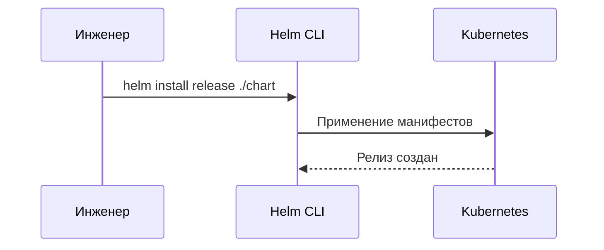

# Helm — пакетный менеджер для Kubernetes

Helm — пакетный менеджер для Kubernetes, позволяющий устанавливать и обновлять сложные приложения с помощью Chart-пакетов.

## Зачем нужен Helm

Управление сырыми YAML-манифестами для деплоя превращается в рутину.
- **Шаблонизация:** Переиспользование конфигураций через `values.yaml`.
- **Rollback:** Мгновенный откат неудачного деплоя.

## Как работает Helm Chart




## Примеры кода

> Ключевые сценарии: структура values.yaml и deployment шаблон.

### Helm Deployment Template

```yaml
apiVersion: apps/v1
kind: Deployment
metadata:
  name: {{ .Release.Name }}-app
spec:
  replicas: {{ .Values.replicaCount }}
  template:
    spec:
      containers:
      - name: app
        image: "{{ .Values.image.repo }}:{{ .Values.image.tag }}"
```

## Вопросы

### Q1
**Главная задача Helm в Kubernetes?**
- [ ] Замена Docker
- [x] Пакетный менеджер, упрощающий установку и откат приложений в K8s
- [ ] Шифрование дисков
- [ ] Управление AWS IAM

Пояснение: Управляет наборами K8s манифестов как единым целым.

### Q2
**Что такое `values.yaml`?**
- [ ] БД пользователей
- [x] Файл с переменными шаблонизации для переопределения параметров
- [ ] Логи
- [ ] Манифест Docker

Пояснение: Хранит конфигурационные параметры.

### Q3
**Как работает откат (`helm rollback`)?**
- [ ] Удаляет кластер
- [x] Возвращает состояние к предыдущей ревизии релиза
- [ ] Перезагружает серверы
- [ ] Отменяет коммит Git

Пояснение: Helm хранит историю всех ревизий.

### Q4
**Какой язык шаблонизации используется в Helm?**
- [ ] Jinja2
- [x] Go Templates
- [ ] JSX
- [ ] Mustache

Пояснение: Использует стандартный движок Go templates.

### Q5
**Что такое Chart.yaml?**
- [ ] График CPU
- [x] Метаданные пакета (название, версия)
- [ ] Скрипт деплоя
- [ ] Лог ошибок

Пояснение: Описывает информацию о пакете.

## Источники

- Helm Docs: https://helm.sh/docs/