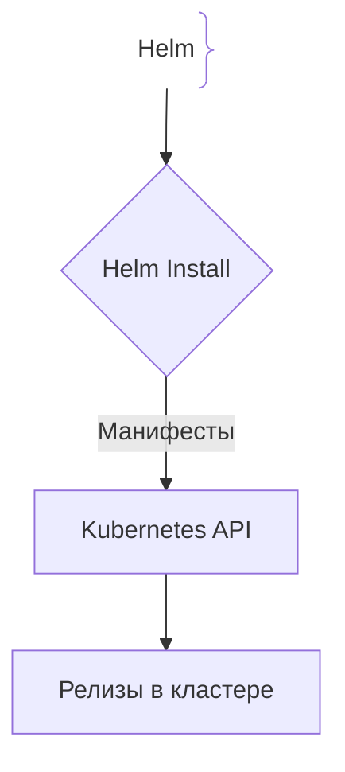
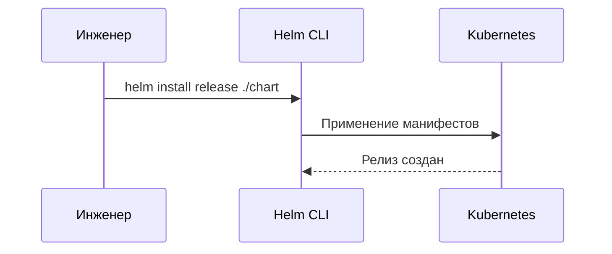

# Helm — пакетный менеджер для Kubernetes

## Определение

Helm — пакетный менеджер для Kubernetes, позволяющий устанавливать и обновлять сложные приложения с помощью Chart-пакетов.

## Зачем нужен Helm

Управление сырыми YAML-манифестами для деплоя превращается в рутину.
- **Шаблонизация:** Переиспользование конфигураций через `values.yaml`.
- **Rollback:** Мгновенный откат неудачного деплоя.

## Как работает Helm Chart





## Примеры кода

> Ключевые сценарии: структура values.yaml и deployment шаблон.

### Helm Deployment Template

```yaml
apiVersion: apps/v1
kind: Deployment
metadata:
  name: {{ .Release.Name }}-app
spec:
  replicas: {{ .Values.replicaCount }}
  template:
    spec:
      containers:
      - name: app
        image: "{{ .Values.image.repo }}:{{ .Values.image.tag }}"
```

## Пример использования: интеграция

Шаблонизация по values: один chart, разные окружения:

```yaml
# values-production.yaml
replicaCount: 6
image:
  repository: registry.example.com/api
  tag: "1.4.2"
resources:
  limits:
    cpu: 1
    memory: 512Mi
ingress:
  enabled: true
  hosts: ["api.example.com"]
```

Один и тот же chart рендерит манифесты для dev/prod; `helm upgrade --install` атомарно обновляет релиз, а `helm rollback` мгновенно возвращает прежнее состояние.

## Паттерны использования

- **Шаблонизация через values.yaml** — код манифестов один, конфигурация за пределами.
- **Releases и `helm rollback`** — откат неудачного деплоя на прежнюю версию.
- **Стабильные версии chart** — тег образа и версия chart в одном месте.
- **Чекы `helm test`** — post-install-проверки готовности релиза.

## Антипаттерны и ловушки

- **Хардкод значений в chart** — chart перестаёт быть переиспользуемым между окружениями.
- **Версии без фиксации** — latest в values съедает воспроизводимость деплоя.
- **Ручное применение raw-манифестов вместо helm** — теряется история и rollback.
- **Правила без валидации** — опечатка в template даёт невалидный YAML в кластере.

## Когда использовать / когда НЕ использовать

- **Использовать:** K8s-приложения со сложной конфигурацией и несколькими окружениями; когда нужен откат деплоя.
- **НЕ использовать:** пара простых манифестов без изменений от окружения — helm-обвязка дороже, чем kustomize/raw YAML; серверless и не-K8s цели.

## Связанные темы

- **kubernetes** — оркестратор, для которого упаковываются charts.
- **docker** — образы, которые chart'ы разворачивают.
- **ci-cd** — пайплайн, который публикует версии chart'ов.

## Вопросы

### Q1
**Главная задача Helm в Kubernetes?**
- [ ] Замена Docker
- [x] Пакетный менеджер, упрощающий установку и откат приложений в K8s
- [ ] Шифрование дисков
- [ ] Управление AWS IAM

Пояснение: Управляет наборами K8s манифестов как единым целым.

### Q2
**Что такое `values.yaml`?**
- [ ] БД пользователей
- [x] Файл с переменными шаблонизации для переопределения параметров
- [ ] Логи
- [ ] Манифест Docker

Пояснение: Хранит конфигурационные параметры.

### Q3
**Как работает откат (`helm rollback`)?**
- [ ] Удаляет кластер
- [x] Возвращает состояние к предыдущей ревизии релиза
- [ ] Перезагружает серверы
- [ ] Отменяет коммит Git

Пояснение: Helm хранит историю всех ревизий.

### Q4
**Какой язык шаблонизации используется в Helm?**
- [ ] Jinja2
- [x] Go Templates
- [ ] JSX
- [ ] Mustache

Пояснение: Использует стандартный движок Go templates.

### Q5
**Что такое Chart.yaml?**
- [ ] График CPU
- [x] Метаданные пакета (название, версия)
- [ ] Скрипт деплоя
- [ ] Лог ошибок

Пояснение: Описывает информацию о пакете.

## Источники

- Helm Docs: https://helm.sh/docs/