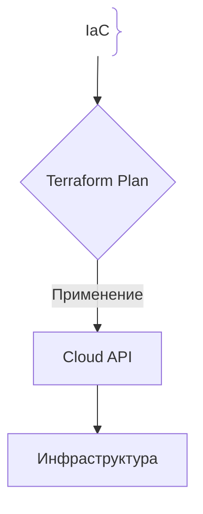
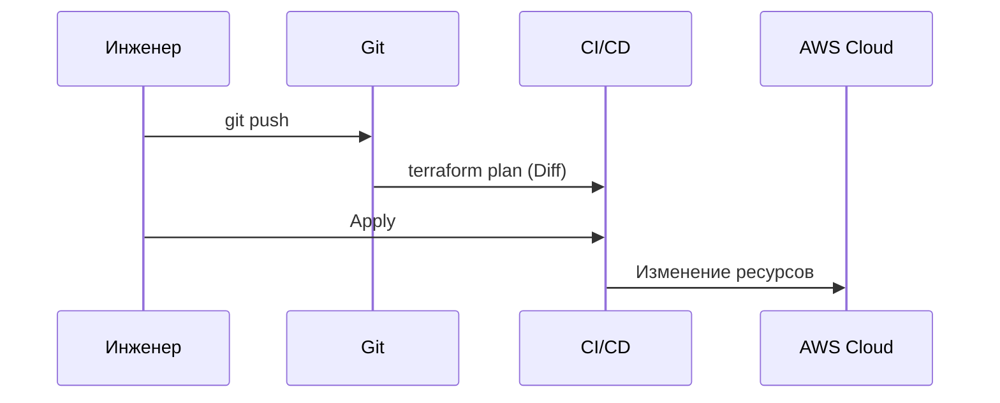

# Инфраструктура как код (IaC)

## Определение

IaC — это подход к управлению инфраструктурой (серверами, сетями) с помощью кода вместо ручного кликанья по веб-интерфейсу (ClickOps).

## Зачем нужен IaC

Ручное создание серверов приводит к «конфигурационному дрейфу».
- **Воспроизводимость:** Поднятие идентичных сред за минуты.
- **GitOps:** Версионирование через Git и код-ревью.

## Как работает IaC





## Примеры кода

> Ключевые сценарии: описание S3 бакета на Terraform (HCL).

### Terraform (AWS S3 Bucket)

```hcl
provider "aws" {
  region = "us-east-1"
}

resource "aws_s3_bucket" "storage" {
  bucket = "my-app-storage-bucket"
}
```

## Пример использования: интеграция

Инфраструктура описывается кодом и проходится code-review как обычный PR:

```hcl
resource "aws_instance" "web" {
  ami           = "ami-0c55b159cbfafe1f0"
  instance_type = "t3.micro"

  tags = {
    Name = "web-${var.env}"
  }
}
```

`terraform plan` показывает diff против текущего состояния, apply применяет его — изменения воспроизводимы и версиируются в Git.

## Паттерны использования

- **Всё инфраструктура — как код** — серверы, сети, роли и политики в репозитории.
- **State вне repo, блокировка на время change** — параллельные apply не ломают базу.
- **Plan перед apply в CI** — дифф виден ревьюерам до изменения прода.
- **Окружения из одних модулей** — вариация только в values, не в коде.

## Антипаттерны и ловушки

- **ClickOps для «быстрых правок»** — ручные изменения создают конфигурационный дрейф.
- **Секреты в конфиге** — креды провайдера попадают в репозиторий.
- **Дрейф состояния vs реальности** — починить «вручную» и не обновить код — следующий apply откатит фикс.
- **Один гигантский PR/применение** — падение apply деструктивнее частых мелких изменений.

## Когда использовать / когда НЕ использовать

- **Использовать:** любая прод-инфраструктура из серверов/сетей/БД; команды, управляющие несколькими окружениями.
- **НЕ использовать:** для единичных опытных стендов, которые «завтра удалим» — IaC приносит выгоду повторяемостью, а не разовостью.

## Связанные темы

- **terraform** — главный инструмент IaC.
- **kubernetes** — инфраструктура, управляемая кодом.
- **ci-cd** — автоматизация apply и проверок.

## Вопросы

### Q1
**Что такое «ClickOps»?**
- [ ] Облачный инструмент
- [x] Ручное управление инфраструктурой через веб-интерфейс, ведущее к хаосу
- [ ] Автодеплой
- [ ] Мониторинг

Пояснение: Ручные клики невозможно воспроизвести через код.

### Q2
**Что такое идемпотентность в IaC?**
- [ ] Работа по ночам
- [x] Многократный запуск конфига при неизменном состоянии не создает дубликаты
- [ ] Каждый запуск удваивает серверы
- [ ] Код без компиляции

Пояснение: Скрипт меняет систему только при наличии отличий.

### Q3
**Главное преимущество хранения IaC в Git?**
- [ ] Скорость интернета
- [x] Код-ревью, история изменений и откаты через git revert
- [ ] Шифрование БД
- [ ] Снижение цен AWS

Пояснение: Инфраструктура становится полноценным программным кодом.

### Q4
**Что делает команда `terraform plan`?**
- [ ] Сносит инфраструктуру
- [x] Сравнивает состояние и выводит отчет об изменениях без их применения
- [ ] Бэкап Git
- [ ] Компиляция

Пояснение: Позволяет увидеть изменения до их применения.

### Q5
**Что такое конфигурационный дрейф?**
- [ ] Смещение по часовым поясам
- [x] Отличие реального состояния облака от кода из-за ручных правок
- [ ] Ошибка компиляции
- [ ] Задержка сети

Пояснение: Опасен тем, что следующий apply может удалить измененное вручную.

## Источники

- Terraform Docs: https://www.terraform.io/
- IaC by Kief Morris
