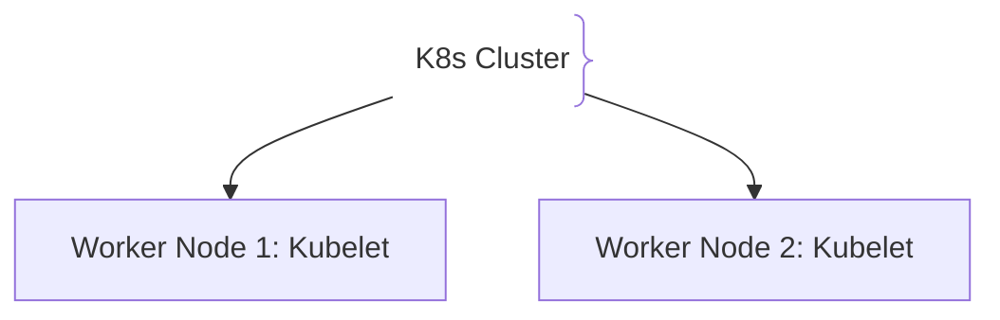
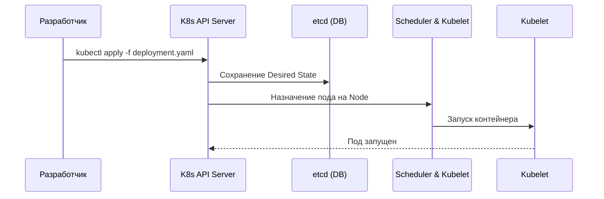

# Оркестрация и Kubernetes (K8s)

Kubernetes — это система оркестрации контейнеров, предназначенная для автоматизации развертывания, масштабирования и управления приложениями.

## Зачем нужен Kubernetes

Управление тысячами контейнеров вручную невозможно.
- **Масштабирование (HPA):** Добавление реплик пода при росте нагрузки.
- **Самовосстановление:** Перезапуск упавших контейнеров и миграция на живые ноды.

## Как работает Kubernetes архитектура





## Примеры кода

> Ключевые сценарии: базовый манифест Deployment и Service в Kubernetes.

### Kubernetes Deployment & Service Manifest (YAML)

```yaml
apiVersion: apps/v1
kind: Deployment
metadata:
  name: core-app
spec:
  replicas: 3
  selector:
    matchLabels:
      app: core-app
  template:
    metadata:
      labels:
        app: core-app
    spec:
      containers:
      - name: app
        image: mycompany/core-app:v1.0.0
        ports:
        - containerPort: 8080
---
apiVersion: v1
kind: Service
metadata:
  name: core-service
spec:
  selector:
    app: core-app
  ports:
    - port: 80
      targetPort: 8080
  type: ClusterIP
```

## Вопросы

### Q1
**Что такое Pod в Kubernetes?**
- [ ] Физический сервер
- [x] Наименьшая единица развертывания, содержащая контейнеры, делящие общую сеть и хранилище
- [ ] База данных etcd
- [ ] Протокол сети

Пояснение: Под — это абстракция над контейнерами на одной ноде.

### Q2
**Какую роль выполняет `etcd` в Kubernetes?**
- [ ] Хранит логи
- [x] Распределенное хранилище состояния кластера (Desired State)
- [ ] Ускоряет компиляцию
- [ ] Шифрует TLS

Пояснение: etcd хранит единый источник правды о кластере.

### Q3
**Что делает Kubernetes Service типа `ClusterIP`?**
- [ ] Открывает порт наружу
- [x] Предоставляет внутренний постоянный IP и балансировку для группы подов внутри кластера
- [ ] Удаляет упавшие поды
- [ ] Заменяет AWS ALB

Пояснение: ClusterIP доступен только внутри кластера.

### Q4
**Что означает «Declarative Configuration» в Kubernetes?**
- [ ] Использование JS
- [x] Описание желаемого состояния в YAML, которое K8s автоматически приводит в соответствие
- [ ] Ручная настройка по SSH
- [ ] Случайная конфигурация

Пояснение: Декларативный подход избавляет от ручных команд.

### Q5
**Что делает Horizontal Pod Autoscaler (HPA)?**
- [ ] Перезагружает ноды
- [x] Автоматически изменяет количество реплик на основе загрузки (CPU/RPS)
- [ ] Увеличивает диск
- [ ] Удаляет образы

Пояснение: HPA масштабирует приложение горизонтально.

## Источники

- Kubernetes Docs: https://kubernetes.io/docs/
- The Kubernetes Book by Nigel Poulton