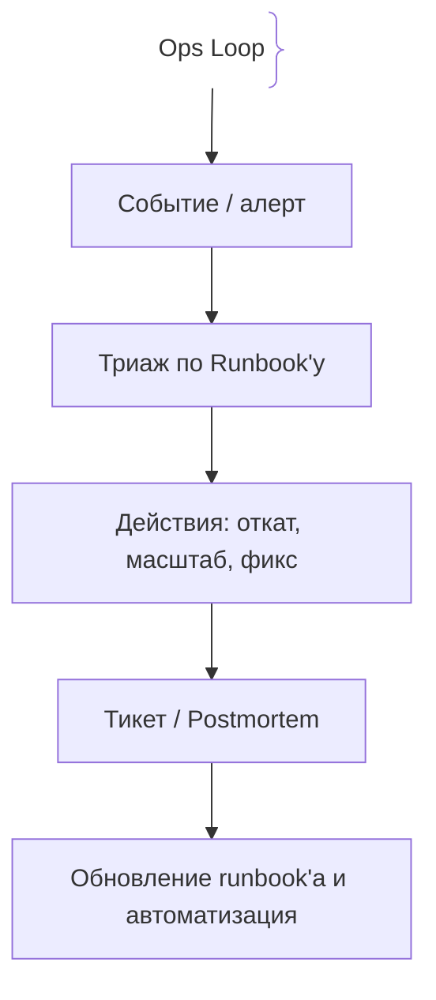
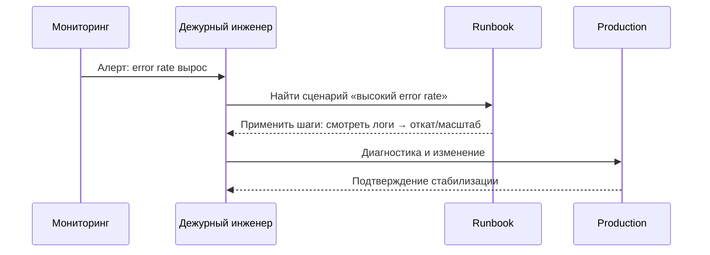

# Эксплуатация и Ops-практики (Operations)

Выпущенный код требует постоянного ухода: наблюдаемости, документированных действий и дисциплины изменений.

## Определение

Эксплуатация (Operations) — набор практик, обеспечивающих стабильную работу сервисов после деплоя: runbook'и, мониторинг и алертинг, управление изменениями, эскалации и накопление знаний о системе.

## Зачем нужны Ops-практики

Стабильность прода не достигается «сама собой» — она зависит от качества процессов.
- **Скорость реакции:** Runbook'и и эскалации сокращают время восстановления (MTTR).
- **Безопасность изменений:** Регламентированные деплои снижают риск недоступности.
- **Устойчивость к людям:** Документы и автоматизация переживают отпуска, увольнения и ночь субботы.

## Как работает эксплуатация





## Примеры кода

### Bash (проверка статуса сервиса)

```bash
if systemctl is-active --quiet api.service; then
  echo "api: active"
else
  journalctl -u api.service --since "30 min ago" --no-pager | tail -50
fi
```

Двухшаговая рутина: статус службы, а при падении — последние логи из journald.

## Пример использования: интеграция

Фрагмент runbook'а для сценария «API отвечает блоги или падает»:

```bash
#!/usr/bin/env bash
set -euo pipefail

POD=$(kubectl get pods -l app=api -o jsonpath='{.items[0].metadata.name}')

echo "→ последние логи приложения:"
kubectl logs "$POD" --tail=100

echo "→ события пода:"
kubectl get events --sort-by=.lastTimestamp | tail -20

echo "→ здоровье и реплики:"
kubectl get pods -l app=api
```

Runbook содержит конкретные команды и ожидаемый результат — дежурный не импровизирует, а действует по проверенной процедуре.

## Паттерны использования

- **Runbook на каждый типовой сценарий** — известные деградации решаются одинаково.
- **Наблюдаемость по умолчанию** — метрики, логи и алерты есть до инцидента, а не после.
- **Change management** — изменения в окна сниженного риска, с оповещением и планом отката.
- **Владелец сервиса** — у каждой системы есть ответственная команда (ownership).
- **Автоматизация вместо рутины** — повторяемые действия превращаются в код.

## Антипаттерны и ловушки

- **Героическая эксплуатация «в голове»** — зависят от одного человека, который «всё помнит».
- **Правки руками без кода** — дрейф конфигурации: деплой/IaC откатят незадокументированный фикс.
- **Игнор предупреждений «пока работает»** — малые деградации превращаются в инцидент.
- **Отсутствие владельца** — сервис, за который «отвечает сам собой», никто не развивает.
- **Изменения без плана отката** — скоуп риска всех меняется.

## Когда использовать / когда НЕ использовать

- **Использовать:** любого производство: деплой, мониторинг, алертинг и runbook'и — минимум живого процесса.
- **НЕ использовать:** ручные эксперименты и разовые стенды «поставлю-завтра-удалю» — полный Ops-процесс там избыточен, но «минимальный runbook на перезапуск» всё ещё полезен.

## Связанные темы

- **on-call** — кто реагирует на событие в эксплуатации.
- **production-incidents** — процесс инцидентов поверх ежедневной эксплуатации.
- **monitoring** — источник данных для алертов и runbook'ов.
- **ci-cd** — автоматизация доставки, на которую опираются Ops-практики.
- **liveness-readiness-probes** — механизм контроля живых подов на уровне кластера.

## Вопросы

### Q1
**Что такое runbook?**
- [x] Документированная последовательность действий для типового сценария деградации или инцидента
- [ ] Журнал изменений в коде
- [ ] Спецификация API
- [ ] Отчёт о затратах в облаке

Пояснение: runbook описывает проверенные шаги и ожидаемый результат для повторяющегося сценария.

### Q2
**Зачем нужны окна изменений (change windows)?**
- [x] Чтобы выполнять рискованные изменения в часы сниженной нагрузки и уменьшить влияние сбоя
- [ ] Чтобы откладывать все релизы на неопределённый срок
- [ ] Чтобы запретить деплои вовсе
- [ ] Чтобы сократить тесты приложений

Пояснение: change window — согласованный период для изменений, когда риск для пользователей минимален.

### Q3
**Что означает владение сервисом (ownership) в SRE/Ops-практике?**
- [x] Команда отвечает за надёжность сервиса, его изменения и имеет полномочия их выполнять
- [ ] Только право ставить правки в чужой код
- [ ] Право игнорировать алерты
- [ ] Бюрократическое назначение без ответственности

Пояснение: ownership связывает ответственность, развитие и реагирование на инциденты в одной команде.

### Q4
**Что такое MTTR?**
- [x] Mean Time To Recover — среднее время восстановления сервиса после сбоя
- [ ] Максимальное время отклика в секундах
- [ ] Среднее время до выдачи релиза
- [ ] Метрика размера базы данных

Пояснение: MTTR — ключевая метрика скорости восстановления в эксплуатации.

### Q5
**Почему «правка руками без кода и runbook'а» — плохая практика?**
- [x] Создаётся дрейф конфигурации, и следующий деплой/IaC вернёт состояние обратно
- [ ] Это всегда очень опасно для безопасности
- [ ] Ручные команды слишком медленные в любом случае
- [ ] Это увеличивает расходы на облако напрямую

Пояснение: незадокументированные ручные изменения теряются, а будущий apply откатывает их — требуется переделывать.

## Источники

- Google SRE Book: https://sre.google/sre-book/table-of-contents/
- Google SRE Workbook: https://sre.google/workbook/table-of-contents/