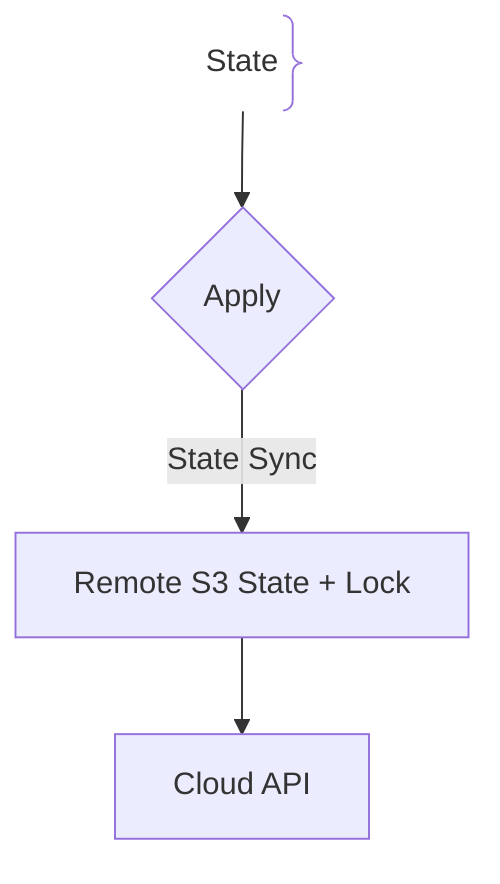
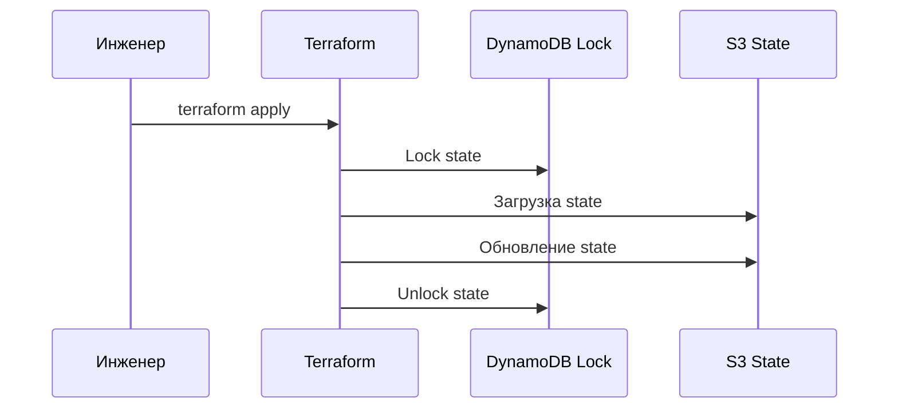

# Terraform и управление состоянием (State Management)

## Определение

Terraform — инструмент IaC для создания и управления ресурсами с использованием HCL.

## Зачем нужен State

Terraform должен помнить соответствие кода и реальных ресурсов в облаке.
- **Remote State:** Хранение состояния в S3 с блокировкой (DynamoDB).

## Как работает Terraform State





## Примеры кода

> Ключевые сценарии: настройка удаленного бэкенда S3.

### Terraform (S3 Backend)

```hcl
terraform {
  backend "s3" {
    bucket         = "states-bucket"
    key            = "prod/state.tfstate"
    region         = "us-east-1"
    dynamodb_table = "locks"
  }
}
```

## Пример использования: интеграция

Remote state в S3 с блокировкой — без файла на дисках разработчиков:

```hcl
terraform {
  backend "s3" {
    bucket         = "tf-state-prod"
    key            = "app/terraform.tfstate"
    region         = "eu-central-1"
    dynamodb_table = "tf-locks"
  }
}

resource "aws_db_instance" "db" {
  engine         = "postgres"
  instance_class = "db.t4g.micro"
  allocated_storage = 20
}
```

State хранится в общем месте, доступ блокируется конкурирующими apply — параллельные изменения не разрушают инфраструктуру.

## Паттерны использования

- **Remote state + lock** — общее хранилище и отсутствие конфликтов apply.
- **Модули и окружения** — единый код, параметризованные значения.
- **Plan/apply в CI** — изменения проходят ревью как PR, не применяются вручную.
- **Terraform workspace / отдельные state'ы на окружение** — изоляция дев и прод.

## Антипаттерны и ловушки

- **Локальный state на машине инженера** — кто не запускал — «не знает» о ресурсах.
- **Работа без lock** — два apply одновременно перетирают state и ресурс.
- **Редактирование state руками** — ломает соответствие кода реальности, дальше `plan` врёт.
- **Ключи провайдера в репозитории** — учетные данные утекают вместе с кодом.

## Когда использовать / когда НЕ использовать

- **Использовать:** управление облачной инфраструктурой через код; команды из нескольких инженеров.
- **НЕ использовать:** разовые эксперименты на одиночно администрируемых серверах — там хватит скриптов; IaC окупается повторяемостью и числом людей.

## Связанные темы

- **infrastructure-as-code** — подход, чей инструмент Terraform.
- **kubernetes** — как Terraform управляет и содержимым кластера.
- **ci-cd** — автоматизация plan/apply в пайплайне.

## Вопросы

### Q1
**Для чего нужен файл `terraform.tfstate`?**
- [ ] Компиляция
- [x] Хранение соответствия между кодом и реальными ID в облаке
- [ ] Логи
- [ ] Пароли

Пояснение: State — карта памяти Terraform.

### Q2
**Почему нельзя хранить state локально в команде?**
- [ ] Много весит
- [x] Риск перезаписи изменений коллег и потеря при поломке ноутбука
- [ ] Запрещено JS
- [ ] Terraform не умеет

Пояснение: Remote State с блокировками обязателен для команд.

### Q3
**Что делает State Locking (DynamoDB)?**
- [ ] Удаляет БД
- [x] Блокирует state на время apply, предотвращая параллельные запуски
- [ ] Шифрует диск
- [ ] Ускоряет интернет

Пояснение: Предотвращает рассинхронизацию стейта.

### Q4
**Что делает `terraform import`?**
- [ ] Удаление
- [x] Привязка уже существующих в облаке ресурсов под управление Terraform
- [ ] Установка плагинов
- [ ] Тесты

Пояснение: Переводит старую инфраструктуру под управление IaC.

### Q5
**Что произойдет при удалении `terraform.tfstate`?**
- [ ] Ничего
- [x] Terraform потеряет связь с ресурсами и попытается создать их заново
- [ ] Облако удалит сервера
- [ ] Сбросится пароль

Пояснение: Потеря стейта требует ручного восстановления.

## Источники

- Terraform State: https://www.terraform.io/
