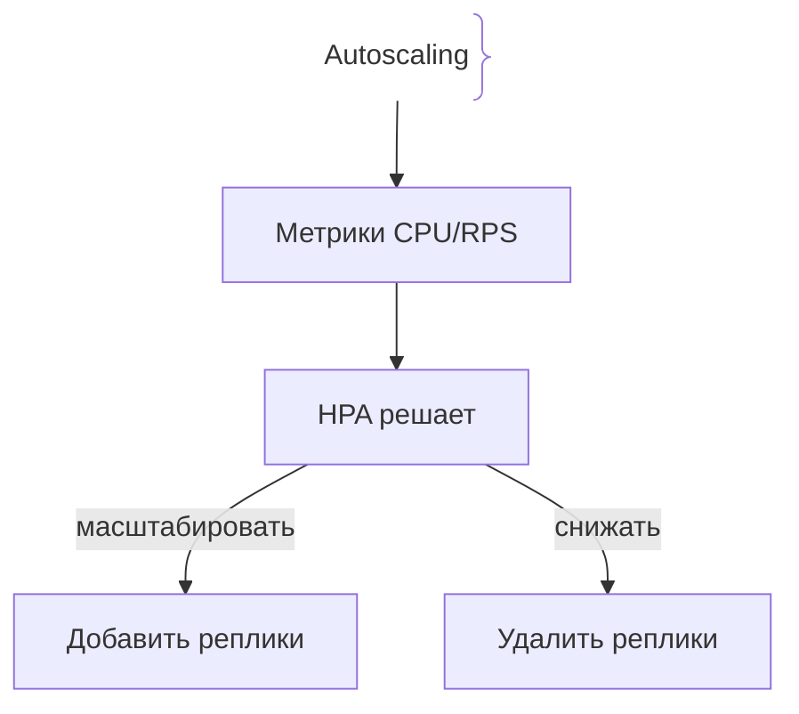
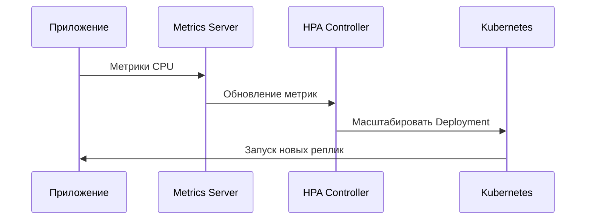

# Автомасштабирование (Autoscaling)

Autoscaling — автоматическое изменение количества экземпляров приложения в зависимости от нагрузки.

## Зачем нужно Autoscaling

Ручное масштабирование не успевает за изменением нагрузки.
- **Экономия ресурсов:** Меньше экземпляров при низкой нагрузке.
- **Доступность:** Больше экземпляров при пиковых нагрузках.

## Как работает Autoscaling архитектура





## Примеры кода

> Ключевые сценарии: Horizontal Pod Autoscaler в Kubernetes.

### Kubernetes HPA Manifest

```yaml
apiVersion: autoscaling/v2
kind: HorizontalPodAutoscaler
metadata:
  name: app-hpa
spec:
  scaleTargetRef:
    apiVersion: apps/v1
    kind: Deployment
    name: app
  minReplicas: 2
  maxReplicas: 10
  metrics:
    - type: Resource
      resource:
        name: cpu
        target:
          type: Utilization
          averageUtilization: 70
```

## Вопросы

### Q1
**Что такое Autoscaling?**
- [ ] Ручное изменение количества серверов
- [x] Автоматическое изменение количества экземпляров по метрикам
- [ ] Шифрование данных
- [ ] Удаление старых версий

Пояснение: HPA автоматически добавляет или удаляет реплики.

### Q2
**Какие метрики чаще всего использует HPA?**
- [ ] Цвет интерфейса
- [x] CPU и память
- [ ] Версия языка
- [ ] Количество файлов

Пояснение: CPU Utilization и Memory Usage — стандартные метрики масштабирования.

### Q3
**Что означает minReplicas: 2?**
- [ ] Максимум 2 реплики
- [x] Минимум 2 работающие реплики
- [ ] Удалить все реплики
- [ ] Отключить приложение

Пояснение: HPA не опустит приложение ниже заданного минимума.

### Q4
**Что происходит при росте нагрузки выше target CPU?**
- [ ] Приложение останавливается
- [x] HPA добавляет новые реплики
- [ ] Удаляет базу данных
- [ ] Отключает мониторинг

Пояснение: Превышение target CPU запускает горизонтальное масштабирование.

### Q5
**Что такое Horizontal Scaling?**
- [ ] Увеличение мощности одного сервера
- [x] Добавление дополнительных экземпляров приложения
- [ ] Перезапуск базы данных
- [ ] Отключение SSL

Пояснение: HPA масштабирует горизонтально, добавляя реплики.

## Источники

- Kubernetes HPA Docs: https://kubernetes.io/docs/
- Cloud Native Patterns