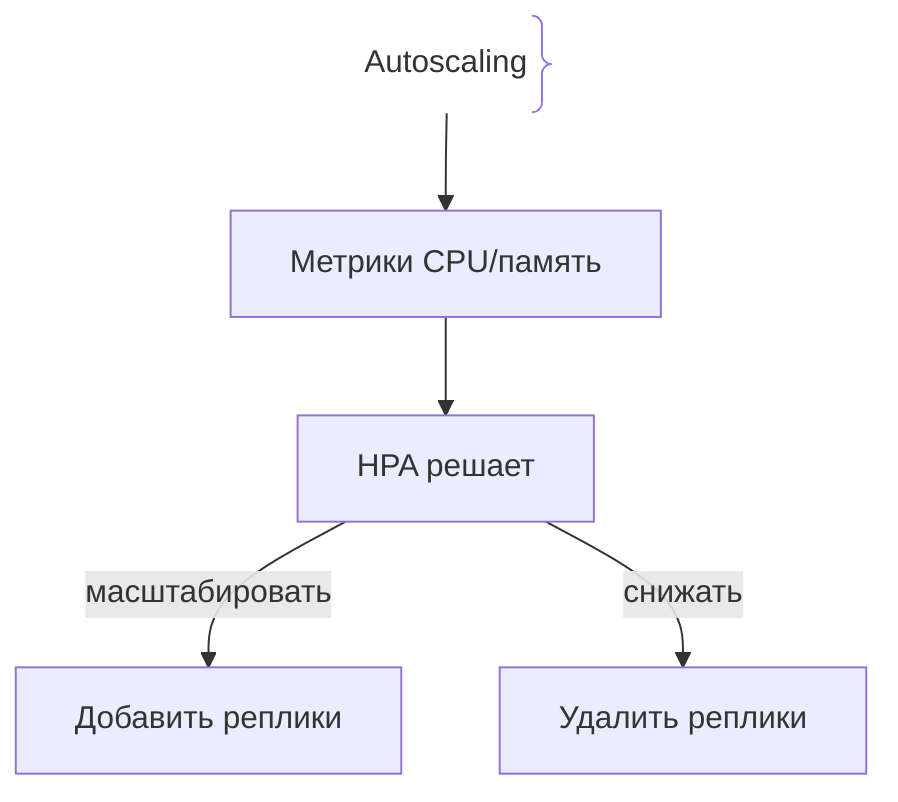
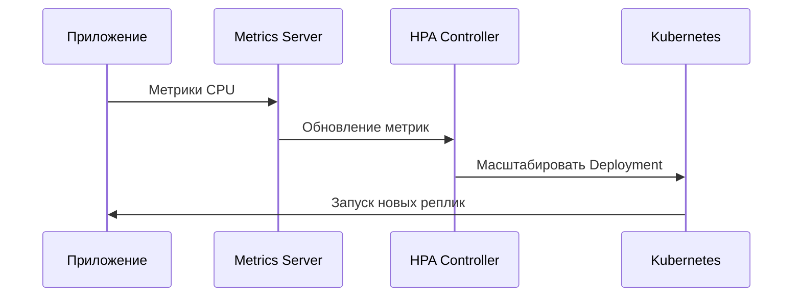

# Автомасштабирование (Autoscaling)

## Определение

Autoscaling — автоматическое изменение количества экземпляров приложения в зависимости от нагрузки.

## Зачем нужно Autoscaling

Ручное масштабирование не успевает за изменением нагрузки.
- **Экономия ресурсов:** Меньше экземпляров при низкой нагрузке.
- **Доступность:** Больше экземпляров при пиковых нагрузках.

## Как работает Autoscaling





## Примеры кода

> Ключевые сценарии: Horizontal Pod Autoscaler в Kubernetes.

### Kubernetes HPA Manifest

```yaml
apiVersion: autoscaling/v2
kind: HorizontalPodAutoscaler
metadata:
  name: app-hpa
spec:
  scaleTargetRef:
    apiVersion: apps/v1
    kind: Deployment
    name: app
  minReplicas: 2
  maxReplicas: 10
  metrics:
    - type: Resource
      resource:
        name: cpu
        target:
          type: Utilization
          averageUtilization: 70
```

## Пример использования: интеграция

HPA масштабирует число реплик по средней загрузке CPU:

```yaml
apiVersion: autoscaling/v2
kind: HorizontalPodAutoscaler
metadata:
  name: api-hpa
spec:
  scaleTargetRef:
    apiVersion: apps/v1
    kind: Deployment
    name: api
  minReplicas: 2
  maxReplicas: 20
  metrics:
    - type: Resource
      resource:
        name: cpu
        target:
          type: Utilization
          averageUtilization: 70
```

При устойчивой нагрузке выше 70% CPU число реплик растёт до максимума; при спаде — схлопывается до минимума.

## Паттерны использования

- **Метрики, отражающие реальную загруженность** — CPU/request-латенция, кастомные метрики очередей.
- **Порог с запасом и стабилизация** — threshold + cooldown не дают «пилу» реплик.
- **Мин/макс границы** — никогда не ниже рабочего числа, не выше лимитов кластера.
- **Горизонтальное + вертикальное** — HPA по репликам, VPA по ресурсам — разные инструменты.

## Антипаттерны и ловушки

- **Только CPU-метрика для всего** — I/O-интенсивный сервис спит при 5% CPU и не масштабируется.
- **Пила (thrashing)** — слишком чувствительные пороги дёргают реплики вверх-вниз.
- **Без верхней границы** — всплеск «съедает» кластер целиком.
- **Реакция с задержкой** — метрики входят с опозданием; без cooldown система не успевает стабилизироваться.

## Когда использовать / когда НЕ использовать

- **Использовать:** сервисы с переменной нагрузкой и тарификацией за использование; K8s-приложения под пиковые сутки.
- **НЕ использовать:** стабильные внутренние сервисы с постоянной нагрузкой — автоскейл лишь добавляет неопределённость; маленькие деплойменты, где одна реплика покрывает весь трафик.

## Связанные темы

- **rolling-deployments** — обновления, на которые накладывается автомасштабирование.
- **blue-green-deployment** — отдельная стратегия релиза с полной заменой среды.
- **canary-releases** — выкат новой версии под контролем метрик.

## Вопросы

### Q1
**Что такое Autoscaling?**
- [ ] Ручное изменение количества серверов
- [x] Автоматическое изменение количества экземпляров по метрикам
- [ ] Шифрование данных
- [ ] Удаление старых версий

Пояснение: HPA автоматически добавляет или удаляет реплики.

### Q2
**Какие метрики чаще всего использует HPA?**
- [ ] Цвет интерфейса
- [x] CPU и память
- [ ] Версия языка
- [ ] Количество файлов

Пояснение: CPU Utilization и Memory Usage — стандартные метрики масштабирования.

### Q3
**Что означает minReplicas: 2?**
- [ ] Максимум 2 реплики
- [x] Минимум 2 работающие реплики
- [ ] Удалить все реплики
- [ ] Отключить приложение

Пояснение: HPA не опустит приложение ниже заданного минимума.

### Q4
**Что происходит при росте нагрузки выше target CPU?**
- [ ] Приложение останавливается
- [x] HPA добавляет новые реплики
- [ ] Удаляет базу данных
- [ ] Отключает мониторинг

Пояснение: Превышение target CPU запускает горизонтальное масштабирование.

### Q5
**Что такое Horizontal Scaling?**
- [ ] Увеличение мощности одного сервера
- [x] Добавление дополнительных экземпляров приложения
- [ ] Перезапуск базы данных
- [ ] Отключение SSL

Пояснение: HPA масштабирует горизонтально, добавляя реплики.

## Источники

- Kubernetes — Horizontal Pod Autoscaler: https://kubernetes.io/docs/tasks/run-application/horizontal-pod-autoscale/
- HPA walkthrough (CPU example): https://kubernetes.io/docs/tasks/run-application/horizontal-pod-autoscale-walkthrough/