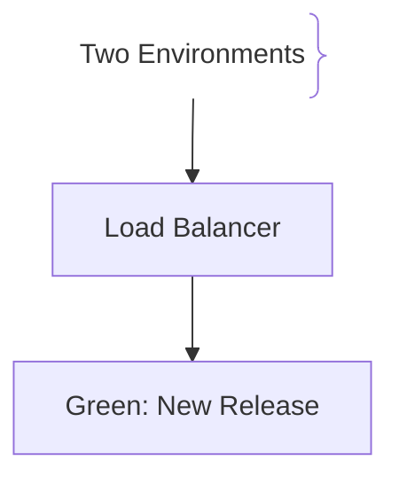
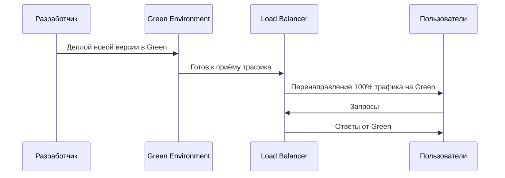

# Blue-Green Deployment (Сине-зелёное развёртывание)

Blue-Green Deployment — стратегия релиза, при которой две идентичные среды работают параллельно: текущая production-среда (Blue) и новая версия (Green).

## Зачем нужен Blue-Green Deployment

Минимизация риска выпуска и обеспечение нулевого простоя.
- **Мгновенный rollback:** Если новая версия не работает, трафик мгновенно возвращается на Blue.
- **Нулевой downtime:** Пользователи не видят момент переключения.

## Как работает Blue-Green Deployment архитектура





## Примеры кода

> Ключевые сценарии: переключение трафика на новую версию.

### Kubernetes Service (переключение на новую версию)

```yaml
apiVersion: v1
kind: Service
metadata:
  name: app-service
spec:
  selector:
    app: app
    version: v2
  ports:
    - port: 80
      targetPort: 8080
```

## Вопросы

### Q1
**Что такое Blue-Green Deployment?**
- [ ] Одновременная работа двух сред: текущей и новой версии
- [x] Две идентичные среды работают параллельно, трафик переключается мгновенно
- [ ] Деплой на один сервер
- [ ] Ручная установка приложения

Пояснение: Две идентичные среды работают параллельно, трафик переключается мгновенно.

### Q2
**Главное преимущество Blue-Green?**
- [ ] Меньше затрат
- [x] Нулевой downtime и мгновенный rollback
- [ ] Простая настройка
- [ ] Не требуется мониторинг

Пояснение: Если новая версия не работает, трафик возвращается на старую.

### Q3
**Что такое «Green» среда?**
- [ ] Старая production-версия
- [x] Новая версия приложения, готовая к приёму трафика
- [ ] База данных
- [ ] Кэш

Пояснение: Green — это новая версия, которая тестируется перед переключением трафика.

### Q4
**Как переключается трафик при Blue-Green?**
- [ ] Через перезапуск серверов
- [x] Через Load Balancer или DNS
- [ ] Через перезапись файлов
- [ ] Через обновление браузера

Пояснение: LB/DNS направляет запросы на нужную среду.

### Q5
**Что происходит при сбое Green версии?**
- [ ] Приложение удаляется
- [x] Трафик возвращается на Blue
- [ ] Пользователи ждут
- [ ] Удаляется база данных

Пояснение: Blue остаётся рабочей версией до успешного переключения.

## Источники

- Kubernetes Deployment Docs: https://kubernetes.io/docs/
- Cloud Native Deployment Patterns