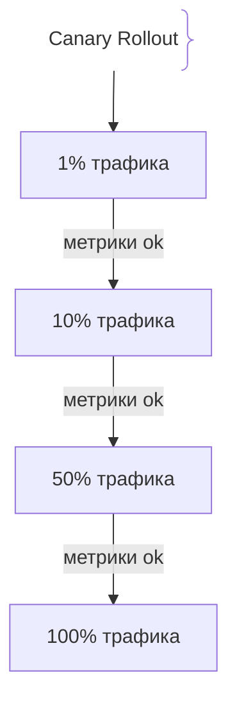
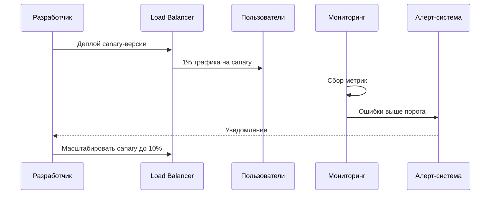

# Canary Releases (Канареечные релизы)

## Определение

Canary Release — стратегия постепенного выпуска новой версии на малую долю пользователей с последующим масштабированием при успешных метриках.

## Зачем нужны Canary Releases

Снижение риска выпуска путём тестирования на реальных пользователях.
- **Минимальный риск:** Новая версия тестируется на 1-5% трафика.
- **Метрики решают:** Масштабирование зависит от качества работы.

## Как работают Canary Releases архитектура





## Примеры кода

> Ключевые сценарии: разделение трафика на canary и production.

### Kubernetes Deployment (canary-версия)

```yaml
apiVersion: apps/v1
kind: Deployment
metadata:
  name: app-canary
spec:
  replicas: 1
  selector:
    matchLabels:
      app: app
      release: canary
  template:
    spec:
      containers:
      - name: app
        image: myapp:v2-canary
```

## Пример использования: интеграция

Argo Rollouts поэтапно наращивает долю новой версии и откатывается по порогу ошибок:

```yaml
kind: Rollout
metadata:
  name: api
spec:
  replicas: 10
  strategy:
    canary:
      steps:
        - setWeight: 10
        - pause: { duration: 10m }
        - setWeight: 40
        - pause: { duration: 10m }
        - setWeight: 100
      analysis:
        templates:
          - templateName: error-rate
```

На каждой ступени мониторинг решает: ошибки в норме — вес растёт, всплеск — автоматический откат.

## Паттерны использования

- **Процентное наращивание** — 1% → 10% → 50% → 100% по данным, а не по календарю.
- **Автоматический анализ метрик** — порог SLO + срабатывание алерта стопит выкат.
- **Порог из SLO** — decision criteria известны до старта.
- **Быстрый пофазный откат** — любой всплеск метрик мгновенно возвращает стабильную версию.

## Антипаттерны и ловушки

- **Canary без анализа метрик** — просто «1% трафика какое-то время» — это не проверка, а ритуал.
- **Пороги больше SLO** — канарейка «проходит», хотя сервис уже бьётся об ошибки.
- **Одинаковые метрики для старта и финиша** — нужен и мониторинг ошибок, и признаки медленного роста.
- **Ручные остановки** — «посмотрел глазами» заменяет автоматы только в маленьких командах без алертинга.

## Когда использовать / когда НЕ использовать

- **Использовать:** высоконагруженные сервисы с пользовательским трафиком, где каждой версии нужна валидация на живых данных.
- **НЕ использовать:** внутренние сервисы без критичного трафика и клиентов в «долгом» сеансе — там простой rolling или blue-green дешевле и проще.

## Связанные темы

- **blue-green-deployment** — альтернативное полное переключение сред.
- **feature-flags** — управление фичами без деплоя, дополняет canary.
- **rolling-deployments** — безопасное поэтапное обновление без тонкой аналитики.

## Вопросы

### Q1
**Что такое Canary Release?**
- [ ] Полное переключение на новую версию
- [x] Постепенный выпуск новой версии на малую долю пользователей
- [ ] Ручной деплой
- [ ] Шифрование данных

Пояснение: Новая версия тестируется на части трафика перед масштабированием.

### Q2
**Какой процент трафика обычно направляют на canary?**
- [ ] 100%
- [x] 1-5%
- [ ] 50%
- [ ] 90%

Пояснение: Небольшая доля пользователей позволяет безопасно протестировать новую версию.

### Q3
**Что происходит при успешных метриках canary?**
- [ ] Версия удаляется
- [x] Доля трафика gradually увеличивается
- [ ] Приложение перезапускается
- [ ] Отключается мониторинг

Пояснение: Хорошие метрики — основание для масштабирования релиза.

### Q4
**Что происходит при плохих метриках canary?**
- [ ] Трафик автоматически увеличивается
- [x] Релиз останавливается или откатывается
- [ ] Удаляется база данных
- [ ] Отключается SSL

Пояснение: Плохие метрики — сигнал остановить rollout.

### Q5
**Какие метрики важны для Canary?**
- [ ] Цвет сайта
- [x] Ошибки, latency, RPS, конверсия
- [ ] Количество строк кода
- [ ] Версия Node.js

Пояснение: Метрики качества работы приложения определяют успех релиза.

## Источники

- Kubernetes Rollouts: https://argoproj.github.io/
- Google SRE Book